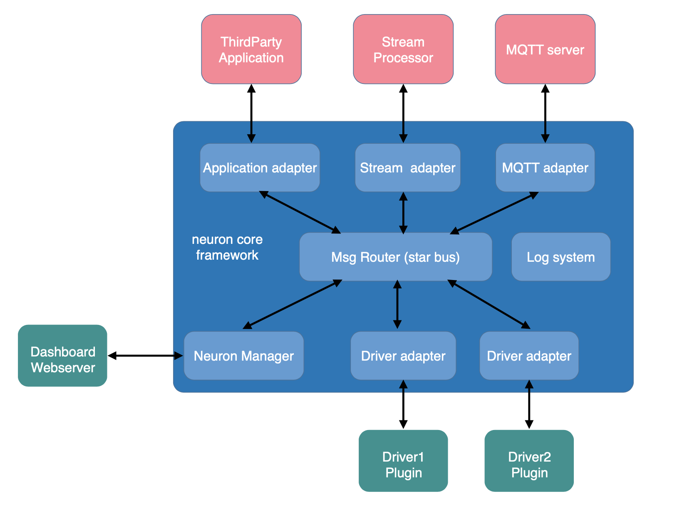
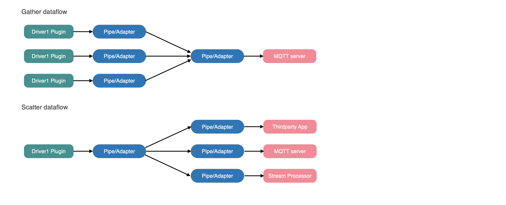

# Architecture

Modern CPUs are all multi-core in design, even though it is lower-end ARM and RISC-V for embedded systems. Multi-core is already a standard. Neuron must have a very good multi-thread management to take advantages of modern CPUs multi-core architecture. As a edge native application, Neuron must have real-time characteristic to execute tasks in certain time frame as running in concurrent. Therefore, We use NNG as our base library for message exchange between threads as NNG provides optimized asynchronous I/O processing for data message delivery.

NNG offers following features.
* Asynchronous I/O - Built on the optimized NNG's asynchronous I/O framework 
* SMP & Multi-threading - Scale out easily to engage multiple cores in the modern SMP system
* Brokerless - Easily integrated into components, lightweight deployment 

The core message bus is based on pairs-1 feature of NNG library to organize a star-like scalable framework. There is a message router core at the center. Outside there are two kinds of nodes surround the router core. Southbound driver nodes are the nodes to communicate with devices, which is a data producer. Northbound application nodes are the data consumer to process or to forward data message. Each node (southbound or northbound) consists of plugin adapter and plugin module. Communication between nodes rely on NNG high efficiency asynchronous I/O to make good use of multi-core CPU capability. 

Scatter-Gather is a better choice for asynchronous I/O processing since messages are required to process in concurrent, that is, sending the messages to desired nodes at the same time through a parallel thread pool. Therefore, as Neuron adopt this scatter-gather processing pattern, southbound drivers (data producers) are requested to group together the data stream so that northbound applications (data consumers) can subscribe the desired data stream groups from various nodes.

All nodes in Neuron are running in loosely-coupled threading services. Therefore, except the build-in web server node, any node in Neuron can be created or destroyed dynamically without interfering other running nodes. That means Neuron is very flexible to load a plugin module and start a new node service, or stop a node service and then off-load the relevant plugin module, in run time. This "hot-plugin" module mechanism can facilitate the individual plugin module upgrades or increase more application features by adding more plugin modules dynamically, providing that the hosts platform/container has enough CPU processing capacity to accommodate more nodes.

Neuron is targeting on data collection, forwarding and aggregation for the Industrial IoT multiple diverse devices in concurrent mode since edge native software are all running in real-time to fulfill the ultra-low latency processing at the edge.

