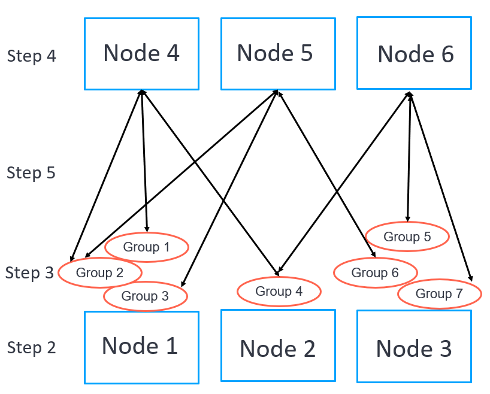

# Configuration

## Configuration Key Concepts

## Configuration Procedures

This procedure is an idea of work flow how to set up he Neuron for various industrial protocol conversions.

### Step 1. Checking over All Available Plugins

Neuron data acquisition and delivery are enabled using various industrial plugins. A specific feature can be used only when corresponding plugin has installed and activated by the License. Since Neuron is a loosely-decoupled architecture, each plugin runs as an independent process thread without interfering each others. 

[Check over the available plugins](./plugin-management/plugin-management.md)

### Step 2. Creating a Southbound Driver

After checking out the available plugins, select all necessary southbound plugins for device communications according to industrial protocols. Each southbound plugin has only one connection to a device or a bus of multiple devices, depending on the specification of protocols.

[Create a southbound driver](./south-devices/south-devices.md)

### Step 3. Adding Groups and Tags to a Driver

In this step, add groups and tags to the southbound driver. Tag is a unique keyword to locate the data storage in the device. The tag also contains some meta-data information for the data such as scaling, precise, and read/write attributes. Those tags will be assigned into groups. Each group has an independent polling frequency to read data from the device. 

[Add groups and tags to a driver](./groups-tags/groups-tags.md)

Usually, there will be a very large number of tags to be handled in Neuron. Instead of adding groups and tags one by one in the dashboard, these groups and tags can be prepared in an offline Excel sheet and then imported into Neuron.

[Import and Export the groups and tags](./import-export/import-export.md)

Once the groups and tags have been created, the real-time values of the tags will be available from the monitoring menu.

[Monitoring the groups and tags](../usage/monitoring.md)

:::tip
Step 2 and 3 would be repeated until all necessary drivers, groups and tags are created.
:::

### Step 4. Creating a Northbound Application

Select the necessary northbound plugins for destination of data delivery. Each northbound plugin has only one connection to a destination such as a broker or an application.

[Create a northbound application](./north-apps/north-apps.md)

### Step 5. Subscribing a Group

In this step, there is no longer to set up groups and tags. Instead, a northbound node can subscribe to any group created in the southbound nodes. Once the subscription has been set up, the corresponding group's data will be published to the northbound node continuously according to the frequency of the group.

[Subscribe a group](./subscription/subscription.md)

## Configuration APIs

Alternatively, a set of configuraiton APIs is provided for integrating with industrial IoT platform, MES or other controlling systems.

