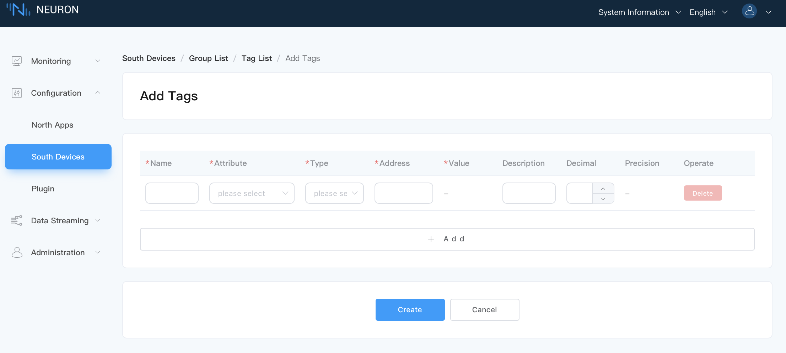

# Configure Data Groups And Tags

## Step 1, Create A Group

Create a group of tags, in which collect and report the data of the same group at the same frequency

Click the new device node to enter the group list management interface, and click `Create` to create the group.

* Name: fill in the name of the Group, such as group-1.
* Interval: the frequency of collection and reporting of this group of tags, in milliseconds, 100 means that the whole group of points is collected every 100 ms, and the value of the whole group of points is reported once.

:::tip
Interval is a time interval which is used to collect data from equipment and report the data to MQTT. The minimum setting can be 100ms, but when there are a lot of collected data, if the data monitoring interface reports an error that the point value is invalid, the value of interval can be appropriately increased.
:::


## Step 2, Add Tags To The Group

Add the device tags to be collected, including tag address, tag attribute, tag type, etc.

Click the `Tag list` icon in the group to enter the tag list management interface.

Select the `Create` icon to enter the tag page.



* Name: fill in the tag name, for example, tag1.
* Attribute: drop-down selection tag's attribute, for example, read, write, subscribe, stastic.
* Type: drop-down selection data type, for example, int16，uint16，int32，uint32，float，bit.
* Address: fill in the drive address, for example, 1!40001. 1 stands for the tag salve id that setted in Modbus simulator, and 40001 stands for the tag register address. Please refer to [Introduction and Usage of Modbus](../south-devices/modbus-tcp/modbus-tcp.md) for detailed instructions on driving address.
* Decimal: used to simply process the collected data, and the usage is: equipment value * decimal = display value;
* Setting precision: when the data type is float/double, an optional parameter **Precision** will be displayed, which is used to set precision, and the optional range is 1-17.
* Description: It is not filled by default. You can fill in the relevant description of the label.


:::tip
After the tag is created, the working status of the equipment card is **running**, and the connection status should be **Connected**. If the connection status is still **Disconnected** at this time, please execute the following instructions at the terminal of the Neuron running environment to confirm whether the Neuron running environment can access the corresponding IP and port.

```bash
$ telnet <Running IP on PC side of Modbus simulator> 502
```

Please confirm whether the IP and Port are set correctly and whether the firewall is closed when configuring the device.
:::

