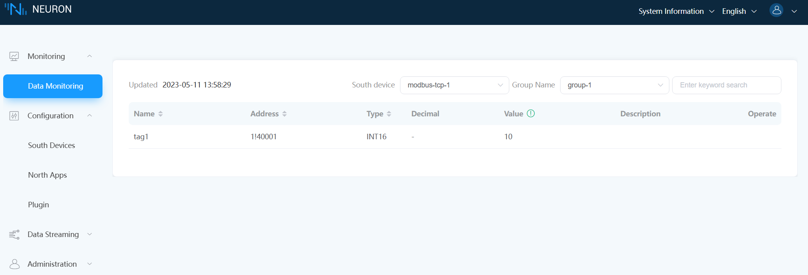

# Configure Tag

## Tag Attribute

### Static Tag

When configuring the attribute at the tags, select `Static` in the drop-down box.

Static tags are assigned at configuration time, for example.

Data monitoring is shown in the following figure.

### Subscribe Tag

When configuring the attribute at the tags, select `Subscribe` in the drop-down box, for example.

Selecting the `subscribe` attribute means that a message will be sent when the data changes, but no message will be sent if there is no change. 
For example, The default data is 0, but it has been changed to 2.
In MQTTX, subscribe to the topic and view it. After the data changes, only one message will be sent, as shown in the following figure.

