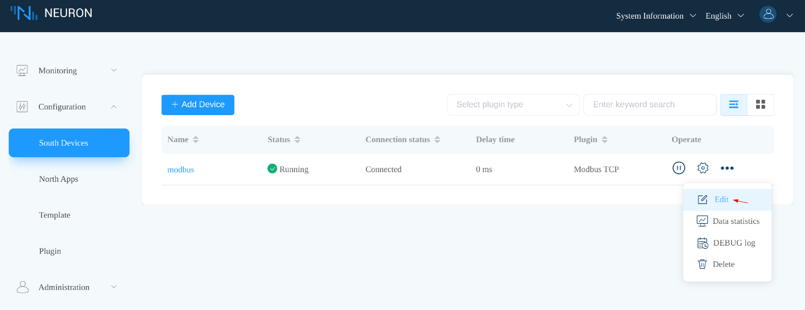
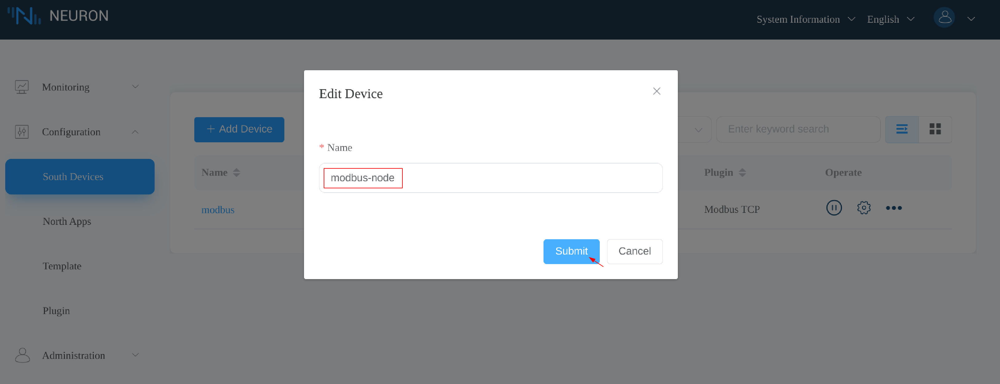
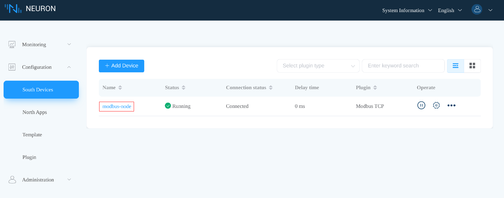

# Update node name

From version 2.5.0, Neuron has added support for updating node names.

* Click the **Edit** icon on the desired node to open the **Edit** dialog.

  

* Edit the node name, and click the **Submit** button.

  

* Verify that the node name is successfully updated.

  
