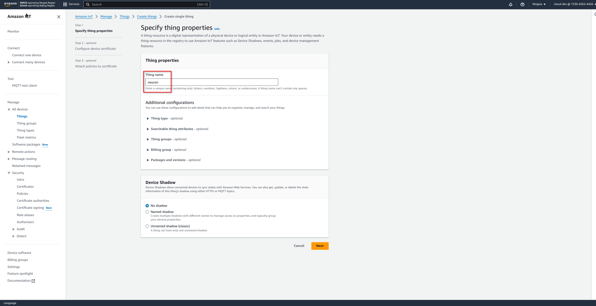
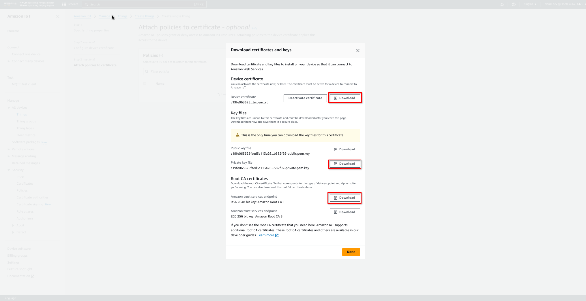
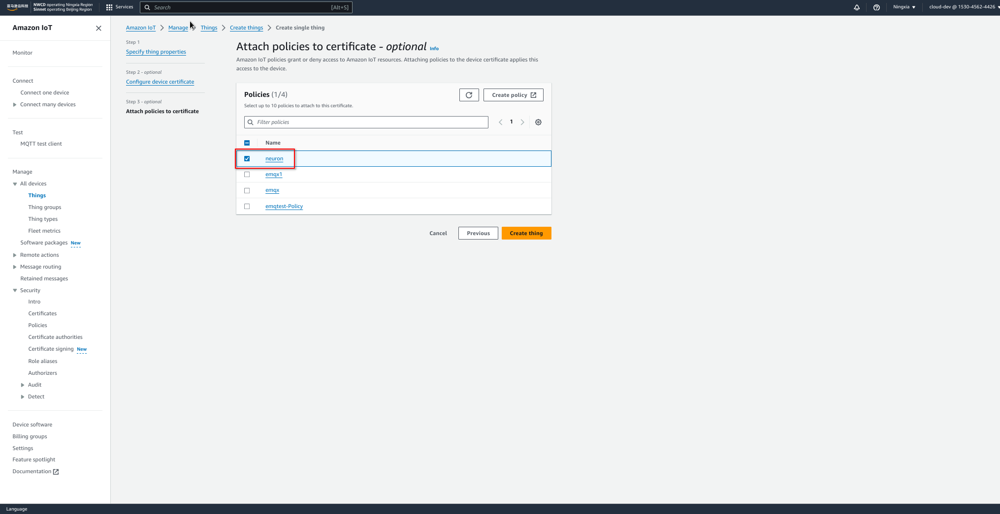
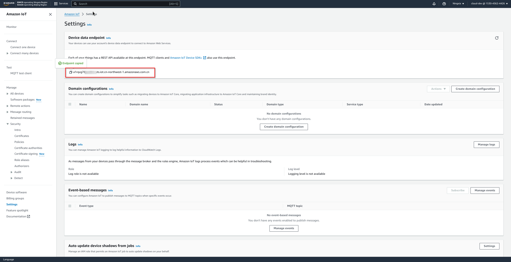
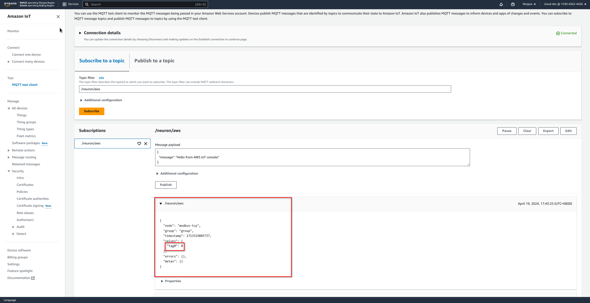
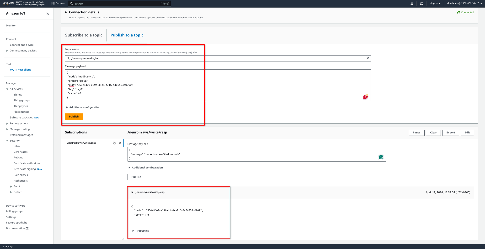
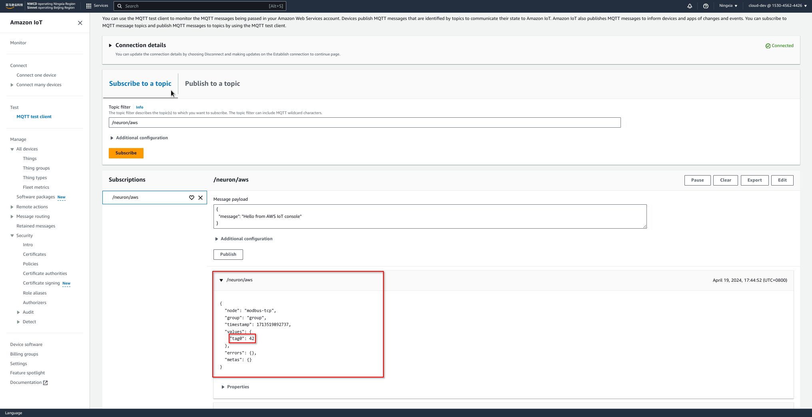

# Bridging Data to AWS IoT using Neuron

This article will introduce how to use the Neuron to bridge data to AWS IoT through the public network so that you can easily build IoT applications.

## Introduction to AWS IoT

### What is AWS IoT

Amazon IoT Core is a hosted cloud platform that makes it easy for connected devices to securely interact with cloud applications and other devices. Amazon IoT can support billions of devices and trillions of messages and can process and securely route them to Amazon Cloud Technologies endpoint nodes and other devices. With Amazon IoT, your applications can track and communicate with all your devices at all times, even when they are not connected.

<figure align="center">
  
</figure>

### Benefits of the AWS IoT platform

1. Broad and deep: AWS has broad and deep IoT services from the edge to the cloud, providing local data collection and analysis capabilities as well as data management and rich analytics integration services on the cloud designed for IoT.
2. Multiple layers of security: including preventive security mechanisms (such as encryption and access control of device data), continuous monitoring and auditing of security configurations, etc.
3. Superior AI integration: AWS brings AI and IoT together to make devices smarter. Multiple machine learning frameworks are supported.
4. Proven at scale: AWS IoT is built on a scalable, secure, and proven cloud infrastructure that scales to billions of different devices and trillions of messages.

## Configure AWS IoT

### 1. Create policy

Find **Security -> Policy**, create a policy named neuron, and write the policy with the following configuration.
<figure align="center">
  
</figure>

```json
{
  "Version": "2012-10-17",
  "Statement": [
    {
      "Effect": "Allow",
      "Action": "iot:Connect",
      "Resource": "arn:aws-cn:iot:cn-northwest-1:153045624426:client/neuron_*"
    },
    {
      "Effect": "Allow",
      "Action": "iot:Publish",
      "Resource": "arn:aws-cn:iot:cn-northwest-1:153045624426:topic//neuron/aws"
    },
    {
      "Effect": "Allow",
      "Action": "iot:Publish",
      "Resource": "arn:aws-cn:iot:cn-northwest-1:153045624426:topic//neuron/*/write/resp"
    },
    {
      "Effect": "Allow",
      "Action": "iot:Receive",
      "Resource": "arn:aws-cn:iot:cn-northwest-1:153045624426:topic//neuron/*/write/req"
    },
    {
      "Effect": "Allow",
      "Action": "iot:Subscribe",
      "Resource": "arn:aws-cn:iot:cn-northwest-1:153045624426:topicfilter//neuron/*/write/req"
    },
    {
      "Effect": "Allow",
      "Action": "iot:Publish",
      "Resource": "arn:aws-cn:iot:cn-northwest-1:153045624426:topic//neuron/*/read/resp"
    },
    {
      "Effect": "Allow",
      "Action": "iot:Receive",
      "Resource": "arn:aws-cn:iot:cn-northwest-1:153045624426:topic//neuron/*/read/req"
    },
    {
      "Effect": "Allow",
      "Action": "iot:Subscribe",
      "Resource": "arn:aws-cn:iot:cn-northwest-1:153045624426:topicfilter//neuron/*/read/req"
    }
  ]
}
```

### 2. Create a thing

Go to the AWS IoT control panel, find **Manage -> Things**, and click **Create things** to create a thing named _neuron_.
<figure align="center">
  
</figure>

Select **Auto-generate a new certificate**.
<figure align="center">
  
</figure>

After the certificate is created, you need to download the certificate on this page for device two-way authentication.
<figure align="center">
  
</figure>

Finally, associate the policy created earlier with the thing.
<figure align="center">
  
</figure>

### 3. Lookup the device data endpoint

In the **Settings** tab, get the device data endpoint for device connection.
<figure align="center">
  
</figure>


## Configure Neuron

### South device

We need some south devices to collect data from. Any Neuron southbound plugin will do for this tutorial, for example, the [Modbus TCP plugin].

#### Add the *modbus-tcp* Node

Click **South Devices -> Add Device** to add a node using the Modbus TCP plugin.
This tutorial will connect to a modbus simulator at port `60502`.
<figure align="center">
  
</figure>

#### Create a Group

Click the *modbus-tcp* node to create a group. We set the group name to *group* and the interval to *1000*.
<figure align="center">
  
</figure>

#### Add Tag

Click the created *group* group to create a tag with the name *tag0* and with type *INT16*.
<figure align="center">
  
</figure>

Finally, check that the *modbus-tcp* node is in **Connected** state.
<figure align="center">
  
</figure>

### North app

#### Add the *aws* Node

Click **North Apps -> Add Application** to add a node using the AWS IoT plugin.
<figure align="center">
  
</figure>

In the **Application Configuration** tab, configure the *aws* node with the AWS data endpoint and device certificates.
<figure align="center">
  
</figure>

Once the configuration is submitted, the *aws* node connects to AWS IoT Core successfully.
<figure align="center">
  
</figure>

#### Subscribe to the *modbus-tcp* Node

Click the *aws* node, then click **Add subscription**, select the *modbus-tcp* node and the *group* group.
Set the data upload topic to */neuron/aws*, which is the MQTT topic to publish south device data.
<figure align="center">
  
</figure>

<figure align="center">
  
</figure>


## Monitor Data

After subscribing to the *group* group of the *modbus-tcp* node, the *aws* node will begin pushing data to the AWS IoT Core.
Click **Monitoring**, then select the *modbus-tcp* node and the *group* group. We see that Neuron reports a initial value *0* for *tag0*.

<figure align="center">
  
</figure>

In the AWS IoT console, using **MQTT test client** to subscribe to the */neuron/aws* topic. We can check that AWS IoT Core receives the data correctly.
<figure align="center">
  
</figure>

## Write Data

In the AWS IoT console, use the **MQTT test client** to send a write request to the topic */neuron/aws/write/req*, which writes value *42* to the tag *tag0*.
<figure align="center">
  
</figure>

Now we can see that Neuron updates *tag0* correctly in the **Data monitoring** tab.
<figure align="center">
  
</figure>

And AWS IoT Core receives the correct tag data, *42*, which is expected.
<figure align="center">
  
</figure>

[Modbus TCP plugin]: ../../south-devices/modbus-tcp/modbus-tcp.md
