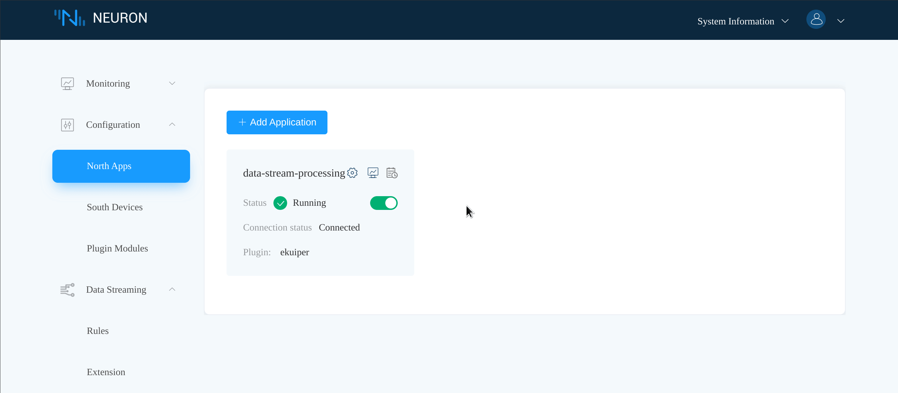
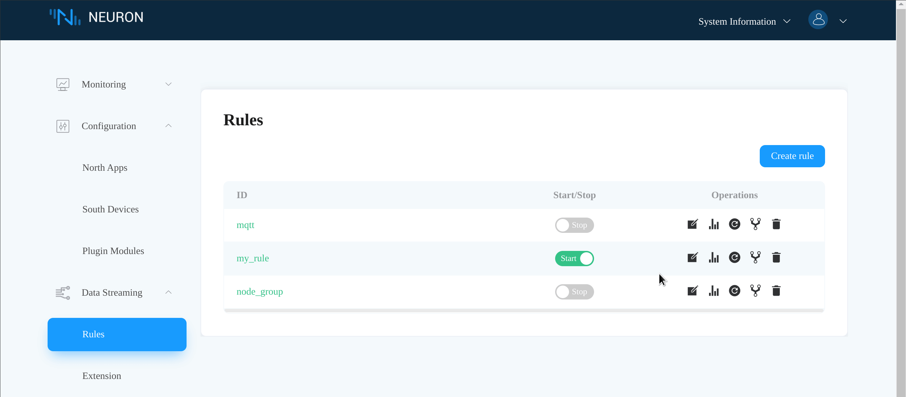

# FAQ

## How to write eKuiper rule SQL to fulfill my requirements

Please refer to the [eKuiper Docs](https://ekuiper.org/docs/en/latest)

## The *data-stream-processing* node stays disconnected after eKuiper started successfully

Make sure you create rules that use the eKuiper neuron source. eKuiper will defer
the connection until the rules are started.

## How do I know eKuiper collects data from Neuron successfully

1. Check that the **data-stream-processing** node is connected, and subscribe to
   some south nodes.
2. Check that the **data-stream-processing** node actually collects data using
   the dashboard metrics panel.
   
3. If you are using the NeuronEX dashboard, check that rules are triggered
   using the rule statistics panel.
   