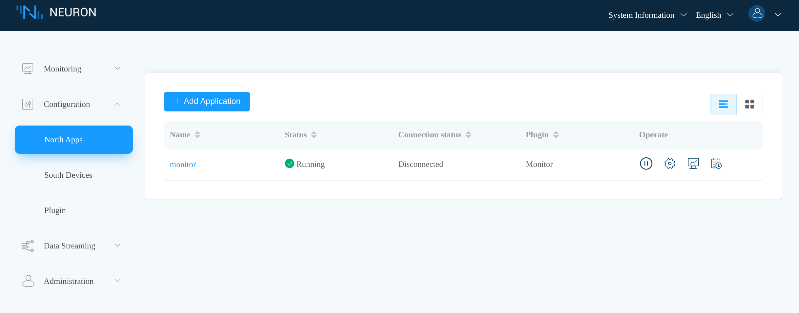
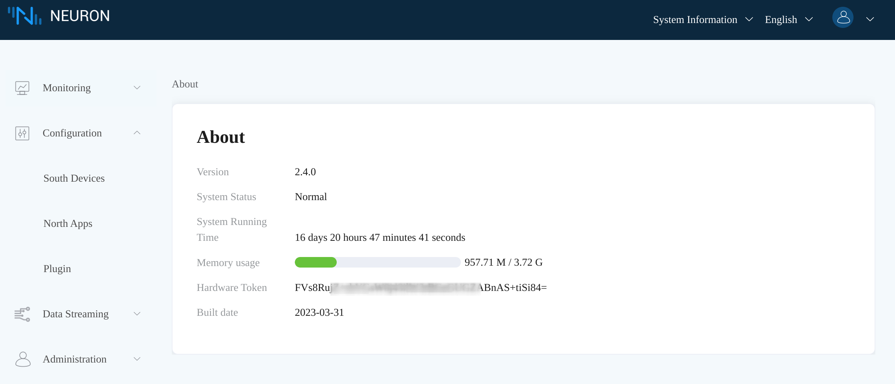
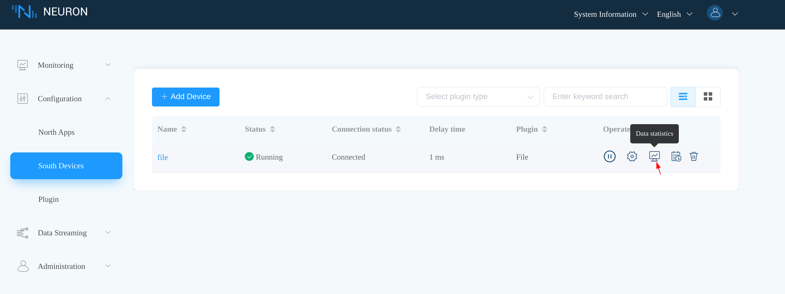
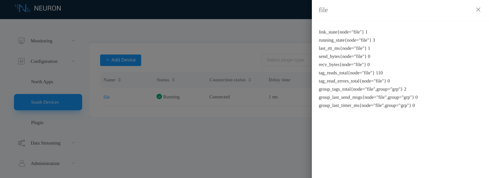

# Monitor

The Neuron Monitor plugin is an open-source northbound plugin, which, as its name implies, is used for monitoring the Neuron instance. The Monitor plugin is special in that users are not allowed to create or delete nodes using the plugin directly, but a singleton *monitor* node is created for you at the startup of the Neuron process. You could see the *monitor* node in the **North Apps** tab through the dashboard.
<figure align="center">
  
  <figcaption align = "center">
    <sub><b>Fig.1 - Neuron *monitor* node</b></sub>
  </figcaption>
</figure>
## Application Configuration

These are the available parameters when configuring the *monitor* node.

:::tip

These parameters are used only for [heartbeats](#heartbeats) and [events](#events) reporting, you don't need to configure the *monitor* node if you do not use these features.

:::

| Parameter                       | Description                                                  |
| ------------------------------- | ------------------------------------------------------------ |
| **Client ID**                   | MQTT client id for communication, required.                  |
| **Event Topic Prefix**          | Prefix of the MQTT topics for event reporting, required.     |
| **Heartbeat Topic**             | MQTT topic to which heartbeat messages will be published, required. |
| **Heartbeat Interval**          | Interval in seconds between heartbeat messages. Set to 0 to disable heartbeat messages. |
| **Broker Host**                 | MQTT broker host, required.                                  |
| **Broker Port**                 | MQTT broker port number, required.                           |
| **Username**                    | MQTT user name, optional.                                    |
| **Password**                    | MQTT user password, optional.                                |
| **SSL**                         | Whether to enable MQTT SSL, default false.                   |
| **CA**                          | CA certificate which signs the server certificate, required when SSL is enabled and using self-signed certificates. |
| **Client Cert**                 | Client certificate, required when using SSL two-way authentication. |
| **Client Private Key**          | Client private key, required when using SSL two-way authentication. |
| **Client Private Key Password** | Client private key password, required only when **Client Private Key**, if provided, is encrypted. |

The **Broker Host**, **Broker Port**, **Username**, **Password**, **SSL**, **CA**, **Client Cert**, **Client Private Key** and **Client Private Key Password** parameters are used to make [MQTT] connections, which are similar to that of the [MQTT plugin]. We refer to these 9 parameters as the MQTT connection parameters in the following text.

## Data Metrics

The Neuron Monitor plugin exposes a [Prometheus] compatible [metrics HTTP API]. The Neuron dashboard **About** page and **Data statistics** tab depends on this API to display certain information.

You may click **System Information -> About** to show the **About** page.
<figure align="center">
  
  <figcaption align = "center">
    <sub><b>Fig.2 - Neuron dashboard About page</b></sub>
  </figcaption>
</figure>

Click the **Data statistics** icon on your node to show the **Data statistics** tab.
<figure align="center">
  
  <figcaption align = "center">
    <sub><b>Fig.3 - Neuron dashboard *Data statistics* icon</b></sub>
  </figcaption>
</figure>

Below is the **Data statistics** tab, showing the metrics of an example *file* node.
<figure align="center">
  
  <figcaption align = "center">
    <sub><b>Fig.4 - Neuron dashboard *Data statistics* tab</b></sub>
  </figcaption>
</figure>
::: warning NOTE
The metrics API is enabled through the lifetime of the Neuron process. Starting or stopping the *monitor* node will only start or stop the [heartbeats](#heartbeats) and [events](#events) functionality.
:::

## Heartbeats

The Monitor plugin allows users to publish heartbeat messages to MQTT brokers, which can be used to check the liveness of the Neuron process or node states. Together with the MQTT connection parameters, this feature is controlled by two additional parameters, **Heartbeat Topic** and **Heartbeat Interval**. The **Heartbeat Topic** parameter designates the MQTT topic that the plugin will publish heartbeat messages to. The **Heartbeat Interval** parameter specifies the interval in seconds between each heartbeat message.

::: tip
Setting the **Heartbeat Interval** to **0** will disable heartbeat messages.
:::

Heartbeat messages have the following fields:
* `timestamp` : the Unix timestamp when the message is generated.
* `version` : the Neuron version number.
* `states` : array of node states which are similar to that in [node state HTTP API].

Below is an example heartbeat message.
```json:no-line-numbers
{
  "timestamp": 1658134132237,
  "version": "2.4.0",
  "states": [
    {
      "node": "mqtt-client",
      "link": 2,
      "running": 3
    },
    {
      "node": "fx5u-client",
      "link": 2,
      "running": 3
    }
  ]
}
```

## Events

Events represent internal state changes in the Neuron process that system administrators or operational engineers may be interested in, such as the creation, removal, or setting of nodes.

The Monitor plugin can publish event messages to MQTT topics determined by the **Event Topic Prefix** parameter. We use *{event-topic-prefix}* to denote the actual value provided for the **Event Topic Prefix** parameter.

### Node Events

#### Node Creation Events

Topic: *{event-topic-prefix}/node/add*

Example:
```json:no-line-numbers
{
  "name": "file",
  "plugin": "File"
}
```

#### Node Removal Events

Topic: *{event-topic-prefix}/node/delete*

Example:
```json:no-line-numbers
{
  "name": "file"
}
```

#### Node Setting Events

Topic: *{event-topic-prefix}/node/setting*

Example:
```json:no-line-numbers
{
  "node": "file",
  "params": {
    "file_length": 512
  }
}
```

#### Node Control Events

Topic: *{event-topic-prefix}/node/ctl*

Example:
```json:no-line-numbers
{
  "node": "file",
  "cmd": 1
}
```

### Group Events

#### Group Creation Events

Topic: *{event-topic-prefix}/group/add*

Example:
```json:no-line-numbers
{
  "node": "file",
  "group": "grp",
  "interval": 1000
}
```

#### Group Update Events

Topic: *{event-topic-prefix}/group/update*

Example:
```json:no-line-numbers
{
  "node": "file",
  "group": "grp",
  "interval": 2000
}
```
#### Group Removal Events

Topic: *{event-topic-prefix}/group/delete*

Example:
```json:no-line-numbers
{
  "node": "file",
  "group": "grp"
}
```

### Tag Events

#### Tag Creation Events

Topic: *{event-topic-prefix}/tag/add*

Example:
```json:no-line-numbers
{
  "node": "file",
  "group": "grp",
  "tags": [
    {
      "name": "tag0",
      "type": 13,
      "attribute": 1,
      "address": "hello.txt",
      "precision": 0,
      "decimal": 0.0,
      "description": ""
    }
  ]
}
```

#### Tag Update Events

Topic: *{event-topic-prefix}/tag/update*

Example:
```json:no-line-numbers
{
  "node": "file",
  "group": "grp",
  "tags": [
    {
      "name": "tag0",
      "type": 13,
      "attribute": 3,
      "address": "hello.txt",
      "precision": 0,
      "decimal": 0.0,
      "description": ""
    }
  ]
}
```

#### Tag Removal Events

Topic: *{event-topic-prefix}/tag/delete*

Example:
```json:no-line-numbers
{
  "node": "file",
  "group": "grp",
  "tags": [
    "tag0"
  ]
}
```


[MQTT]: https://mqtt.org
[MQTT plugin]: ../mqtt/overview.md
[Prometheus]: https://prometheus.io/
[metrics HTTP API]: ../../../http-api/metrics.md
[node state HTTP API]: ../../../http-api/configuration.md#get-node-state
