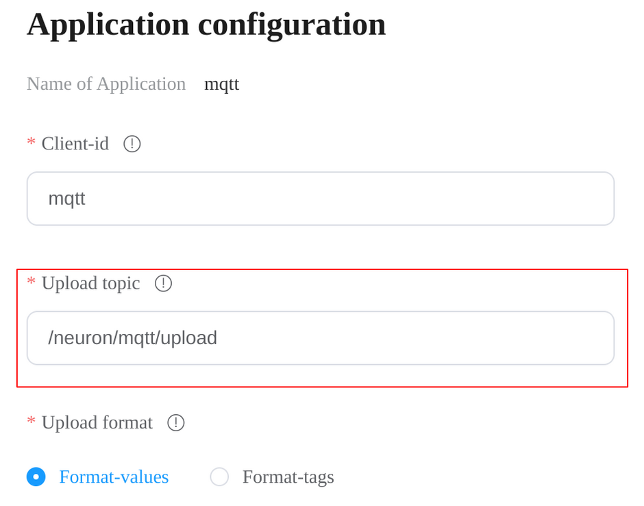
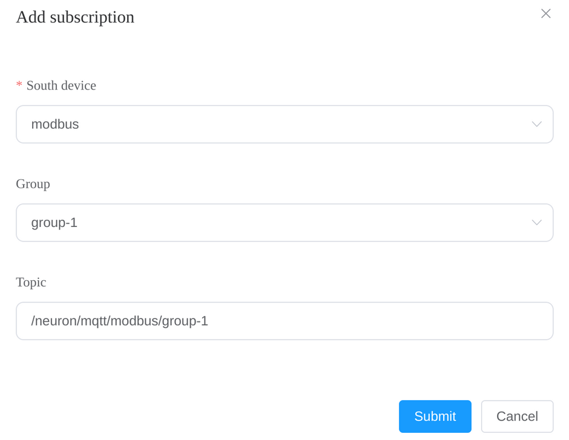
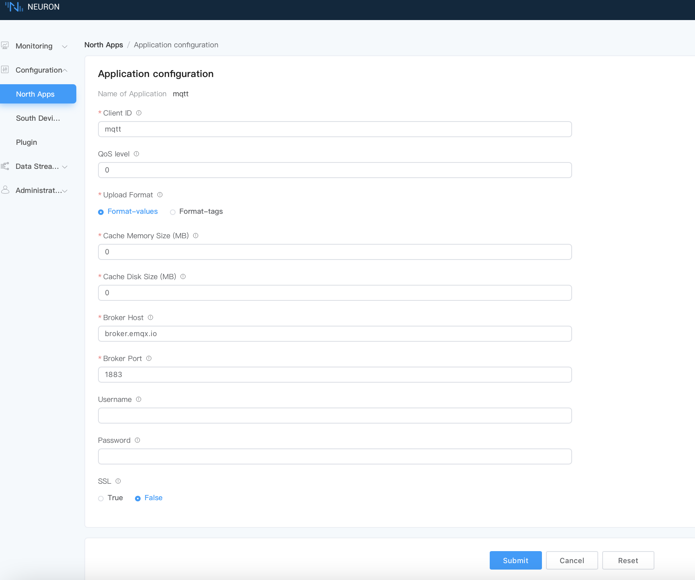

# MQTT Client

[MQTT] is a messaging protocol designed for IoT devices and applications
operating on a publish/subscribe model. It's lightweight, efficient, reliable,
and allows for real-time communication. MQTT is well-suited for environments
with limited resources, where efficient use of power and bandwidth is necessary.

Neuron supports MQTT as one of its communication protocols.
The Neuron MQTT plugin allows users to quickly build IoT applications that use
MQTT communication between devices and the cloud. Using the MQTT plugin,
developers can also publish messages back to IoT devices, triggering device
actions such as turning on or off lights, motors, and other equipments.
The plugin also supports secure communication with devices, using authentication
and encrypted communication protocols to ensure data safety and privacy.

[MQTT]: https://mqtt.org

## Parameters

These are the available parameters when configuring a node using the MQTT plugin.

| Parameter                       | Description                                                  |
| ------------------------------- | ------------------------------------------------------------ |
| **Client ID**                   | MQTT client id for communication, required.                  |
| **QoS Level**                   | MQTT QoS level for message delivery, optional, default QoS 0. (since 2.4.0) |
| **~~upload-topic~~**            | ~~Subscription data reporting topic, required.~~ (removed in 2.4.0) |
| **Upload Format**               | JSON format of reported data, required. There are *values-format* and *tags-format*. In *values-format*, data are split into `values` and `errors` sub objects. In *tags-format*, tag data are put in a single array. |
| **Write Request Topic**         | MQTT topic to which the plugin subscribes for write requests. See [MQTT API](./api.md#write-tag) (since 2.4.5) |
| **Write Response Topic**        | MQTT topic to which the plugin sends write responses. (since 2.4.5) |
| **Offline Data Caching**        | Offline data caching switch. Cache MQTT messages when offline, and sync cached messages when back online. (Since 2.4.3) |
| **Cache Memroy Size**           | In-memory cache limit (MB) in case of communication failure, required. Range in [0, 1024]. Should not be larger than *cache-disk-size*. |
| **Cache Disk Size**             | In-disk cache limit (MB) in case of communication failure, required. Range in [0, 10240]. If nonzero, *cache-mem-size* should also be nonzero. |
| **Broker Host**                 | MQTT Broker host, required.                                  |
| **Broker Port**                 | MQTT Broker port number, required.                           |
| **Username**                    | Username to use when connecting to the broker, optional.     |
| **Password**                    | The password to use when connecting to the broker, optional. |
| **SSL**                         | Whether to enable MQTT SSL, default false.                   |
| **CA**                          | CA certificate, required when SSL enabled.                   |
| **Client Cert**                 | client certificate, required when using SSL two way authentication. |
| **Client Private Key**          | client key, required when using SSL two way authentication. |
| **Client Private Key Password** | client key password, optional when using SSL two way authentication. |

### Data upload

Before Neuron version 2.4.0, the Neuron MQTT plugin will publish collected data
in JSON to the topic designated by the **upload-topic** parameter.
<figure align="center">
  
  <figcaption align = "center">
    <b>Fig.1 - Setting upload topic in Neuron version 2.3.0</b>
  </figcaption>
</figure>

Neuron version 2.4.0 removes the **upload-topic** parameter. Instead, users
should provide the intended topic through the group subscription page.
Click your MQTT node to enter the group subscription page, and click
**Add Subscription** to add a subscription.

<figure align="center">
  
  <figcaption align = "center">
    <b>Fig.2 - Setting upload topic in Neuron version 2.4.0</b>
  </figcaption>
</figure>

The exact format of the data reported is controlled by the **Upload Format**
parameter. There are two formats, *tags-format* and *values-format*.

For more detail information, see [MQTT API](./api.md#data-upload)

### Offline data caching

Offline data caching is a feature that allows data to be stored locally on the
device running Neuron during network outage. When a network connection becomes
available, the MQTT plugin can synchronize data with the broker.
This feature is useful in scenarios where network connectivity may be limited,
unstable, or intermittent. And provides a critical functionality that can enhance
the robustness and reliability of applications built on Neuron.

Offline data caching is controlled by the **Offline Data Caching**,
**Cache Memory Size**, and **Cache Disk Size** parameters.
Setting the **Offline Data Caching** parameter to *true* switches on offline
data caching, in which case, users should also set the **Cache Memory Size**
and **Cache Disk size** parameters.
The **Cache Memory Size** parameter specified the memory cache size in
megabytes, and the max allowed memory cache size is 1GB. The **Cache Disk Size**
parameter specified the disk cache size in megabytes, and the max allowed disk cache
size is 10GB.
When network disruption occurs, the MQTT plugin will store data in the memory
cache first, and only flush data to the disk cache when memory cache is full.
When network connection restores, the MQTT plugin will publish the cached data
to the broker in FIFO (Fist In First Out) order.

::: tip
The **Offline Data Caching** parameter is added since Neuron version 2.4.3. For
For older versions, you may disable offline data caching by setting both
**Cache Memory Size** and **Cache Disk Size** to zero.
:::

### Data security

SSL/TLS (Secure Sockets Layer/Transport Layer Security) is a security protocol
used to encrypt communication channels between networked devices. It enables
secure communication over an insecure network, such as the internet.
MQTT over SSL/TLS is a secure method for transmitting MQTT messages between
client and the MQTT broker by encrypting the data being transmitted with SSL/TLS
encryption. This ensures that all data passed between the clients and the broker
are encrypted and secure.

The Neuron MQTT plugin supports running MQTT over SSL. To enable SSL encryption,
turn on the **SSL** parameter when configuring the node, and provide the **CA**
parameter with the CA's certificate. The certificate of the broker you are
connecting to should be issued by the provided CA. And if you are using two-way
authentication, you should also provide the client certificate, key file, and
key file password through the **Client Cert**, **Client Private key**, and
**Client Private Key Password** parameters respectively.

## Setting Parameters of MQTT client.

Configure the parameters required for MQTT client.

Click the `Application Configuration` icon on the application card to enter the application configuration interface to set MQTT connection, as shown in the figure below.

* Client-id:Note that each ID should be independent of each other and cannot be repeated. Use the default value of mqtt;
* Qos level:Quality of Service, divided into 0, 1, 2;
* Host:Use the default public EMQX Broker (broker.emqx.io);
* Port:Use MQTT broker port(1883);
* Click `Submit` to complete the configuration of northbound application, and the application card will automatically enter the working state of **Running**.

## Check The Data By MQTTX.

After the subscription is completed, you can use the MQTT client (MQTTX is recommended and can be downloaded from [official website](https://www.EMQX.com/zh/products/MQTTX)) to connect to the public emqx proxy to view the reported data, as shown in the following figure.

After subscribing to the corresponding topic in MQTTX, you can see that the data reported by Neuron can be continuously received in this topic.

* open MQTTX to add a new connection, correctly fill in the name and the Host and Port of the public EMQX Broker, and complete the connection;
* Add a new subscription, and the Topic should be consistent with the Upload topic in setting northbound application parameters, for example, fill in `/neuron/mqtt/upload`.

:::tip
The default topic format for uploading topic is `/neuron/{node_name}/upload`, where {node_name} is the name of the created northbound application. Users can also customize the reporting theme.
:::
