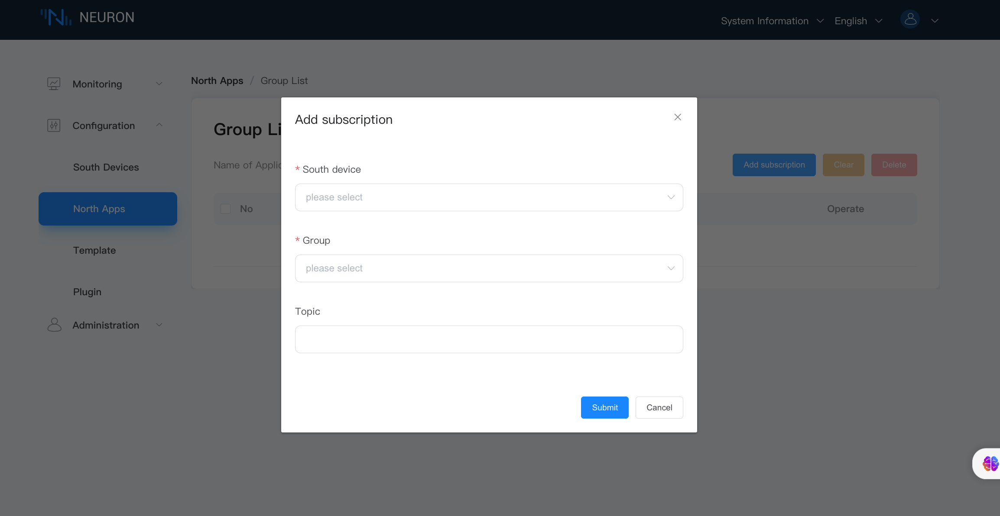
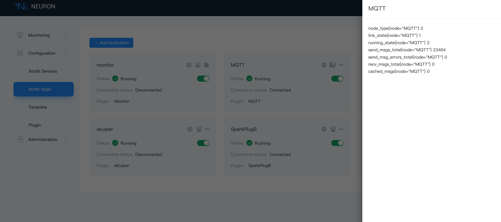

# Create a Northbound Application

Northbound plugins are used for connecting to IoT platforms or edge stream processing engines, while southbound plugins are designed for connecting to southbound devices to gather data. The combination of these two types of plugins facilitates data acquisition and delivery.

Neuron currently supports the following northbound nodes:

- **[MQTT](./mqtt/overview.md)**: The MQTT plugin allows users to quickly build IoT applications using the MQTT protocol for communication between devices and the cloud.
- [**eKuiper**](./ekuiper/overview.md): LF Edge [eKuiper](https://ekuiper.org/) is a lightweight IoT data analytics and stream processing engine. The eKuiper plugin enables users to forward collected data to eKuiper for further processing.
- **[SparkPlugB](./sparkplugb/overview.md)**: SparkPlugB is an industrial IoT data transmission specification built on MQTT 3.1.1. The SparkPlugB plugin allows data collected from devices to be transmitted from the edge to SparkPlugB applications via the SparkPlugB protocol. Users can also send commands from SparkPlugB applications to Neuron to modify device data.
- **[WebSocket](./websocket/websocket.md)**: The WebSocket protocol provides a two-way communication channel over a single TCP connection. With the WebSocket plugin, users can push collected data to a WebSocket server.
- **[Monitor](./monitor/overview.md)**: Neuron creates a Monitor singleton node at startup to monitor the running status of Neuron. You can see the Monitor node in the **North Apps** tab on the dashboard.

This section demonstrates the complete process of adding a northbound application using the MQTT plugin as an example, as well as how to subscribe to southbound data groups.

## Add a Northbound Application

To create a northbound MQTT node and connect it to an MQTT Broker to upload data, navigate to **Configuration -> North Apps** and click **Add Application** to add an MQTT client node:

- Name: The name of this application node, for example, "mqtt".
- Plugin: Select the MQTT plugin.

After clicking **Create**, you will be redirected to the **Application Configuration** page, where we will set up the parameters required for Neuron to establish a connection with the northbound application. You can also click the device configuration icon on the southbound device card to enter the **Application Configuration** interface.

## Application Configuration

Configure the relevant parameters for the MQTT client. 

Click the **Application Configuration** button on the application card to set the MQTT connection. For configuration items of the MQTT plugin, check the [MQTT Page](./mqtt/overview.md).

After clicking **Submit**, the configuration of the northbound application is completed, and the application card automatically enters the **Running** state.

## Device Cards

On the **North Apps** page, you can choose to display northbound applications in a list or card view. Here uses the device card as an example to explain the various options.

- **Name**: The unique name provided by the user for the northbound application.

- **Application Configuration**: Click this button to enter the configuration interface for setting the parameters required for Neuron to connect to southbound devices.

- **Edit**: Starting from version 2.5.0, Neuron supports updating node names. To change the name of the target node, click the **Edit** icon, and in the pop-up dialog box, modify the node name.

- **Data Statistics**: Statistics for the node.

- **DEBUG Log**: Print the DEBUG level log for the current node. After ten minutes, Neuron will revert to printing the default level of logs.

- **Delete**: Remove this node from the device list.

- Status: Displays the current status of the device node. Currently, the node has five working statuses.

  - **Initialize**: After adding a northbound application for the first time, it will enter the initialization state.
  - **Configure**: Enter the device configuration and enter the configuration state.
  - **Ready**: After successful configuration, enter the ready state.
  - **Running**: The application is in running status.
  - **Stop**: The application is stopped.
  
- **Connection Status**: Displays the connection status of the device.

- **Plugin**: Displays the name of the plugin module used by the device.

## Subscribe to Southbound Data

Data points are uploaded as a group. The northbound application needs to subscribe to a southbound group once created. 

Click on the MQTT node card, enter the **Group List** page, click **Add Subscription** to select the group to subscribe, and subscribe to the point group of the southbound device.

- Southbound Device: Choose the southbound device you wish to subscribe to, for example, modbus-tcp-1.
- Group: Select a group from the southbound device, for example, group-1.
- Topics (optional): Select the topic to subscrbe.  

## Operation and Maintenance

### Data Statistics

In the device card or device column, you can click on the data statistics chart to view the application running status, and the state of received and sent data.

Key field descriptions are as follows:

| Parameter             | Description                                                  |
| --------------------- | ------------------------------------------------------------ |
| send_msgs_total       | Total number of messages sent                                |
| send_msg_errors_total | Total number of failed messages sent                         |
| recv_msgs_total       | Total number of messages received                            |
| link_state            | Node connection status DISCONNECTED = 0  CONNECTED = 1 |
| running_state         | Node state  INIT = 1 READY = 2 RUNNING = 3 STOPPED = 4 |

### Troubleshooting

If there are any issues with device operation, you can click on the DEBUG log chart. The system will automatically print DEBUG level logs for that node and switch back to the system default log level after ten minutes. Later, you can click on **System Information** -> **Logs** at the top of the page to view logs and perform troubleshooting. For a detailed interpretation of system logs, see [Managing Logs](../../admin/log-management.md).

