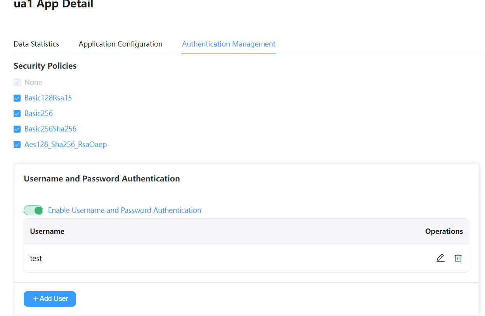
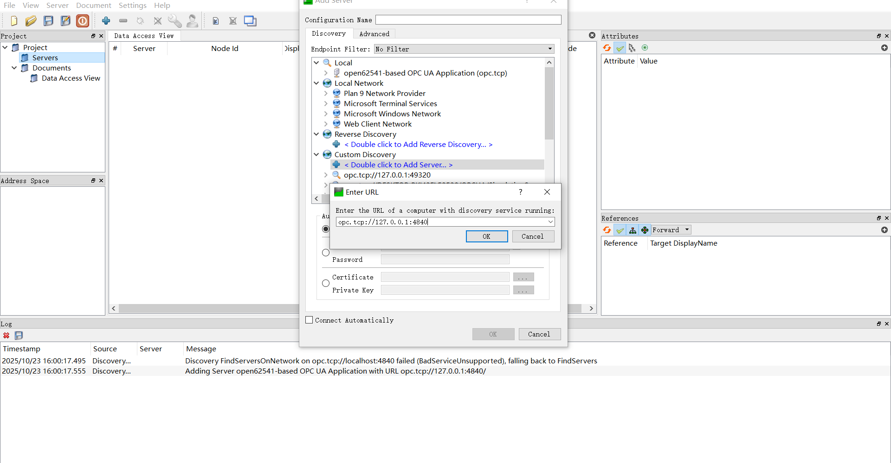
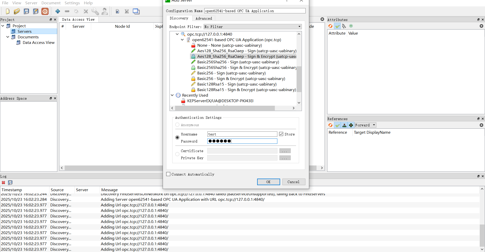
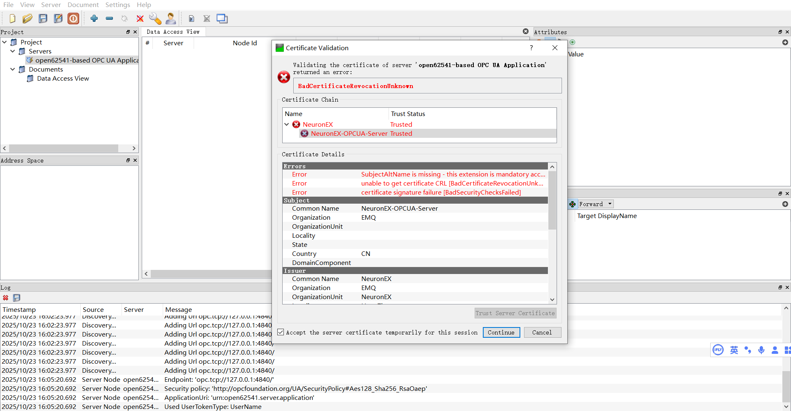
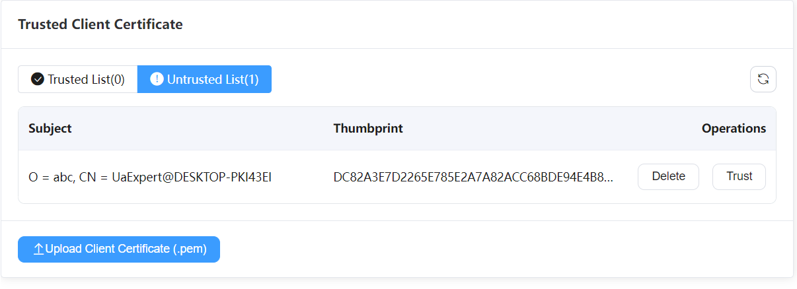
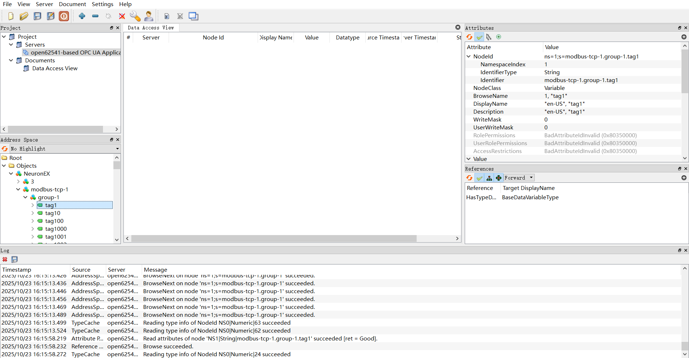
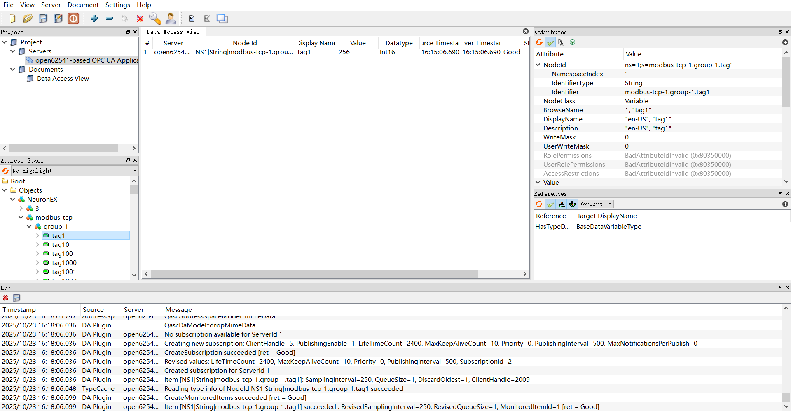

# Using UaExpert to Connect to Neuron OPC UA Server

This section demonstrates how to use UaExpert (a popular OPC UA client) to connect, trust certificates, subscribe to variables, and write values, to verify the Neuron OPC UA Server configuration.

## 1. Install UaExpert

Download and install UaExpert from the [Unified Automation official website](https://www.unified-automation.com/downloads.html).

## 2. Add Northbound OPC UA Server

1. Add a northbound OPC UA Server application, keep the default configuration, and click Submit.
2. Enter the application configuration page, switch to authentication management, and enable security policy and username/password authentication.

    
3. Subscribe to southbound driver data.

## 3. UaExpert Connection

1. Open UaExpert, click the **+** button on the toolbar, double-click **Custom Discovery** -> **< Double click to Add Server... >**, enter the OPC UA Server address in the dialog, and click **OK** to add the address to the end of the list.

    

2. Expand the subnodes under the address, select the appropriate connection policy, set the username and password, and click `OK` to add the connection to the **Project** view in UaExpert.
   
    

3. In the left **Project** view, right-click the target OPC UA Server under **Servers**, and select **Connect** from the context menu. A server certificate verification page will pop up, where you can check if the server certificate matches the one shown in the northbound application, then trust the server certificate and continue.
    

4. Since this is an unknown client connection, the northbound OPC UA Server application will return a `BadCertificateUntrusted` error. You need to manually trust the certificate in the northbound application authentication page, then reconnect.
    

5. Expand the subnodes in the left **Address Space** view. In the right **Attributes** panel, you can see the node's address information, where **NamespaceIndex** is the namespace index and **Identifier** is the node ID.

    

## 4. Monitoring and Writing

1. Drag subnodes from the **Address Space** view to the **Data Access View** to see the node's data type.
    
2. Modify the corresponding data point value on the southbound device and observe whether the subscribed node data changes.
3. Double-click the `Value` item to write data and observe whether the southbound device data changes.
