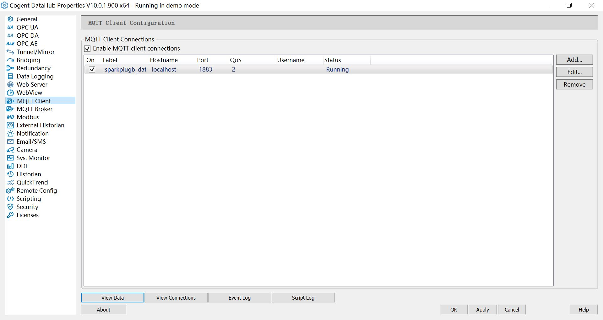

# Connect to Cogent

## Cogent setting

1. Download the CogentDataHub installation package from the official Cogent website and install it according to the official documentation.

2. Start an EMQX broker instance locally with the start command: `./bin/emqx start`.

3. Right-click on the Cogent icon in the system tray to open **Cogent DataHub**.

4. Open **MQTT Broker** and deselect `Enable MQTT Broker`.

5. Open **MQTT Client**, select `Enable MQTT client connections`, click `Add` button to add a new connection, select **Sparkplug B**, set `Type` to `Non-primary application`, set `Host Name/IP` to `localhost` and `Port` to `1883`.

## Neuron setting

1. Add a Sparkplug B application to the Neuron **Northbound Application Manager**.

2. Fill in the `Client ID`, `Group ID`, `Node ID`, `Server Address` and `Server Port` in **Application Configuration**, click `Submit` and start the connection.

3. Add the `Southbound devices` and `Groups` to the **Group** list that you want to subscribe to.

4. Click the `View Data` button on the Cogent DataHub main interface to see the test data being uploaded instantly.

