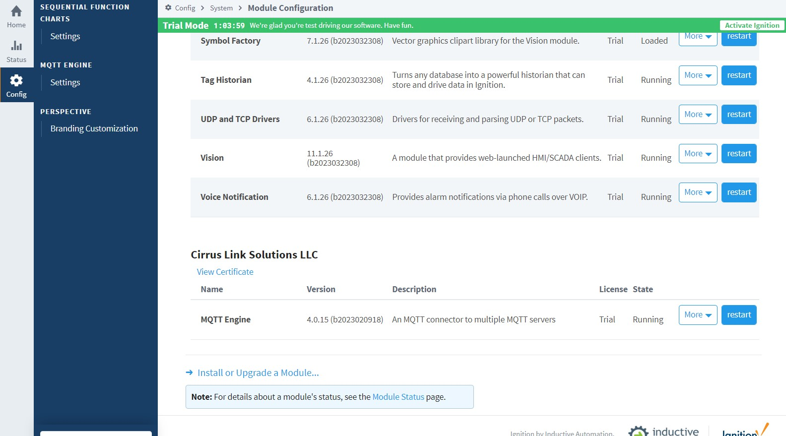
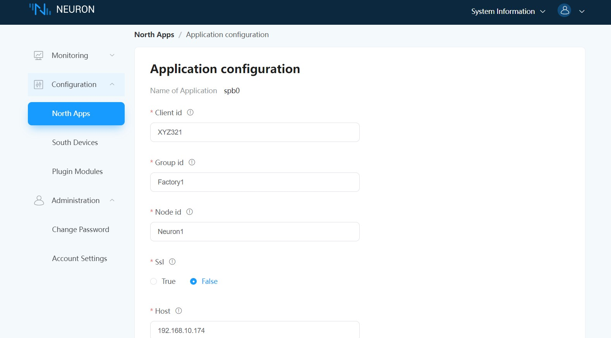
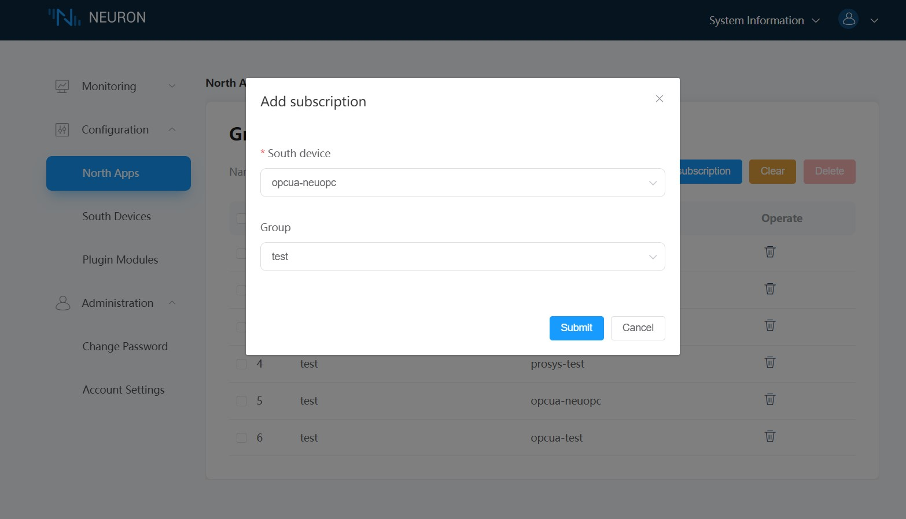

# Connect to Ignition

## Ignition setting

1. Download the Ignition installation package from the Ignition website and install it according to the official documentation.

2. Download the Designer Launcher installation package from the Ignition website and install it according to the official documentation.

3. Download the third-party module MQTT-Engine-signed.modl from the Ignition official website. login to the Ignition web administration page, go to the **Config** -> **Modules** page, click `Install or Upgrade a Module...` and install `MQTT-Engine-signed`.

4. Start an EMQX broker instance locally with the start command: `./bin/emqx start`.

5. Open **Config** -> **MQTT ENGINE/Setting** -> **Servers** -> **Setting**, click `Create new MQTT Server Setting... ` Create a connection with `Name` as EMQX, `URL` set to `tcp://localhost:1883`, click `Save Changes` to save the settings. 

## Neuron setting

1. Add a Sparkplug B application to the Neuron **Northbound Application Manager**.

2. Fill in the `Client ID`, `Group ID`, `Node ID`, `Server Address` and `Server Port` in **Application Configuration**, click `Submit` and start the connection.

3. Add the `Southbound devices` and `Groups` to the **group** list that you want to subscribe to.

## Ignition Designer setting

1. Open the Desiger Launcher desktop icon and click `Add Designer` to add the installed Ignition server URL.

2. After connecting to the Ignition server, open `samplequickstart`.

3. Find **Tag Browser** in the software interface and select `MQTT Engine`, expand `Edge Nodes\Factory1\Neuron1\opcua-kepserver\test` to see the instantly uploaded measurement point data.
