# WebSocket Plugin Data Upload Walkthrough

In this tutorial, we show how to upload data collected from south devices to a WebSocket server using the Neuron WebSocket plugin.

## Tutorial Setup

We use two PCs connected to a local area network in this tutorial. 

- One is a Linux machine with Neuron installed
- One is a Linux machine with a WebSocket server. Consult the [the installation instruction] on how to install Neuron.

|                  | PC 1              | PC 2                |
| ---------------- | ----------------- | ------------------- |
| Operating System | Linux             | Linux               |
| IP address       | 192.168.1.152     | 192.168.1.107       |
| Software         | Neuron            | Python 3.7          |
| Network          | Connected         | Connected           |

For this demonstration, you'll need a WebSocket server that communicates using the WebSocket protocol. You have the flexibility to choose any server software that supports WebSocket. To keep things straightforward, we'll use a simple Python program in this tutorial. The Python server program requires Python version 3.7 or higher and relies on the [websockets package] for implementation.

Run the following command to install the dependencies.

``` sh
$ pip install websockets
```

## Configure WebSocket Server

Following is our python server program, it listens at TCP port *8000*.

``` python
#!/usr/bin/env python

import asyncio
import websockets

async def echo(websocket):
    async for message in websocket:
        print(message)

async def main():
    async with websockets.serve(echo, "0.0.0.0", 8000):
        await asyncio.Future()  # run forever

asyncio.run(main())
```

Start the server program:

``` sh:no-line-numbers
$ python websockets.py

```

## Configure Neuron

### South devices

We need some south devices to collect data from. Any Neuron southbound plugin will do for this tutorial, for example, the [Modbus TCP plugin]. In this tutorial, we will use the [File plugin] to create south devices collecting data from local files. This makes things simple since we don't need an actual device and we can fake tag data by just modifying file contents.

#### Add the *file* Node

In the Neuron dashboard, click **Configuration -> South Devices -> Add Device** to add a node using the File plugin.
<figure align="center">
  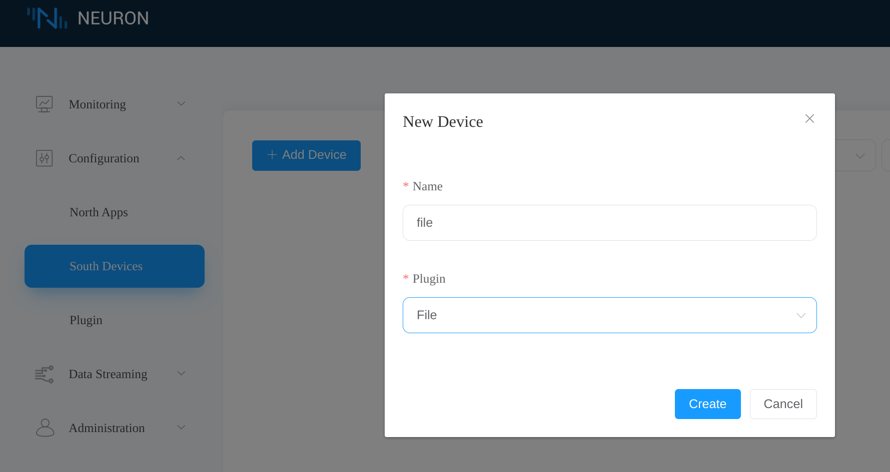
  <figcaption align = "center">
    <sub><b>Fig.1 - Add *file* node in Neuron dashboard</b></sub>
  </figcaption>
</figure>

Click the **Device configuration** icon to configure the *file* node.
<figure align="center">
  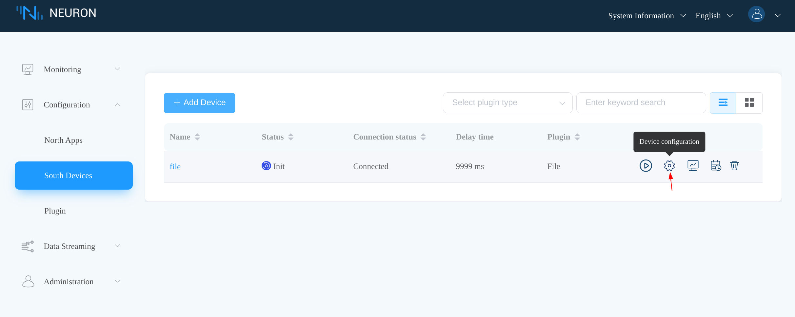
  <figcaption align = "center">
    <sub><b>Fig.2 - Neuron dashboard sourth devices tab</b></sub>
  </figcaption>
</figure>

Click **Submit** to keep the default settings. 
<figure align="center">
  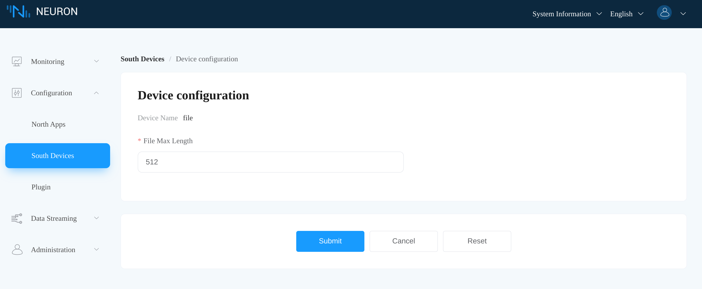
  <figcaption align = "center">
    <sub><b>Fig.3 - Configure the *file* node in the Neuron dashboard</b></sub>
  </figcaption>
</figure>

#### Create a Group

The *file* node should be in **Connected** state once configured. Click the *file* node to enter the **Group List** tab, then click **Create** to create a group.

<figure align="center">
  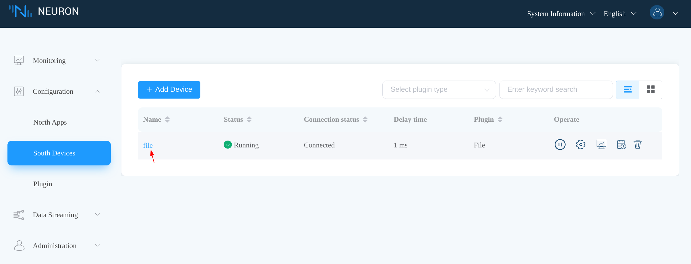
  <figcaption align = "center">
    <sub><b>Fig.4 - Neuron dashboard sourth devices tab showing *file* node connected</b></sub>
  </figcaption>
</figure>

We set the group name to *grp* and the interval to *1000*.
<figure align="center">
  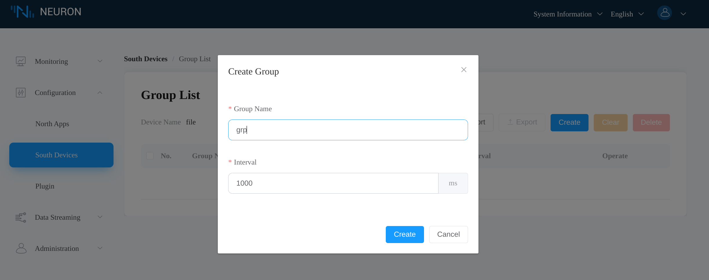
  <figcaption align = "center">
    <sub><b>Fig.5 - Add a group to the *file* node in Neuron dashboard</b></sub>
  </figcaption>
</figure>

#### Add Tag

Click the created *grp* group to enter the **Tag List** tab, then click **Create** to create a tag.
<figure align="center">
  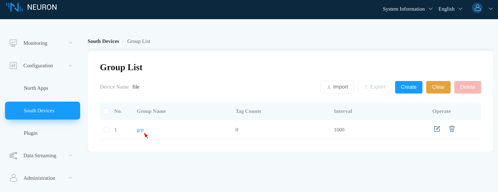
  <figcaption align = "center">
    <sub><b>Fig.6 - Neuron dashboard group list</b></sub>
  </figcaption>
</figure>

We name the tag *tag0* with type *STRING*. The tag address is set to *hello.txt* which represents the file in the working directory of the Neuron process.
<figure align="center">
  
  <figcaption align = "center">
    <sub><b>Fig.7 - Add a tag to the *file* node in Neuron dashboard</b></sub>
  </figcaption>
</figure>

### North app

#### Add the *WebSocket* Node

In the Neuron dashboard, click **Configuration -> North Apps -> Add Application** to add a node using the WebSocket plugin.
<figure align="center">
  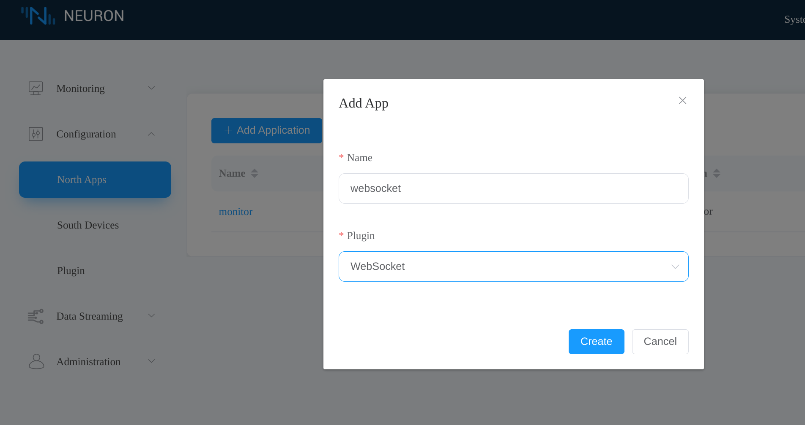
  <figcaption align = "center">
    <sub><b>Fig.8 - Add *websocket* node in Neuron dashboard</b></sub>
  </figcaption>
</figure>

Click the **Application Configuration** icon to configure the *WebSocket* node.
<figure align="center">
  
  <figcaption align = "center">
    <sub><b>Fig.9 - Neuron dashboard north apps tab</b></sub>
  </figcaption>
</figure>

We set the **host** parameter to *192.168.1.107* and **port** to *8000*, which is the address of our WebSocket server.
<figure align="center">
  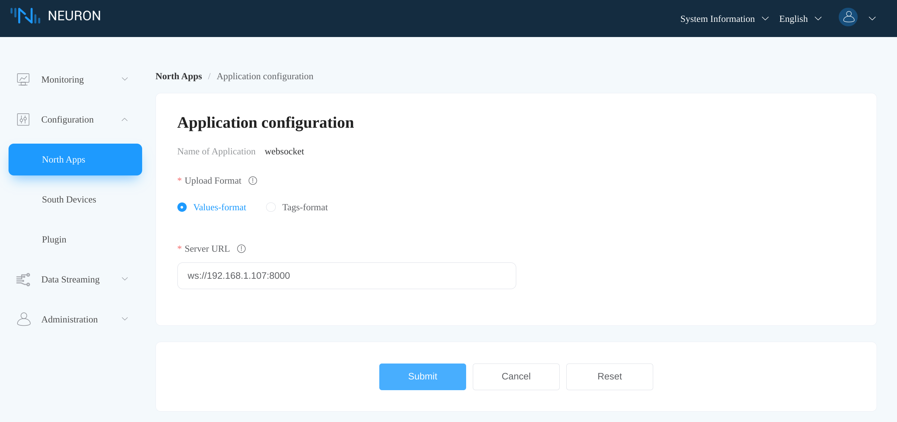
  <figcaption align = "center">
    <sub><b>Fig.10 - Configure *websocket* node in Neuron dashboard</b></sub>
  </figcaption>
</figure>

Once the configuration is submitted, the *WebSocket* node connects to the WebSocket server successfully.
<figure align="center">
  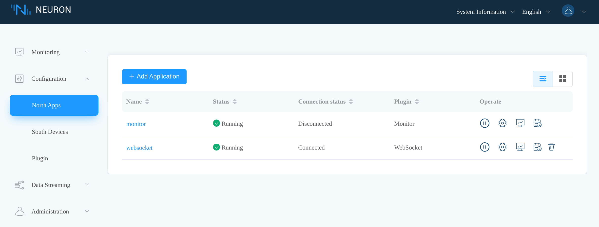
  <figcaption align = "center">
    <sub><b>Fig.11 - Neuron dashboard north apps tab showing *websocket* node connected</b></sub>
  </figcaption>
</figure>

#### Subscribe to the *File* Node

Click the *WebSocket* node to enter the **Subscription** tab. Then click **Add subscription**, select the *file* node and the *grp* group.
<figure align="center">
  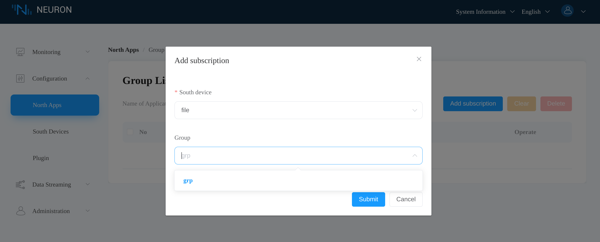
  <figcaption align = "center">
    <sub><b>Fig.12 - *websocket* node subscribe to *file* node</b></sub>
  </figcaption>
</figure>


## Monitor Data

After subscribing to the *grp* group of the *file* node, the *WebSocket* node will begin pushing data to the WebSocket server. In the Neuron dashboard, click **Monitoring -> Data monitoring**, then select the *file* node and the *grp* group. We see that Neuron reports an error code *1011* indicating the file *hello.txt* does not exist.

<figure align="center">
  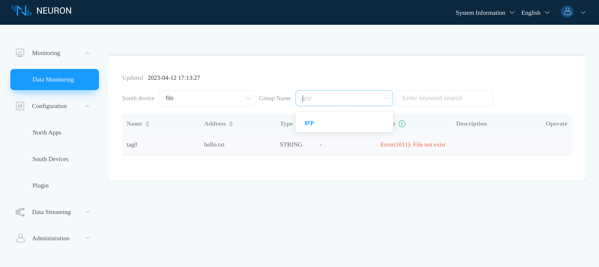
  <figcaption align = "center">
    <sub><b>Fig.13 - Neuron dashboard data monitoring tab showing error</b></sub>
  </figcaption>
</figure>

We can check the server output that it receives the data correctly. And sure, the received data says that *tag0* encounters the error code *1011*.
<figure align="center">
  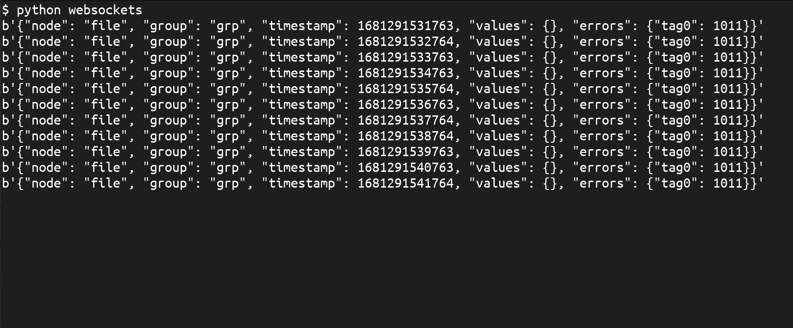
  <figcaption align = "center">
    <sub><b>Fig.14 - WebSocket server output showing error code 1011</b></sub>
  </figcaption>
</figure>

In the Neuron process working directory, create the *hello.txt* file with the content *world*.
``` sh:no-line-numbers
$ echo world > hello.tx
```

Now we can see that Neuron updates *tag0* correctly in the **Data monitoring** tab.
<figure align="center">
  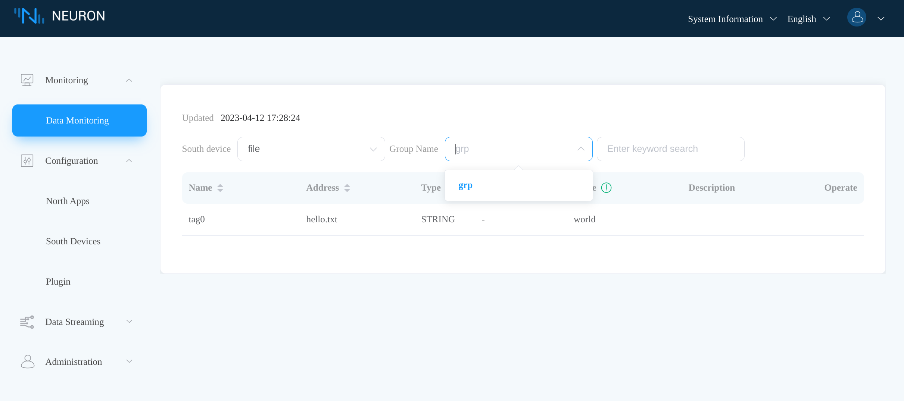
  <figcaption align = "center">
    <sub><b>Fig.15 - Neuron dashboard data monitoring tab showing updated value</b></sub>
  </figcaption>
</figure>

And the WebSocket server receives the correct tag data, *world*, which is expected.
<figure align="center">
  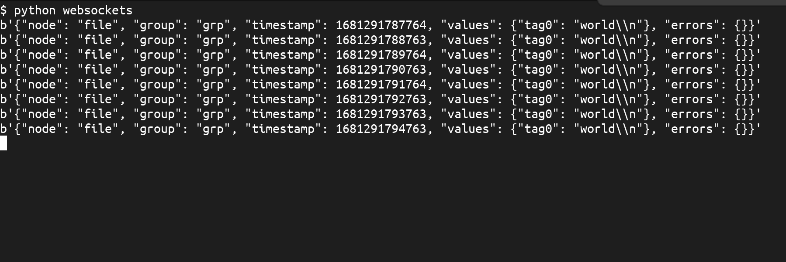
  <figcaption align = "center">
    <sub><b>Fig.16 - WebSocket server output showing correct value</b></sub>
  </figcaption>
</figure>

[websockets package]: https://websockets.readthedocs.io/en/stable/
[Modbus TCP plugin]: ../../south-devices/modbus-tcp/modbus-tcp.md
[File plugin]: ../../south-devices/file/file.md
[the installation instruction]: ../../../installation/installation.md
