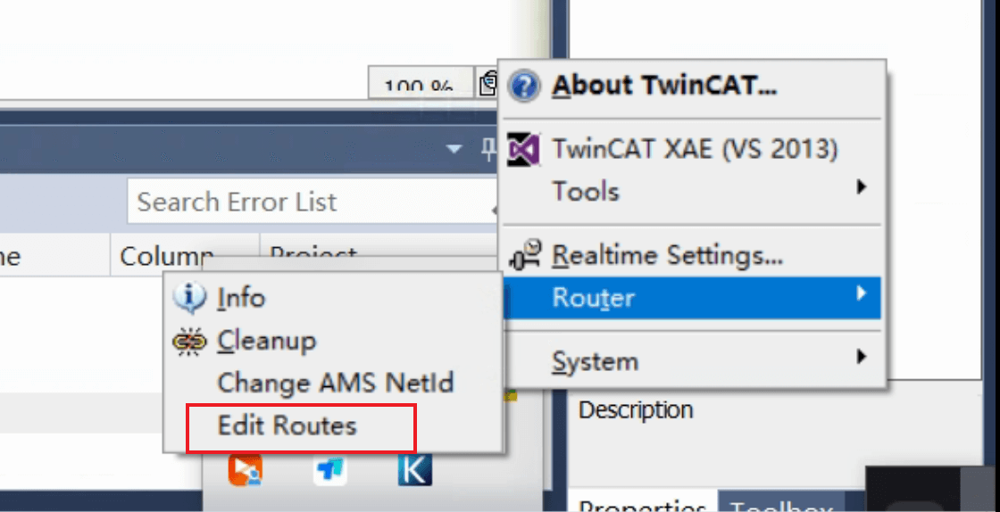
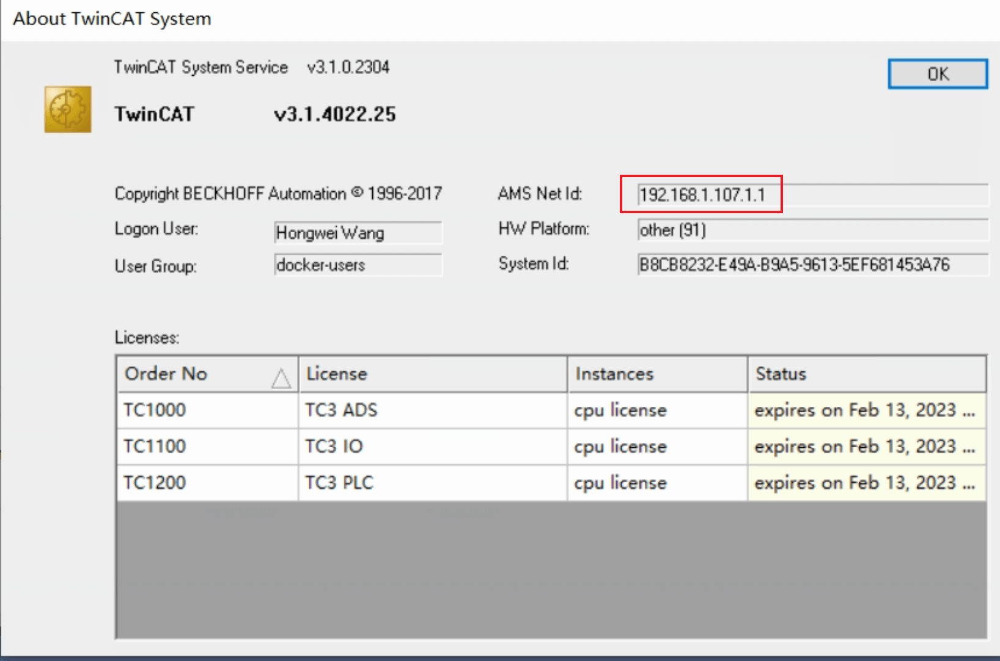
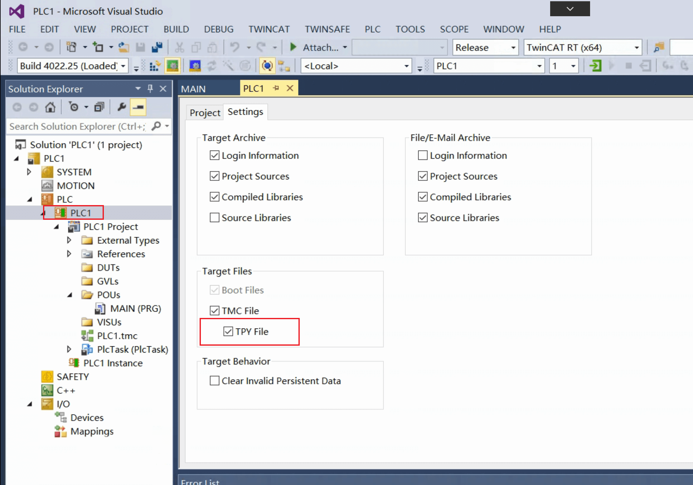
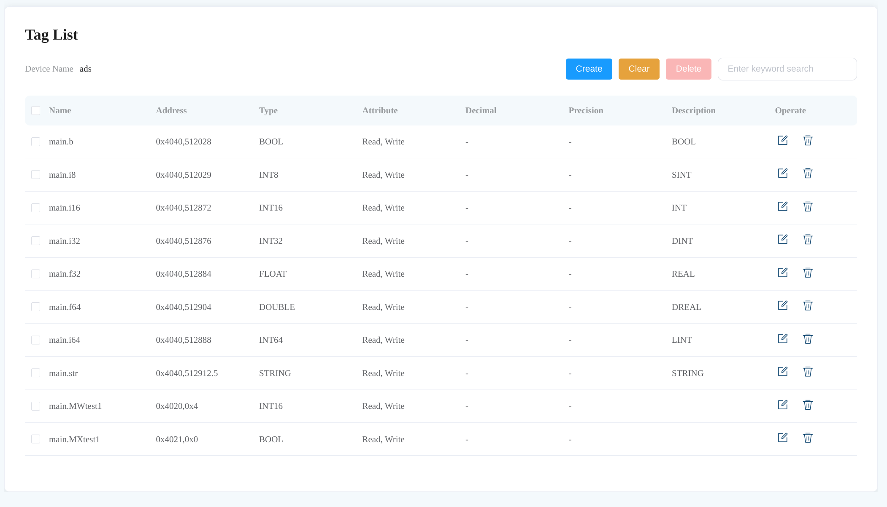
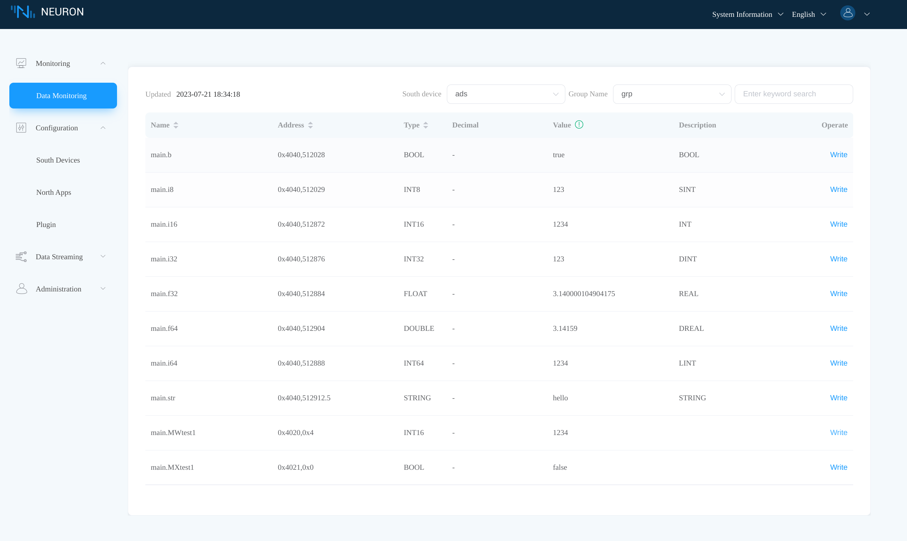
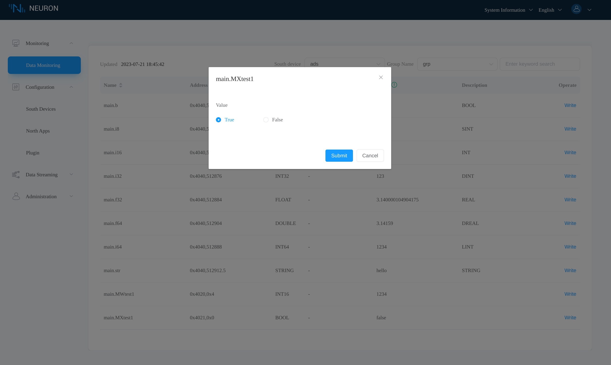
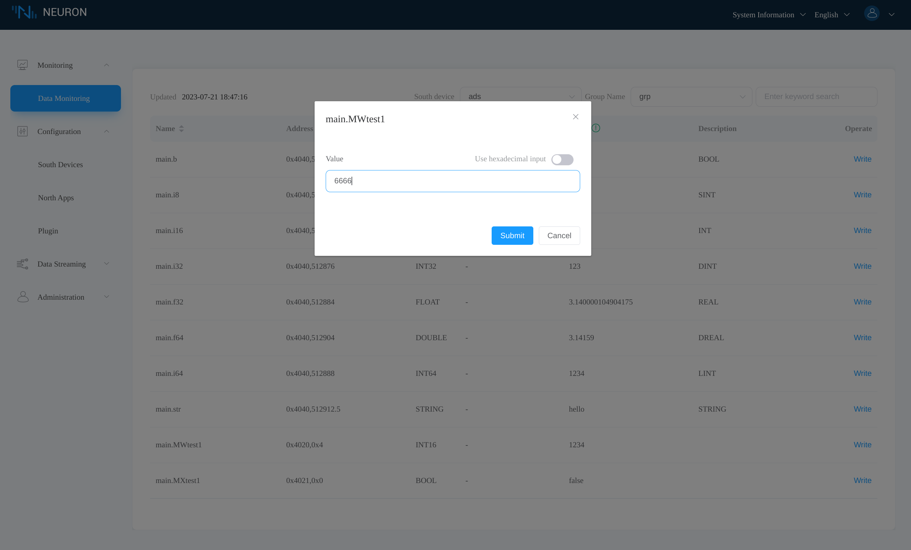
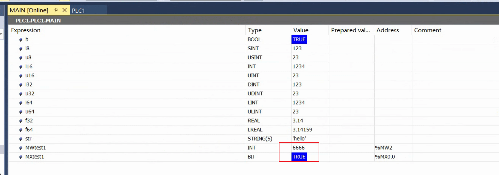

# Data acquisition using the Beckhoff ADS plugin

In this tutorial, we introduce how to collect data from Beckhoff software PLCs
using the Neuron ADS plugin.

## Setup

We use two PCs connected in a local area network in this tutorial. One is a
Linux machine with Neuron installed, the other is a Windows machine with
TwinCAT 3 installed.
Consult the [the installation instruction] on how to install Neuron.
Refer to the [Beckhoff TwinCAT website] to download and install TwinCAT.

|                  | PC 1              | PC 2                |
| ---------------- | ----------------- | ------------------- |
| Operating System | Linux             | Windows             |
| IP address       | 192.168.1.152     | 192.168.1.107       |
| AMS Net ID       | 192.168.1.152.1.1 | 192.168.1.107.1.1   |
| Software         | Neuron            | TwinCAT 3           |
| Network          | Connected         | Connected           |

## Setup TwinCAT

In order for Neuron and the TwinCAT PLC to communicate with each other, we first
need to add a static route for Neuron in TwinCAT. We also need to find the AMS Net
ID of the TwinCAT PLC and the index group and index offset of the variables.

### Add static route in TwinCAT

Open the **TwinCAT Static Routes** dialog

<figure align="center">
  
  <figcaption align = "center">
    <b>Fig.1 - Open the TwinCAT static routes dialog</b>
  </figcaption>
</figure>

Click **Add**

<figure align="center">
  
  <figcaption align = "center">
    <b>Fig.2 - TwinCAT static routes dialog</b>
  </figcaption>
</figure>

Provide the information as hilighted in the following image. Note that the
**AmsNetId** is the IP address of the Neuron PC appended with ".1.1".

<figure align="center">
  
  <figcaption align = "center">
    <b>Fig.3 - TwinCAT add route dialog</b>
  </figcaption>
</figure>

A successfully added route is shown as follow.

<figure align="center">
  
  <figcaption align = "center">
    <b>Fig.4 - TwinCAT static routes dialog updated</b>
  </figcaption>
</figure>

### Check the AMS Net ID and port number of the TwinCAT PLC

Open the **TwinCAT System** dialog to show the AMS Net ID.

<figure align="center">
  
  <figcaption align = "center">
    <b>Fig.5 - TwinCAT system dialog</b>
  </figcaption>
</figure>

By default, TwinCAT PLC port number is 851.

<figure align="center">
  
  <figcaption align = "center">
    <b>Fig.6 - TwinCAT PLC project tab</b>
  </figcaption>
</figure>

### Find the index group and index offset of variables

We use the following TwinCAT PLC program, which defines enough variables for
testing in this tutorial.

<figure align="center">
  
  <figcaption align = "center">
    <b>Fig.7 - TwinCAT PLC project main program</b>
  </figcaption>
</figure>

#### Find the index group

The [Beckhoff index group/offset page] lists the index group to access the PLC
memory range. For the %MW field, the index group is 0x4020. For the %MX field,
the index group is 0x4021.
For the variables *b、i8、u8、i16、u16、i32、u32、i64、u64、f32、f64、str*
defined in the main program, the index group is 0x4040.

<figure align="center">
  
  <figcaption align = "center">
    <b>Fig.8 - TwinCAT index group table</b>
  </figcaption>
</figure>

#### Find the index offset through the data area tab

Open the TwinCAT PLC data area tab to find the index offset of the variables.

<figure align="center">
  
  <figcaption align = "center">
    <b>Fig.9 - TwinCAT PLC data area tab</b>
  </figcaption>
</figure>

#### Find the index group/offset by TPY file

We could also find the index group and index offset through the TPY file.

First ensure **TPY File** is enabled.

<figure align="center">
  
  <figcaption align = "center">
    <b>Fig.10 - TwinCAT PLC project setting tab</b>
  </figcaption>
</figure>

Open the TPY file in the TwinCAT project directory.

<figure align="center">
  
  <figcaption align = "center">
    <b>Fig.11 - TwinCAT PLC project TPY file path</b>
  </figcaption>
</figure>

The TPY file contains the index group and index offset of each variable defined
in the PLC program.

<figure align="center">
  
  <figcaption align = "center">
    <b>Fig.12 - TwinCAT PLC project TPY file content</b>
  </figcaption>
</figure>

## Setup Neuron

### Add ADS south node

In the Neuron dashboard, click **South Devices -> Add Device** to add an ADS node.

<figure align="center">
  
  <figcaption align = "center">
    <b>Fig.13 - Add ADS south device in Neuron dashboard</b>
  </figcaption>
</figure>

### Configure the ADS node

Click the node configuration icon to configure the newly created ADS node.

<figure align="center">
  
  <figcaption align = "center">
    <b>Fig.14 - Configure ADS node in Neuron dashboard</b>
  </figcaption>
</figure>

### Add tags to the ADS node

For each variable in the aforementioned TwinCAT PLC program, we add a
corresponding tag to the Neuron ADS node. The [Beckhoff data types] page lists
the size of the data types. Together with the program source code we could
derive the data types of the tags.

<figure align="center">
  
  <figcaption align = "center">
    <b>Fig.15 - TwinCAT PLC main program</b>
  </figcaption>
</figure>

For tag addresses, the index offset component is shown in the TwinCAT PLC
data area tab.

<figure align="center">
  
  <figcaption align = "center">
    <b>Fig.16 - TwinCAT PLC data area tab</b>
  </figcaption>
</figure>

The following figure shows all added tags in the ADS node.

<figure align="center">
  
  <figcaption align = "center">
    <b>Fig.17 - ADS node tags in Neuron dashboard</b>
  </figcaption>
</figure>

## Data Monitor

### Read tags

Once the TwinCAT PLC is in running mode, we could see the variable values in the interface.

<figure align="center">
  
  <figcaption align = "center">
    <b>Fig.18 - TwinCAT variable values in running mode</b>
  </figcaption>
</figure>

In the Neuron dashboard, click **Monitoring -> Data Monitoring**, see that tag values are read correctly.

<figure align="center">
  
  <figcaption align = "center">
    <b>Fig.19 - Neuron data monitoring tab</b>
  </figcaption>
</figure>

### Write tags

In the Neuron **Data Monitoring** tab, click **Write** on the *main.MXtest1* tag
to write a true value.

<figure align="center">
  
  <figcaption align = "center">
    <b>Fig.20 - Neuron write main.MXtest1</b>
  </figcaption>
</figure>

Click **Write** on the *main.MWtest1* tag to write the value *6666*.

<figure align="center">
  
  <figcaption align = "center">
    <b>Fig.21 - Neuron write main.MWtest1</b>
  </figcaption>
</figure>

After a successful write, we could check that variable values do update in TwinCAT.

<figure align="center">
  
  <figcaption align = "center">
    <b>Fig.22 - TwinCAT variable values updated</b>
  </figcaption>
</figure>

[the installation instruction]: ../../../../installation/installation.md
[Beckhoff TwinCAT website]: https://www.beckhoff.com/en-us/products/automation/twincat
[Beckhoff index group/offset page]: https://infosys.beckhoff.com/english.php?content=../content/1033/tcadscommon/12495369867.html
[Bechhoff data types]: https://infosys.beckhoff.com/english.php?content=../content/1033/tc3_plc_intro/2529399691.html
