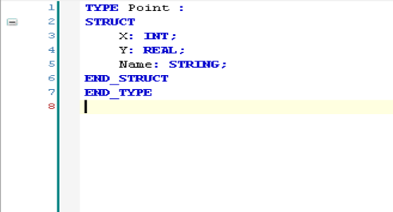
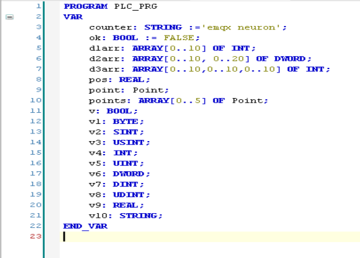
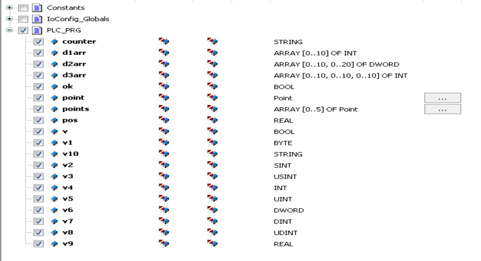

# Connecting to the CODESYS V3 PLC Simulator

This document demonstrates how to use the CODESYS V3 TCP plugin to connect to the CODESYS V3 PLC simulator for reading and writing data.

## Installation of the CODESYS V3 Development Environment

The installation package for the CODESYS V3 development environment can be downloaded from the official CODESYS website. The version used in this example is CODESYS V3.5 SP12. There may be slight differences between versions, but the overall process is similar.

## Creating a New Project

- Click **File -> New Project**, select **Standard project** and name it **test**.
- Select **CODESYS Control Win v3 x64** for the device and **Structured Text (ST)** for PLC_PRG.
- Right-click **Application** and add an object **DUT**, then create a new structure **Point** with the following definition.

- Open **PLC_PRG** and define variables as shown below.

- Right-click **Application**, add an object **Symbol Configuration**, click **Build**, and select variables to export as shown below.
 
- Click **Build**, then **Build -> Generate Code**. The symbol file `test.Device.Application.xml` will be generated in the project directory with the following content.
```xml
<?xml version="1.0" encoding="utf-8"?>
<Symbolconfiguration xmlns="http://www.3s-software.com/schemas/Symbolconfiguration.xsd">
  <Header>
    <Version>3.5.11.0</Version>
    <SymbolConfigObject version="3.5.12.0" runtimeid="3.5.12.0" libversion="3.5.11.0" compiler="3.5.12.0" lmm="3.5.12.0" profile="CODESYS V3.5 SP12+" settings="SupportOPCUA, XmlIncludeComments, LayoutCalculator=OptimizedClientSideLayoutCalculator" />
    <ProjectInfo name="test" devicename="Device" appname="Application" />
  </Header>
  <TypeList>
    <TypeSimple name="T_BOOL" size="1" swapsize="0" typeclass="Bool" iecname="BOOL" />
    <TypeSimple name="T_BYTE" size="1" swapsize="1" typeclass="Byte" iecname="BYTE" />
    <TypeSimple name="T_DINT" size="4" swapsize="4" typeclass="DInt" iecname="DINT" />
    <TypeSimple name="T_DWORD" size="4" swapsize="4" typeclass="DWord" iecname="DWORD" />
    <TypeSimple name="T_INT" size="2" swapsize="2" typeclass="Int" iecname="INT" />
    <TypeSimple name="T_REAL" size="4" swapsize="4" typeclass="Real" iecname="REAL" />
    <TypeSimple name="T_SINT" size="1" swapsize="1" typeclass="SInt" iecname="SINT" />
    <TypeSimple name="T_STRING" size="81" swapsize="0" typeclass="String" iecname="STRING" />
    <TypeSimple name="T_UDINT" size="4" swapsize="4" typeclass="UDInt" iecname="UDINT" />
    <TypeSimple name="T_UINT" size="2" swapsize="2" typeclass="UInt" iecname="UINT" />
    <TypeSimple name="T_USINT" size="1" swapsize="1" typeclass="USInt" iecname="USINT" />
    <TypeArray name="T_ARRAY__0__10__0__10__0__10__OF_INT" size="2662" nativesize="2662" typeclass="Array" iecname="ARRAY [0..10, 0..10, 0..10] OF INT" basetype="T_INT">
      <ArrayDim minrange="0" maxrange="10" />
      <ArrayDim minrange="0" maxrange="10" />
      <ArrayDim minrange="0" maxrange="10" />
    </TypeArray>
    <TypeArray name="T_ARRAY__0__10__0__20__OF_DWORD" size="924" nativesize="924" typeclass="Array" iecname="ARRAY [0..10, 0..20] OF DWORD" basetype="T_DWORD">
      <ArrayDim minrange="0" maxrange="10" />
      <ArrayDim minrange="0" maxrange="20" />
    </TypeArray>
    <TypeArray name="T_ARRAY__0__10__OF_INT" size="22" nativesize="22" typeclass="Array" iecname="ARRAY [0..10] OF INT" basetype="T_INT">
      <ArrayDim minrange="0" maxrange="10" />
    </TypeArray>
    <TypeUserDef name="T_Point" size="89" nativesize="92" typeclass="Userdef" pouclass="STRUCTURE" iecname="Point">
      <UserDefElement iecname="X" type="T_INT" byteoffset="0" vartype="VAR" />
      <UserDefElement iecname="Y" type="T_REAL" byteoffset="4" vartype="VAR" />
      <UserDefElement iecname="Name" type="T_STRING" byteoffset="8" vartype="VAR" />
    </TypeUserDef>
    <TypeArray name="T_ARRAY__0__5__OF_Point" size="552" nativesize="552" typeclass="Array" iecname="ARRAY [0..5] OF Point" basetype="T_Point">
      <ArrayDim minrange="0" maxrange="5" />
    </TypeArray>
  </TypeList>
  <NodeList>
    <Node name="Application">
      <Node name="PLC_PRG">
        <Node name="counter" type="T_STRING" access="ReadWrite" />
        <Node name="d1arr" type="T_ARRAY__0__10__OF_INT" access="ReadWrite" />
        <Node name="d2arr" type="T_ARRAY__0__10__0__20__OF_DWORD" access="ReadWrite" />
        <Node name="d3arr" type="T_ARRAY__0__10__0__10__0__10__OF_INT" access="ReadWrite" />
        <Node name="ok" type="T_BOOL" access="ReadWrite" />
        <Node name="point" type="T_Point" access="ReadWrite" />
        <Node name="points" type="T_ARRAY__0__5__OF_Point" access="ReadWrite" />
        <Node name="pos" type="T_REAL" access="ReadWrite" />
        <Node name="v" type="T_BOOL" access="ReadWrite" />
        <Node name="v1" type="T_BYTE" access="ReadWrite" />
        <Node name="v10" type="T_STRING" access="ReadWrite" />
        <Node name="v2" type="T_SINT" access="ReadWrite" />
        <Node name="v3" type="T_USINT" access="ReadWrite" />
        <Node name="v4" type="T_INT" access="ReadWrite" />
        <Node name="v5" type="T_UINT" access="ReadWrite" />
        <Node name="v6" type="T_DWORD" access="ReadWrite" />
        <Node name="v7" type="T_DINT" access="ReadWrite" />
        <Node name="v8" type="T_UDINT" access="ReadWrite" />
        <Node name="v9" type="T_REAL" access="ReadWrite" />
      </Node>
    </Node>
  </NodeList>
</Symbolconfiguration>
```
## Start the Simulator and Download the Program

- Run `CODESYS Control Win v3 x64` directly from the Windows menu bar.
- Switch the development environment to the **Device** configuration page, press `Enter` to connect to the simulator. The first connection will prompt for username and password.
- Log in to the simulator with the configured username and password, download the program, and run it.
- 
## Configure Neuron Node to Connect to CODESYS V3 Simulator
- In the **Southb Devices**, click **Add Device** and select the **CODESYS V3 TCP** plugin to create a node for connecting to the CODESYS V3 simulator.
- After creating the node, click **Device Configuration** to enter the configuration page and configure the node information based on the actual situation.
	- **Device IP Address**: The IP address of the device, which is the IP address of the host running the simulator.
	- **Device Port**: The port of the device, default is 11740.
	- **Connection Timeout**: Default is 3000.
	- **Username**: The configured username.
	- **Password**: The configured password.
- Create groups and points in the created southbound device node, and concatenate the point addresses according to the NodeList in the exported XML file.
- Go to the Neuron **Data Monitoring**, select the corresponding device and group, and view the collected data points as shown below.

