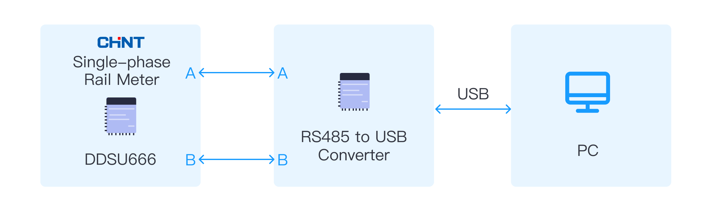

# Connect to Chint Single-phase Rail Meter

The Chint Single-phase Rail Meter is a DIN rail-mounted device designed for measuring and recording power consumption in single-phase circuits. Commonly deployed in residential, commercial, and industrial settings, it collects crucial power data via sensors connected within the circuit.

The meter leverages the [RS485 communication protocol](#rs485), widely recognized in the power industry for remote communication and data transfer between multiple devices. This makes it possible to seamlessly transmit data from the meter to various devices or systems for monitoring and analysis.

Lastly, this guide will demonstrate how to [convert data](#converter) from the Chint Single-phase Rail Meter into a format compatible with the RS485 protocol. It will also cover the use of the Neuron DLT645-2007 plugin to gather and forward this data, streamlining the process of power consumption monitoring and data management.

The connection diagram is as follows:

### Device Model

Chint Single-phase Rail Meter (DDSU666), 220V 5(60)A.

## Install Drivers

Most USB to RS485 converter drivers can be downloaded from the device manufacturer's official website. The driver typically provides an interface compatible with the operating system to enable communication with the converter.

In the Windows system, when a USB to RS485 converter is plugged in, the system usually automatically recognizes and installs the driver. If the system cannot recognize the device automatically, the driver can be installed manually by following the instructions in the driver installation wizard.

In operating systems like Linux and macOS, it may be necessary to manually install the driver. Some converter manufacturers provide drivers and guides specifically for these operating systems.

Note that if an older USB to RS485 converter is used, an older version of the driver may need to be installed or specific software may need to be used. It is recommended to consult the device manufacturer's documentation for the latest driver and operating instructions before using the converter.

## Get Port Information 

In the Windows operating system, the **Device Manager** can be used to view the computer's serial (COM) and parallel (LPT) ports.

Here is how to view serial ports:

1. Open **Device Manager**: This can be done by opening the Control Panel and clicking on **Device Manager**, or by typing **Device Manager** in the Windows search bar.
2. Expand **Ports (COM & LPT)**: Find the **Ports (COM & LPT)** option in the Device Manager and expand it to view the list of available serial ports in the computer.
3. View serial port properties: Right-click on the serial port and select the **Properties** option to view detailed information about the serial port, including its name, status, and baud rate.
If further testing of the serial port is needed, a serial port debugging tool such as RealTerm or TeraTerm software can be used for testing.

Note that the method for viewing and managing serial ports may vary slightly in operating systems like Linux and macOS. The terminal or relevant tools in the operating system can be used to view and manage serial ports.

## Configure Neuron

In the Neuron UI interface, follow these steps:

1. Add a DL/T645-2007 device in the southbound devices and complete the device configuration.

   * Address: 210220003011

   * Stop bit: 1

   * Parity: Even

   * Baud rate: 9600

   * Data bits: 8

2. Click on the DL/T645-2007 device card and create a group.
3. Create tags in the group, you may refer to the table below for reference. 

   | Name            | Attribute  | Type   | Address                  | Decimal     |
| --------------- | ---------- | ------ | ------------------------ | -------- |
| Phase A voltage | Read       | UINT16 | 210220003011#02-01-01-00 | 0.1     |
| Phase A current | Read       | UINT32 | 210220003011#02-02-01-00 | 0.001   |
| Instantaneous active power of phase A  | Read      | UINT32 | 210220003011#02-03-01-00 |  0.0001  |

## Further Reading

### RS485

RS-485 is a standard for serial communication transmission of data over long distances. It is an improvement over RS-232 in terms of speed, distance, and noise immunity.

RS-485 uses differential signaling, meaning it transmits data using two wires, one carrying the positive signal and the other carrying the negative signal. This allows for noise cancellation and makes it less susceptible to interference.

RS-485 can support up to 32 devices on a single bus, with distances of up to 1,200 meters at a speed of 100 kbps. At lower speeds, the distance can be increased up to 4,000 meters.

RS-485 is commonly used in industrial automation, process control, and building automation systems. It is also used in applications where multiple devices need to communicate over long distances, such as security systems and remote monitoring systems.

The RS-485 interface typically uses two signal wires, namely A and B, for data transmission. Data is encoded and decoded by the voltage difference between the A and B wires to achieve data transmission and reception. It also supports half-duplex communication mode, which means that data can only be sent or received at the same time.

### Converter

A USB to RS485 converter is a device that converts the USB interface to the RS485 interface. It can convert data sent from a computer into RS485 signals and transmit data to other devices through the RS485 bus.

The USB to RS485 converter typically consists of a USB interface, an RS485 interface and a chip. The chip is responsible for converting USB data into RS485 signals and managing data transfer rates and flow control.

Using a USB to RS485 converter makes it convenient to connect a computer with devices that use the RS485 interface, enabling data transmission and communication. It is widely used in automation control, instrumentation, industrial communication, and smart home applications.
