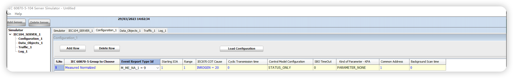

# Connect to IEC 60870-5-104 Server Simulator

This article will use the IEC60870-5-104 plugin of Neuron to connect to [IEC60870-5-104 Server Simulator](https://www.freyrscada.com/iec-60870-5-104-Client-Simulator.php), which supports the collection of multiple data types and control.

## Install IEC 60870-5-104 Server Simulator

You can download the IEC6087-5-104 Server Simulator from [here](https://sourceforge.net/u/freyrscada/profile/), the trial version of the emulator will automatically shut down after 15 minutes of operation, save the configuration data in time. 
Download and unzip the IEC6087-5-104 Server Simulator executable file, click install.

### Configure Simulator

1. Open **IEC 60870-5-104 Server Simulator**.
2. Click **Add Server** to create a server.
3. Modify the configuration in table **IEC104-SERVER_1**, and modify the value of the **Source IP Address** to 0.0.0.0 .
4. In table **Configuration_1**, click **Add Row** to create a tag, **IEC60870-5 Group to Choose** menu selection **Measured Normalized**, **Event Report Type Id** menu selection **M_ME_NA_1=9**.
5. Other parameters keep their default value, **IOA** default 1, and **Common Address** default 1.

6. Click **Load Configuration** and then click **Start Communication** to run server.

### Configure Neuron

1. Go to Neuron Dashboard, and create a south node with the **IEC60870-5-104 plugin**.
2. Click **Device Configuration** and then **Device IP Address** fill in the simulator address, other parameters keep default value.
3. Create a group, and then create a tag in that group with tag address **1**.

* In **Monitoring -> Data Monitoring** page, you can see the tag value after selecting **South device** and **Group name**.

## Data Monitoring

After completing the point configuration, you can click **Monitoring** -> **Data Monitoring** to view device information and control devices. For details, refer to [Data Monitoring](../../../../../usage/monitoring.md).