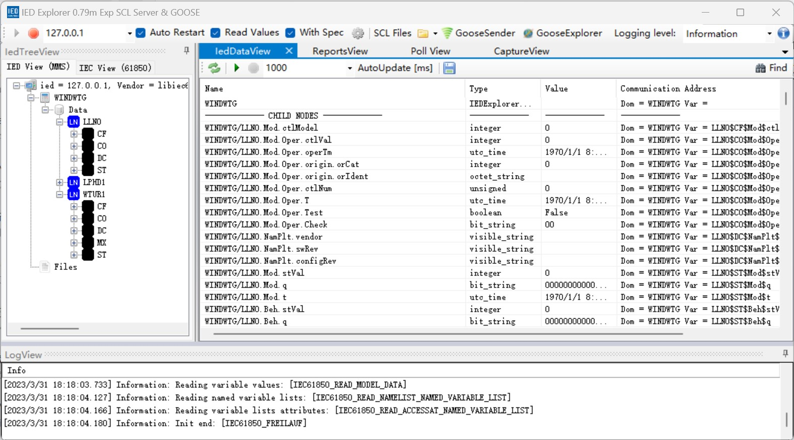

# Connect to LibIEC61850 Server

libiec61850 is an open-source (GPLv3) implementation of an IEC 61850 client and server library implementing the protocols MMS, GOOSE and SV. This section introduces how to use Neuron IEC61850 plugin to connect LibIEC61850 Server.

## Install LibIEC61850

Go to https://github.com/mz-automation/libiec61850 to download the source code, follow the instructions on the project page to compile the source code, here is a demonstration of the compilation and installation on Ubuntu systems.

```sh
$ cd libiec61850
$ mkdir build
$ cd build
$ cmake .. && make -j4
$ cd sudo ./examples/server_example_61400_25/server_example_61400_25
```

## Install IEDExplorer

1. Go to https://sourceforge.net/projects/iedexplorer/ to download IEDExplorer.

2. Open IEDExplorer_0.79n.exe and set the IP address and port of the **server_example_61400_25** server to listen on and start the connection.


## Configure Neuron

1. Adding an IEC61850 device to the Neuron southbound device management;

2. Change the **Device IP Address** to the IP address of the **server_example_61400_25** server listening in the device configuration.

3. Change the **Device Port** to **server_example_61400_25** in the device configuration for the port the server is listening on.

4. Leave the other configuration parameters as default and submit the settings form.

6. Add **Group**, add from test **Tag**.

## Test Data List

| Name | Address                                 | Attribute | Data Type  |
| ---- | ------------------------------------- | ---- | ------ |
| CF1  | GenericIO/GGIO1$CF$Mod$ctlModel       | Read | INT8   |
| CO1  | GenericIO/GGIO1$CO$SPCSO1$Oper$ctlNum | Read | UINT8  |
| CF2  | GenericIO/GGIO1$CF$SPCSO1$ctlModel    | Read | INT16  |
| CO2  | GenericIO/GGIO1$CO$SPCSO2$Oper$ctlNum | Read | UINT16 |
| CF3  | GenericIO/GGIO1$CF$SPCSO2$ctlModel    | Read | INT32  |
| ST1  | GenericIO/GGIO1$ST$SPCSO4$Oper$ctlNum | Read | UINT32 |
| CF4  | GenericIO/GGIO1$CF$SPCSO3$ctlModel    | Read | INT64  |
| ST2  | GenericIO/GGIO1$ST$SPCSO1$ctlNum      | Read | UINT64 |
| MX1  | GenericIO/GGIO1$MX$AnIn1$mag$f        | Read | FLOAT  |
| MX2  | GenericIO/GGIO1$MX$AnIn3$mag$f        | Read | DOUBLE |
| CO3  | GenericIO/GGIO1$CO$SPCSO1$Oper$Test   | Read | BOOL   |
| DC1  | GenericIO/LLN0$DC$NamPlt$vendor       | Read | STRING |

## Data Monitoring

After completing the point configuration, you can click **Monitoring** -> **Data Monitoring** to view device information and control devices. For details, refer to [Data Monitoring](../../../usage/monitoring.md).
