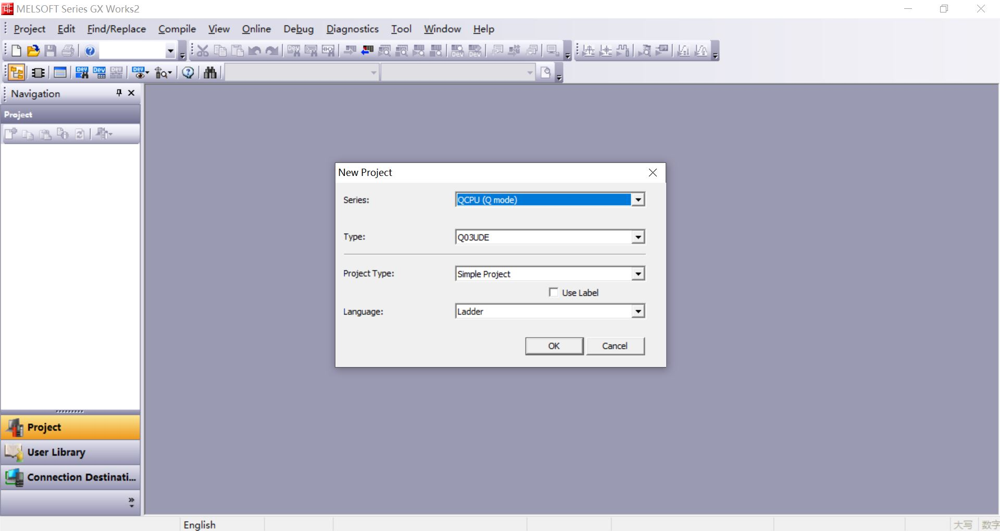
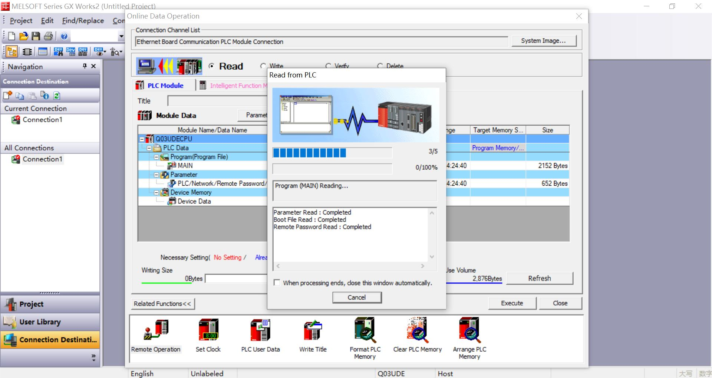
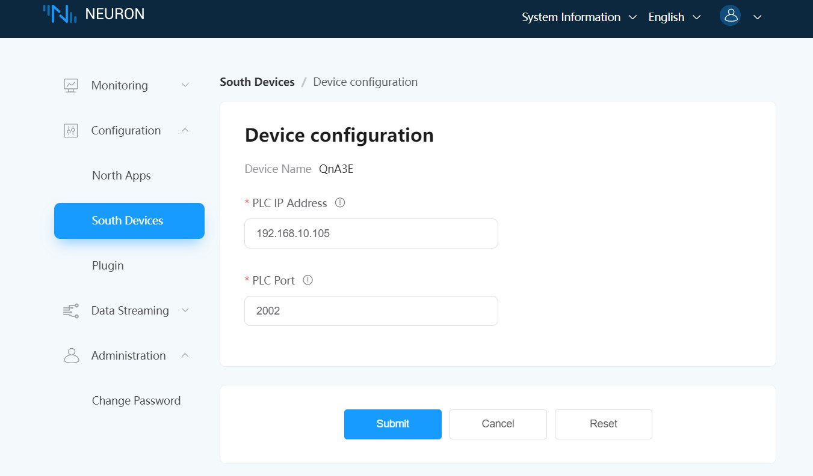

# Connect to Q03UDE

The Q03UDE, a flagship product in Mitsubishi Electric's Q series of PLCs, is engineered for complex and large-scale automation applications, delivering high performance and a comprehensive suite of features.

This section introduces how to connect Q03UDE using the Neuron Mitsubishi 3E plugin.

## Configure the PLC

1. Open the GX Works2 PLC programming software and create a new project, **Series** select **QCPU(Q mode)**, **Type** select **Q03UDE**, Click **OK**.

2. Click **Connection Destination** -> **Connection1** -> **PLC Direct Coupled Setting** -> **Ethernet**, set **Adapter** and **IP Address**, Click **OK**.

3. Click on the menu **Online** -> **Read from PLC** -> **Select All** -> **Execute**.

4. Click **Navigation** -> **Parameter** -> **PLC Parameter** -> **Open Setting**, **Protocol** select **TCP**, **Open System** select **MC Protocol**, Set **Host Station Port No.**, Click **End**.

5. Click on the menu **Online** -> **Write to PLC** -> **Execute**.

## Configure Neuron

1. In Neuron, add a Mitsubishi 3E device under **Configuration** -> **South Devices**. 

2. Change the **PLC IP Address** to the target device IP address in the device configuration.

3. Modify **PLC Port** as the target device port in the device configuration and submit the setup form.

4. Add **Group**, add test **tag**.

## Test Data List

| Name |  Address    | Attribute | Data type   |
| ---- | --------| ---- | ------ |
| DATA1  | D0    | Read Write | INT16  |
| DATA2  | D1    | Read Write | UINT16 |
| DATA3  | D2    | Read Write | INT32  |
| DATA4  | D4    | Read Write | UINT32 |
| DATA5  | D6    | Read Write | FLOAT  |
| DATA6  | D8    | Read Write | DOUBLE |
| DATA7  | X0    | Read       | BIT    |
| DATA8  | Y0    | Read Write | BIT    |
| DATA9  | D20.0 | Read       | BIT    |
| DATA10  | D100.16  | Read Write | STRING |
