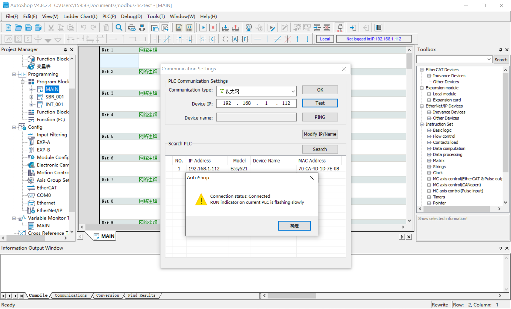
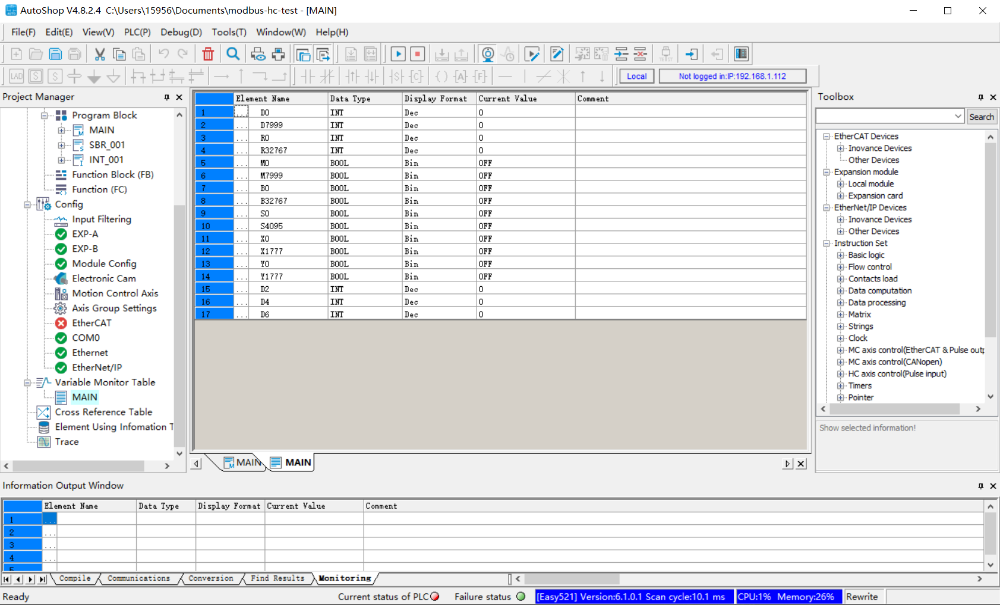

# Connect to Easy521

This article will use the Inovance Modbus TCP plugin to connect to the Inovance Easy521 PLC for reading and writing tags within the PLC.

The Inovance Modbus TCP plugin requires connection to the Inovance PLC via the local area network, so please ensure that the PLC and Neuron are in the same local area network.

## Prerequisites

This section assumes that It is already possible to use Inovance Programming Software AutoShop to connect to the Inovance Easy521 PLC and view the tags in the PLC.

## Get PLC Point Positions

1. Select **Test communication status** from the top right menu bar, open the Communication Settings window, search for the PLC, and configure its IP address, Subnet mask, etc.

2. From the left menu, select **Variable Monitor Table**, open the MAIN window, and manually add components. You can view the supported data areas and address ranges of the PLC. After adding, click **Monitoring** in the top menu bar to monitor point data in real time.

## Configure Neuron
* In Neuron, click **Configuration** -> **South Devices**. Click on **Add Device** in the **South Devices** and select the Inovance Modbus TCP plugin to create a node to connect to the Easy521 PLC.
* After creating the node, click on **Device Configuration** to enter the device configuration page. Configure the node information according to the actual situation,
	* **PLC IP Address**: PLC device IP address
	* **PLC Port**: PLC device port, the default is 502
* In the created south-device node, create a group and create some point positions under the group.

## Data Monitoring

After completing the point configuration, you can click **Monitoring** -> **Data Monitoring** to view device information and control devices. For details, refer to [Data Monitoring](../../../../../admin/monitoring.md).