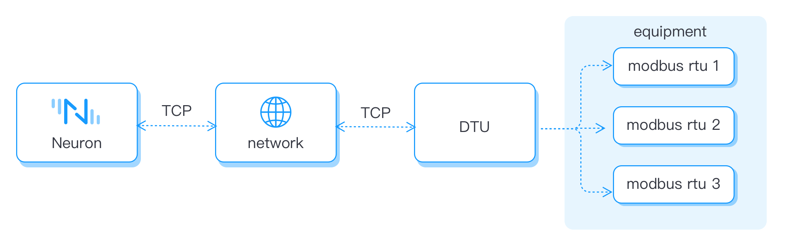
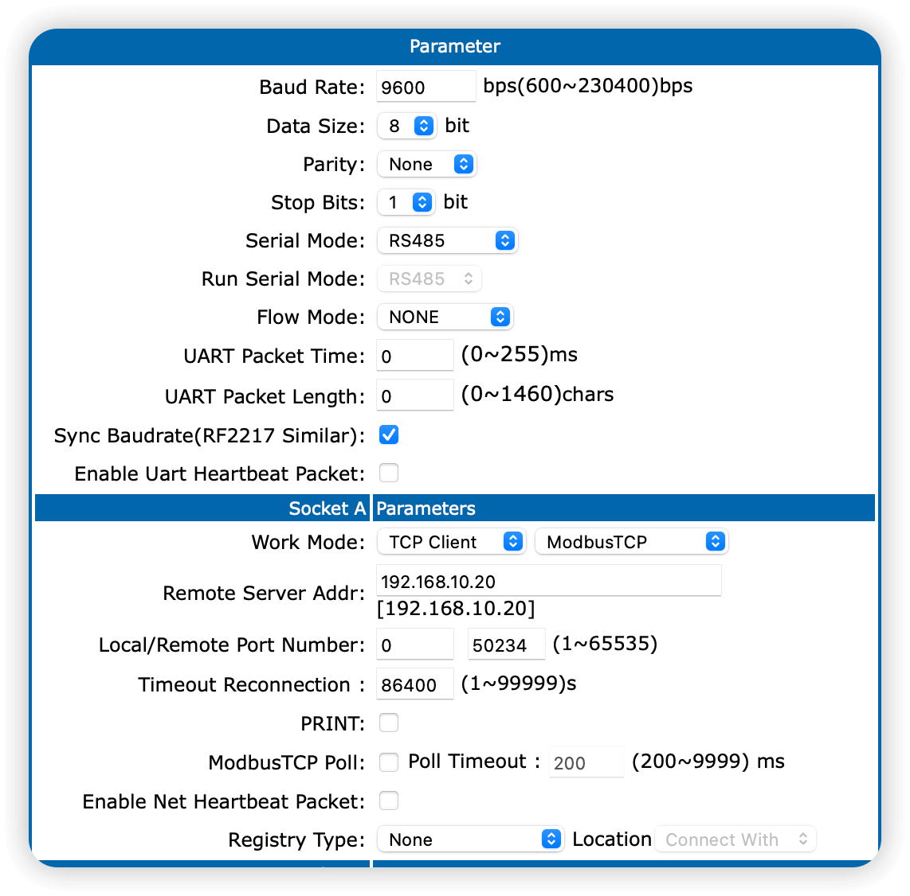
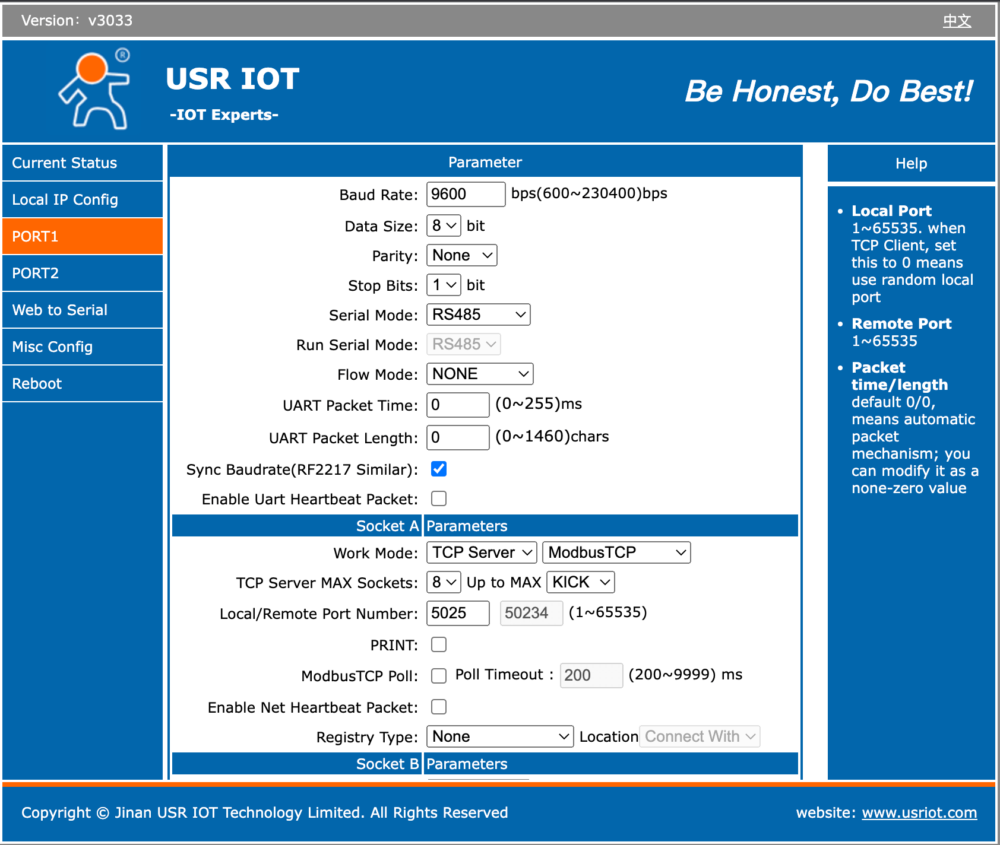
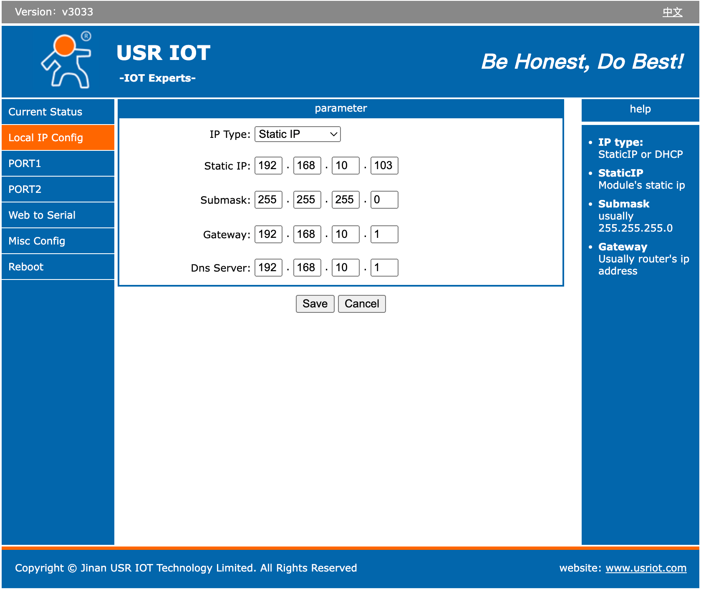
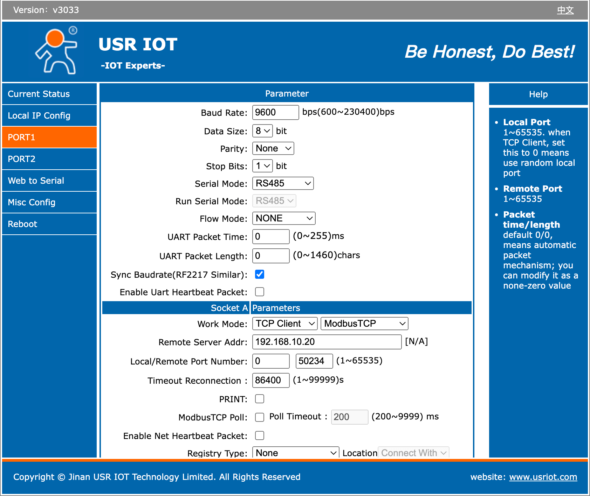
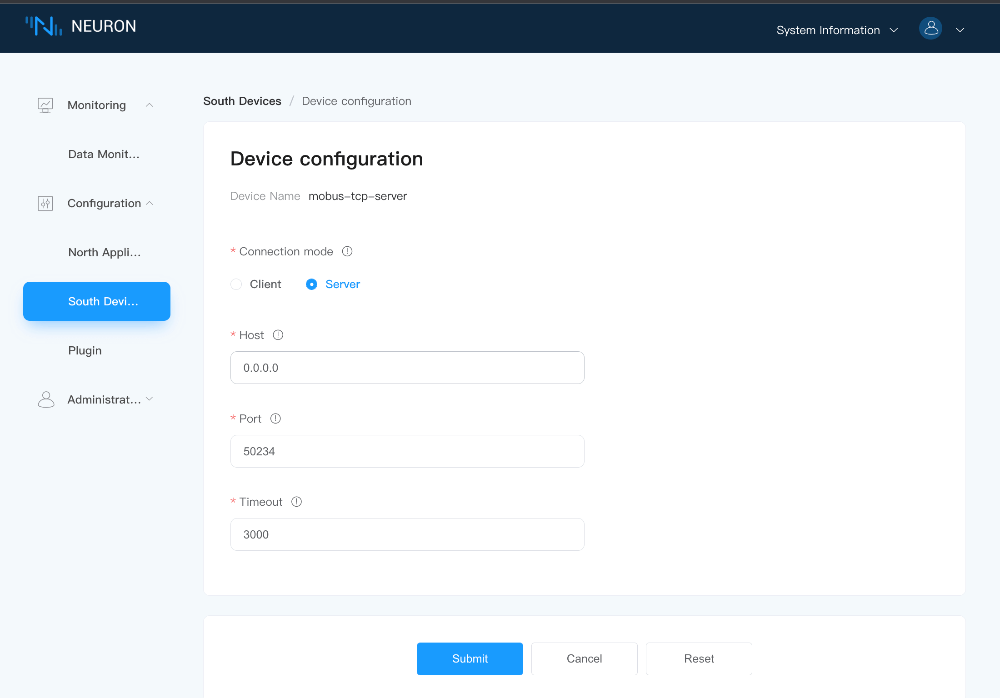

# Connect to USR DTU

USR DTU supports two-way conversion of data, supports mutual conversion of common serial data such as RS232, RS485, RS422, and TCP/IP data, and transmits them through the wireless communication network. The communication methods generally used by DTU are 2/3/4G, NB-IoT, LoRaWAN, WIFI, etc.

You can directly communicate with Modbus RTU devices using Neuron's Modbus RTU plugin in serial mode. Or you can use USR DTU to first gather and convert serial data to network data, then connect it to Neuron. In this case:

- For USR DTU's pass-through working mode, connect directly to the Ethernet mode of Neuron's Modbus RTU module. 
- If you're using YouRenYun DTU's Modbus TCP mode, you need to use the Modbus TCP plugin.

This section introduces how to connect USR DTU under Modbus TCP mode. For details about Neuron's Modbus TCP plugin, see the  [Modbus TCP driver module](../../../modbus-tcp/modbus-tcp.md).



## USR DTU Configuration


| Parameter                 | Description              |
| -------------------- | ------------------------------------------------------- |
| **Work Mode** | Typically, USR DTU supports connecting via TCP or UDP in either client or server mode. It can transmit data using the Modbus TCP standard protocol, or it can transmit **None** (transparent) data. Here we set it to **ModbusTCP**. |
| **Remote Server Addr** | When DTU acts as a client, fill in the address bound to Neuron Modbus.|
| **Local/Remote Port Number** | When DTU acts as a client, fill in the port bound to Neuron Modbus. When DTU acts as a server, use the port of DTU.|

:::tip
DTU usually supports serial port heartbeats, or enables network heartbeats and registration packets. These features cannot be used in the standard Modbus protocol, and Neuron currently is not compatible with these features. When using Neuron to connect to a DTU, be sure to turn off these options.
:::

## Client/Server Mode

Client/Server, also known as client/server mode, referred to as C/S mode, is a network communication architecture, which is used to distinguish the two parties who establish a communication connection as a client (Clent) and a server (Server).

In TCP, the client is the initiator of the request and sends the connection request to the server actively, while the server waits for the request from the client passively.

The following figure shows the workflow for establishing a connection between the Client and Server.


## Connect Neuron (Client)

This section mainly describes the configuration of Neuron and DTU when Neuron serves as the Client and DTU serves as Server.

As a Client, Neuron initiates connection requests to DTU actively. The user needs to ensure the network connectivity of Neuron -> DTU.

### Configure DTU Server

First, you need to configure the parameters of the connection between the DTU and the serial port, and second, you need to configure the parameters of the Socket for the connection between the DTU and the Neuron, as shown in the figure below.



* Working mode: TCP Server, Modbus TCP;
* Fill in the unused local port, no need to fill in the remote port;
* The other parameters are optional.

### Get DTU IP

When configuring the Neuron southbound driver, it needs to be the IP of the DTU on the server side, as shown in the figure below.


### Connect Neuron (Client)

In **South Device**, create a node using the plugin Modbus TCP, and configure the driver, as shown in the figure below.


* **Connection mode**: client
* **Host**: Fill in the IP address of USR DTU
* **Port**: Fill in the port of USR DTU
* **Timeout**: Keep the default setting

## Connect Neuron (Server)

This section mainly describes the configuration of Neuron and DTU when Neuron serves as the Server and DTU serves as the Client.

As a Client, DTU initiates connection requests to Neuron. Users need to ensure the network connectivity of DTU -> Neuron. This connection mode can generally be used in the following scenarios. When some DTU uses 4G to access the Internet, Neuron cannot actively connect to DTU, so Neuron can only choose Server mode and actively connect to Neuron by DTU.

Besides, When Neuron and DTU are not in the same LAN, you can map the LAN IP and port of the Neuron operating environment to the WAN, and use Neuron as the server end and DTU as the client end. 

### Configure DTU Client

First, you need to configure the parameters of the connection between the DTU and the serial port, and second, you need to configure the parameters of the Socket for the connection between the DTU and the Neuron, as shown in the figure below.



* **Remote server address**: Fill in the IP address of Neuron (running as the server);
* **Local port**: Not filled in by default;
* **Remote port**: Since each TCP Server port will listen to the incoming TCP traffic on the port specified by the client, therefore, the user needs to customize an unoccupied port for handshake establishment between the client and the server connect.

:::tip
You can execute the following command on the server terminal to determine whether the listening port is occupied.

```bash
# Confirm whether the port is occupied
$ netstat -anp |grep <port>
```
:::

### Configure Neuron (Server)

In **South Devices**, create a node with plugin Modbus TCP, and configure the driver, as shown in the figure below.



* Select server as the **Connection mode**;
* **Host**: Fill in 0.0.0.0;
* **Port**: Fill in the listening port.

