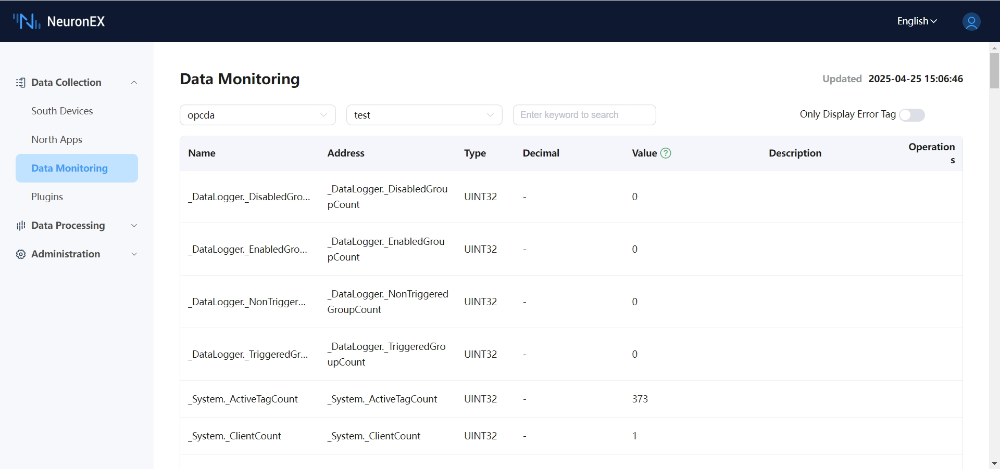

# Example of Connecting to KEPServerEX 6 OPC DA Server  

This article demonstrates how to use the Neuron HUB plugin and the NEURON HUB Windows program to connect to the KEPServerEX 6 OPC DA Server, enabling read and write operations on OPC DA Server data.  

## Installing KEPServerEX 6  

The KEPServerEX installation package can be downloaded from the official website: [KEPServerEX Demo Download](https://www.ptc.com/en/products/kepware/kepserverex/demo-download).  

## Installing the NEURON HUB Windows Program  

The installation package for the NEURON HUB Windows program can be obtained by contacting technical support personnel. After obtaining the installation package, double-click to run the installer.  

## Using the NEURON HUB Windows Program  

### Adding an OPC DA Node  
1. Click the `File->NewOpcDa` menu item to enter the OPC DA node addition interface.  
2. Fill in the `node name`. This parameter serves as the unique identifier for the OPC DA node and cannot be duplicated. It will be used later in the Neuron HUB driver.  
3. Fill in the `host`. This can be an IP address or hostname, representing the address of the OPC DA Server host to be connected.  
4. Try clicking the dropdown button for `server` to attempt retrieving the list of OPC DA Servers on the target host. If the dropdown is empty, it indicates no OPC DA Servers were detected on the target host.  
5. Click the `Add` button to add this OPC DA node.  

After successful addition, the newly added OPC DA node, along with its basic information, operational status, and connection status, will be displayed in the `Nodes Table`.  

   

### Exporting Tags  

When the OPC DA node is in a normal connected state, all OPC DA tags can be exported in the format of the Neuron EX tag template file. To do this, hover the mouse over the OPC DA node whose tags need to be exported, right-click, and select `export neuronex tags`.  

   

## Connecting to the OPC DA Node Using the Neuron HUB Driver  

* In the **Southbound Devices** section, click `Add Device`, select the `Neuron HUB` plugin to create a node connecting to the NEURON HUB Windows program. Fill in the configuration information:  
  * `HUB IP Address`: The IP address of the host running the NEURON HUB Windows program.  
  * `HUB Port`: The port of the NEURON HUB Windows program, default is 17889.  
  * `Node Type`: Select `OPC DA`.  
  * `Node Name`: The name of the OPC DA node added in the NEURON HUB Windows program (e.g., `test` in this example).  
* In the created southbound device node, import the OPC DA tag table exported earlier.  
* Navigate to the **Monitoring Page**, select the corresponding device and group, and view the collected data points, as shown below.  
*    
