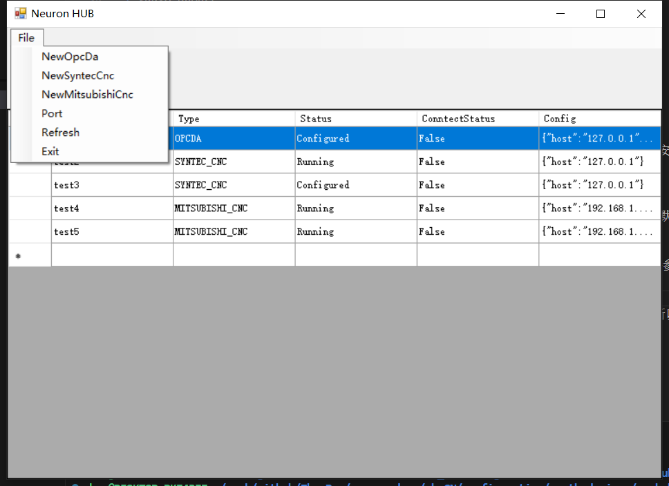

# NEURON HUB

The **NeuronHUB** desktop application (runs on **Windows**) and the **Neuron HUB** southbound plugin for NeuronEX together form an acquisition relay workflow: **NeuronHUB** connects to upstream protocols and collects data **on an on-site Windows machine** (protocols covered include **OPC DA**, **OPC AE**, **GE Historian**, **SYNTEC CNC**, and **Mitsubishi CNC**); **Neuron HUB** attaches to NeuronEX as its southbound driver plugin to ingest data already acquired on NeuronHUB.

**Why this exists:** NeuronEX is deployed on **Linux**. If acquisition depends on **DCOM** or other Windows-tied mechanisms (such as OPC DA), or only Windows-side gateways and data sources are available, **NeuronEX cannot natively acquire those protocols directly on Linux**.

**Topology:** Install and run NeuronHUB on a Windows host (**contact EMQ business representatives for the NeuronHUB program**). It communicates locally with backends such as **OPC DA, OPC AE, GE Historian, SYNTEC CNC, and Mitsubishi CNC**, and manages acquisition nodes. **NeuronEX** obtains the data already collected by the **NeuronHUB** program through the **Neuron HUB** southbound driver, completing the full acquisition chain.

## Device Settings

| Field          | Description                        |
| -------------- | ---------------------------------- |
| host           | NeuronHUB IP address               |
| port           | NeuronHUB port (default: 17889)    |
| type           | Node type                          |
| node           | Node name                          |
| batch_size     | Command batch size (default: 50)   |
| expires        | Expiration time (default: 2000 ms) |
| sliding_window | Window size (default: 1)           |

On the southbound plugin, `type` must match the node type already created in NeuronHUB. Common examples include **OPCDA**, **OPC AE**, **GE Historian**, **SYNTEC CNC**, and **MITSUBISHI CNC**, subject to NeuronHUB menus and versions in the field.

## Supported Data Types

* uint8  
* int8  
* uint16  
* int16  
* uint32  
* int32  
* uint64  
* int64  
* float  
* double  
* bool  
* string  
* ARRAY_INT8     
* ARRAY_UINT8    
* ARRAY_INT16    
* ARRAY_UINT16    
* ARRAY_INT32     
* ARRAY_UINT32   
* ARRAY_INT64     
* ARRAY_UINT64   
* ARRAY_FLOAT       
* ARRAY_DOUBLE    
* ARRAY_BOOL       
* ARRAY_STRING    

## Address Format
The address format varies by node type. Refer to the corresponding device documentation for details.

## NeuronHUB Windows Program
NeuronHUB is the Windows program that performs protocol bridging and collection described above (names are similar to the Neuron southbound plugin; mind the deployment context). Contact support for the installer package.

### Installation
Double-click to install. It is recommended not to install on the system drive to avoid permission issues when modifying configuration files. The program starts automatically by default.

### Create a Node
Click the `File` menu and select the corresponding submenu item based on the device type to connect. Fill in the connection parameters on the interface and add the node.  
 

### Node Operations
In the `Node Tables` interface, right-click a node to access context menu options for starting/stopping nodes, updating parameters, or deleting nodes. OPCDA nodes also support exporting points to NEURON node table files.  
 

### Port Settings
The program listens on port 17889 by default. Change the port via `File->Port`.