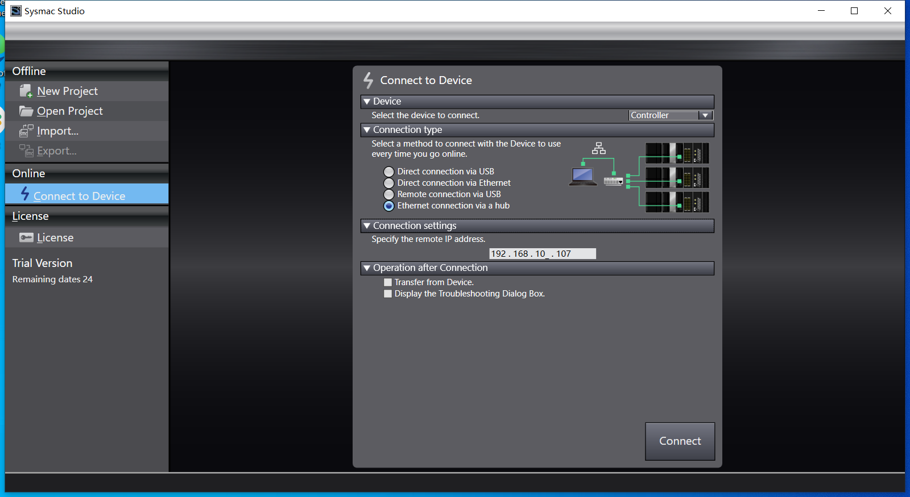
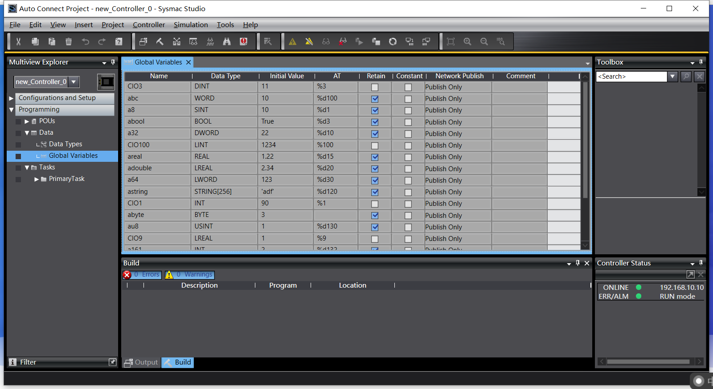
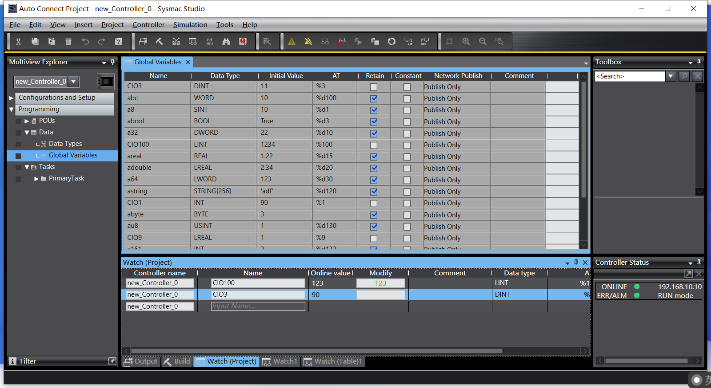

# Connect to NX1P

This article will use the Omron FINS UDP plugin to connect to the Omron NX1P PLC for reading and writing of point positions within the PLC.

The Omron FINS UDP plugin requires connection to the Omron PLC via local area network, so please ensure that the PLC and Neuron are in the same local area network.

## NX1P PLC Point Operation

The article assumes that it is already possible to use Omron Programming Software Sysmac Studio to connect to the Omron NX1P PLC and view the point positions in the PLC.

* Select **Connect to Device** in the left menu bar to open the PLC connection settings window. Select the **Device** tab, and select the **Controller** option to connect to. Select the **Ethernet-Hub Connection** type, and set the PLC IP address. After setting the connection settings, click the **Connect** button. The device settings page is shown in the following figure.

* After successfully connecting, we are now in the project page and select **Controler -> Transfer -> From Controller**. Based on the popup message, execute the default action.

* Select **Programming -> Data -> Global Variables** in the left menu bar, and then select **Edit** with the right mouse button. The window will display the current position information of the PLC. The following figure illustrates this.

* Sysmac Studio is currently online and cannot be used for editing of point positions. Enter the menu **Controller -> Offline**, and enter editing mode. Right-click on the point table and use the context menu to perform corresponding editing operations. After editing is completed, enter the menu **Controller -> Online**, connect to the PLC, and then enter the menu **Controller -> Transfer -> To Controller**. Default action is executed based on the popup notification. The editing result of the point table will be written to the PLC.

* Sysmac Studio is currently online, enter the menu **View -> Watch Tag Page**, select **Watch (Project)** in the window, and enter the name of the point position to monitor real-time data and modify point position data. The following figure illustrates this.

## Configure the Neuron node to connect to the NX1P PLC
* * Click on `Add Device` in the **South Devices** and select the Omron FINS UDP plugin to create a node to connect to the NX1P PLC.
* After creating the node, click on `Device Configuration` to enter the device configuration page. Configure the node information according to the actual situation,
	* `Equipment Type` : PLC equipment type
	* `PLC IP Address` : PLC device IP address
	* `PLC Port` : PLC device port, the default is 9600
* In the created south-device node, create a group and create some point position under the group.
* Enter the Neuron **Data Monitoring** page and select the corresponding device and group to view the collected data points.

