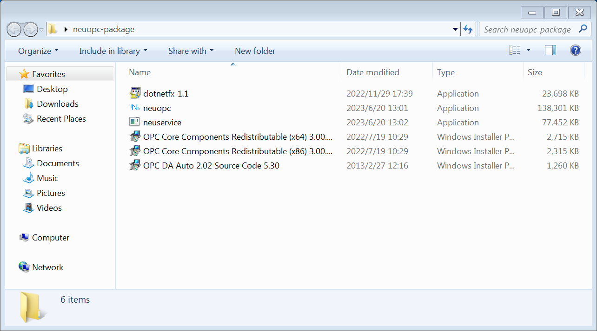
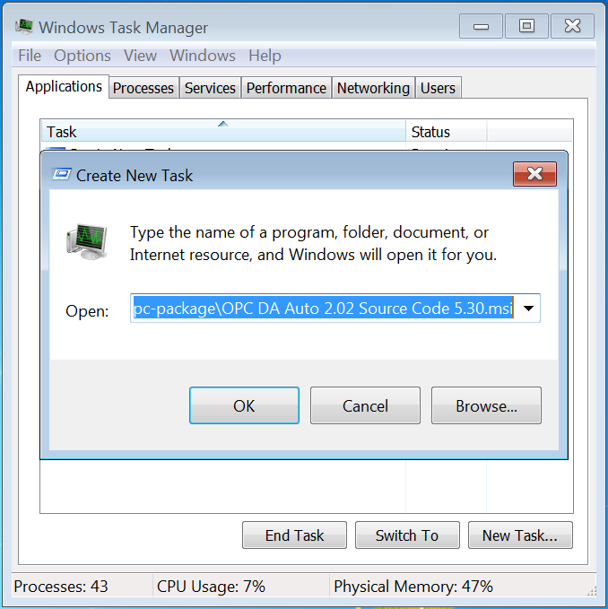
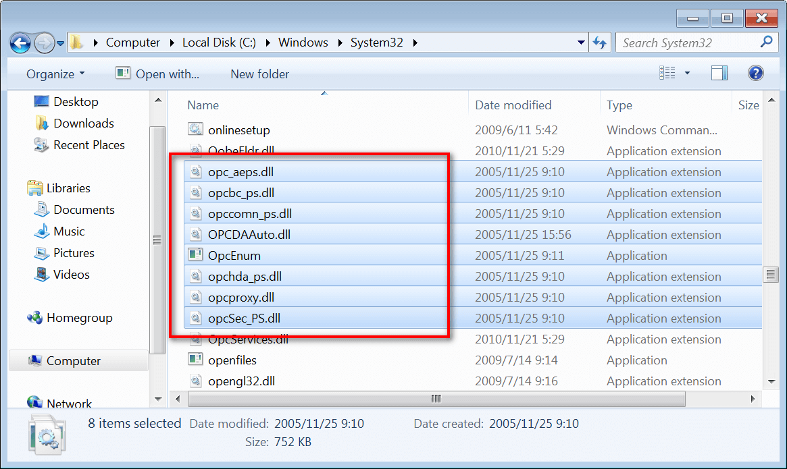

# NeuOPC install

This example uses windows 7 SP1 32-bit system to demonstrate

::: tip
NeuOPC can only run on Windows 7 SP1 and above and requires the installation of the [KB3063858](https://www.microsoft.com/zh-CN/download/details.aspx?id=47409)  and [KB2999226](https://www.microsoft.com/zh-cn/download/details.aspx?id=49077) updates.
:::

## Install the NeuOPC runtime environment

1. Enter NeuOPC [Project releases page](https://github.com/neugates/neuopc/releases) to download the latest version component package "neuopc-package.zip". After decompression, you can see the following files:

* `neuopc.exe`-the main program to run OPC DA to convert OPC UA;
* `dotnetfx-1.1`-.Net framework 1.1, you need to correct this program before installing OPC DAAuto;
* `OPC DA Auto 2.02 Source Code 5.30.msi`-the official component of the OPC Foundation, Install using **Windows Task Manager**;
* `OPC Core Components Redistributable (x64) 3.00.108.msi`-OPC Foundation official components, no need to install;
* `OPC Core Components Redistributable (x86) 3.00.108.msi`-OPC Foundation official components, no need to install;

2. Check if .Net framework 1.1 has been installed, if not, install `dotnetfx-1.1`;

3. Use the task manager to install `OPC DA Auto 2.02 Source Code 5.30.msi`, open the **Windows Task Manager** -> **File** -> **New Task**, enter the MSI file path, and check `Create this task with system administrative rights`;

4. Check if the component is installed.

* If it is a 32-bit operating system, enter the `C:\Windows\System32` directory, if it is a 64-bit operating system, enter the `C:\Windows\SysWOW64` directory, and check whether the following files exist:

::: tip
If the file does not exist then contact sales for support.
:::

* Open **Windows Task Manager** to check whether the `OpcEnum` system service is running, as shown in the figure:

::: tip
If it works normally, it means that `OPC DA Auto 2.02` has been installed normally.
:::

5. Install the MatrikonOPCSimulation simulator program locally, if the installation fails, you can install KepServerEX for testing;

6. Run the neuopc.exe program, select `OPCDA Host` and `OPCDA Server` and click `Connection Test`, set the parameters of UA and click `Start`, the operation is successful, as shown in the figure:

