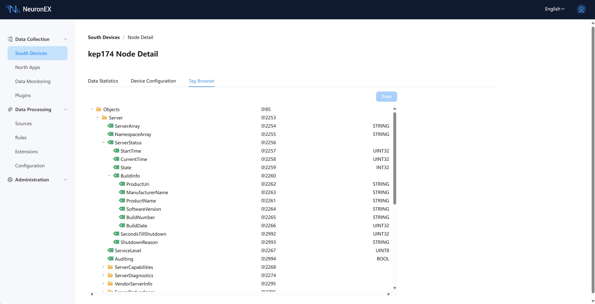

# Browse OPC UA Address Space

NeuronEX integrates the Address Space Browser function for OPC UA servers, which helps users to get the Tag information in the connected OPC UA servers, including the Tag's location information in the server model, the Tag's access address, and the Tag's type information.

## How to use
1. In the **Southbound Devices** list, click **Device Configuration** in the OPC UA Node Operation menu. 2.

2. Fill in the correct configuration options in the **Device Configuration** and submit. 3.

3. Click on the **Scan** button in the **Point Discovery** and if the connection has been established, the model information in the OPC UA server will be immediately available.

4. Expand each node in the model information tree to get information about the type of this node and its children.

