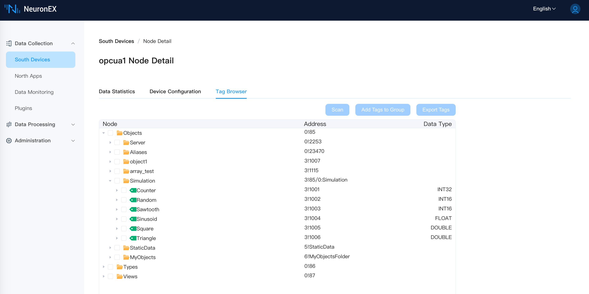
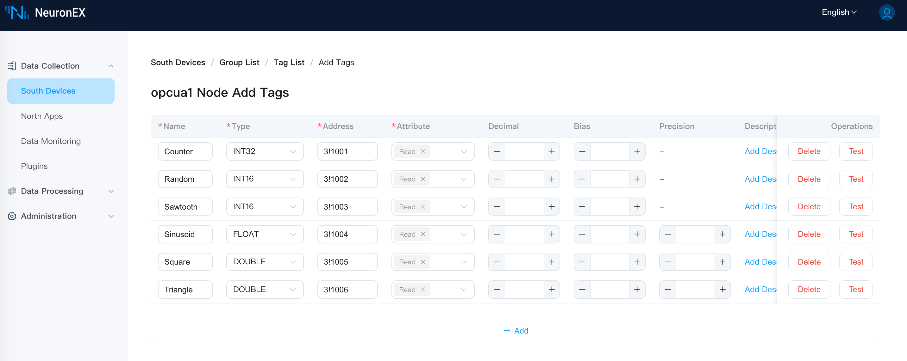
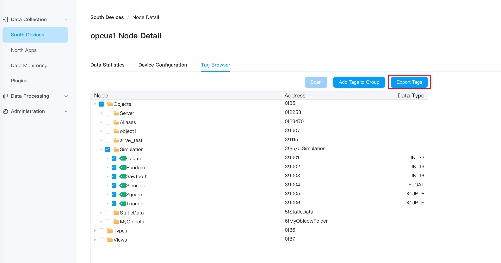

# Browse OPC UA Address Space

NeuronEX integrates the Address Space Browser function for OPC UA servers, which helps users to get the tags information in the connected OPC UA servers, including the tag's location information in the server model, the tag's access address, and the tag's type information. The tags can be quickly added to the collection group.

## How to use
1. In the **Southbound Devices** list, click **Device Configuration** in the OPC UA Node Operations menu. 

2. Fill in the correct configuration options in the **Device Configuration** and submit. 

3. Click on the **Scan** button in the **Tag Browser** and if the connection has been established, the model information in the OPC UA server will be immediately available.

4. Select one or more data tags in the OPCUA address space and click the **Add Tags to Group** button to add these tags to the collection group. You can choose an existing group or create a new one. Up to 10000 tags can be added at a time.

5. In the **Tag List** page, you can continue to edit the tags, including modifying the tag name and read/write type.

6. You can also export the selected data tags to an `.xlsx` file in the **Tag Browser** page and edit them manually. Up to 10000 data tags can be exported at a time.

