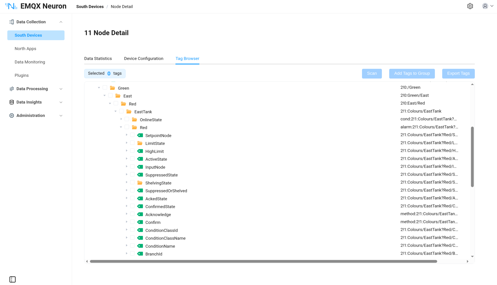
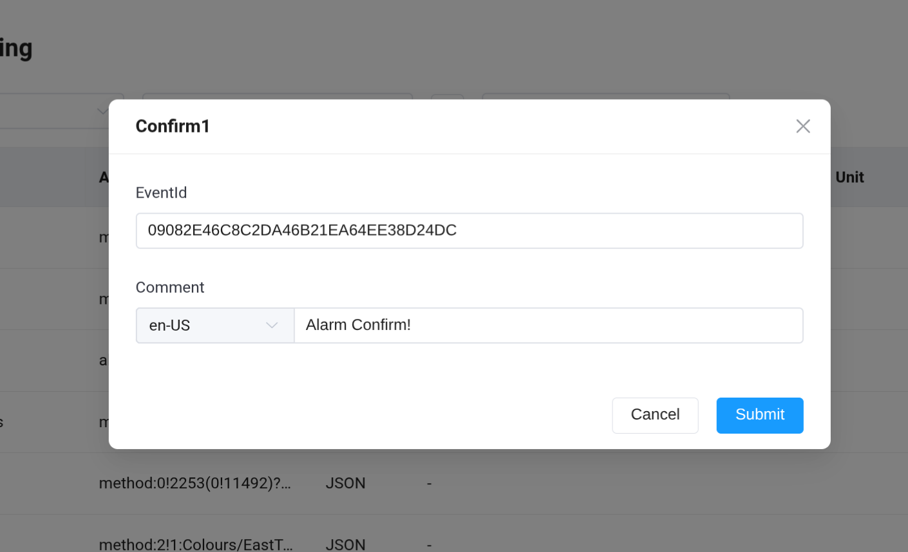

# OPC UA Conditions and Alarms

OPC UA Part 9 defines the Conditions and Alarms model for monitoring device status and events. The NeuronEX OPC UA plugin supports subscribing to conditions and alarms, and can invoke methods on the OPC UA server to perform operations such as alarm acknowledgment.

## Prerequisites

The following conditions must be met to use the Conditions and Alarms functionality:

1. The OPC UA server must support the Part 9 Conditions and Alarms model.
2. The **Update Mode** in device configuration must be set to **Subscribe** or **Read&Subscribe**.
3. The **Event Root Node** must be correctly configured (default `0!2253`, representing the Server node) for subscribing to condition and alarm events.

::: tip
Conditions and alarms are event-driven and must receive server-pushed notifications through subscriptions, so only Subscribe or Read&Subscribe modes are supported.
:::

## Adding Alarm Tags and Methods

Use the tag discovery feature (browse address space) to quickly find and add alarm tags and method nodes.

The following example uses the public test server `opc.tcp://opcua.demo-this.com:62544/Quickstarts/AlarmConditionServer`.

### Steps

1. In the **South Devices** list, click the OPC UA device's **Device Configuration** to ensure the device is connected.
2. Go to the **Tag Discovery** page and click the **Scan** button to browse the address space.

   

3. In the address space tree, expand the `Server` node to find the conditions and alarms branches.
4. Select the target alarm tag (e.g., `alarm:2!1:Colours/EastTank?Red`) and click **Add Tag to Group**.
5. Method nodes can also be found through the address space (e.g., `method:2!1:Colours/EastTank?Red(...)`). Select and add them to the group.
6. In the **Tag List**, you can edit the tag name, read/write type, and other attributes.

## Alarm Tags

The alarm tag address format is `alarm:<NS>!<NODEID>`, and the data type is **JSON**.

### Address Example

Assume there is a red light alarm node on the OPC UA server with namespace index 2 and node ID `1:Colours/EastTank?Red`. The address is:

```
alarm:2!1:Colours/EastTank?Red
```

- `alarm:` — prefix indicating an alarm node
- `2` — namespace index
- `1:Colours/EastTank?Red` — node ID

### Data Format

Example of the JSON data reported by this tag:

```json
{
    "active": true,
    "enabled": true,
    "confirmed": false,
    "retain": true,
    "severity": 700,
    "message": "The alarm severity has increased.",
    "source_name": "EastTank",
    "time": 1776749660756,
    "event_type": "ns=0;i=9764",
    "condition_id": "ns=2;s=1:Colours/EastTank?Red",
    "event_id": "F9372A873B95264C91FD50D281433084",
    "condition_name": "Red"
}
```

| Field            | Description                              |
| ---------------- | ---------------------------------------- |
| `active`         | Whether the alarm is active              |
| `enabled`        | Whether the alarm is enabled             |
| `confirmed`      | Whether the alarm is confirmed           |
| `retain`         | Whether the alarm is retained            |
| `severity`       | Alarm severity level (0-1000)            |
| `message`        | Alarm message text                       |
| `source_name`    | Alarm source name                        |
| `time`           | Event time (Unix timestamp in milliseconds) |
| `event_type`     | Event type ID                            |
| `condition_id`   | Condition node ID                        |
| `event_id`       | Event unique identifier                  |
| `condition_name` | Condition name                           |

## Method Invocation

Methods can be used to perform operations on alarms, such as acknowledging an alarm. Method tags have a data type of **JSON** and are **write-only**.

### Address Format

```
method:<NS>!<ObjectNODEID>(<MethodNS>!<MethodNODEID>)?<parameter_name>=<type>&<parameter_name>=<type>
```

### Example

To call the Confirm method on the red light alarm above for acknowledgment, the address is:

```
method:2!1:Colours/EastTank?Red(2!1:Colours/EastTank?Red/Confirm)?EventId=ByteString&Comment=LocalizedText
```

- `2!1:Colours/EastTank?Red` — alarm object node
- `2!1:Colours/EastTank?Red/Confirm` — Confirm method node
- `EventId=ByteString&Comment=LocalizedText` — method parameters and types


