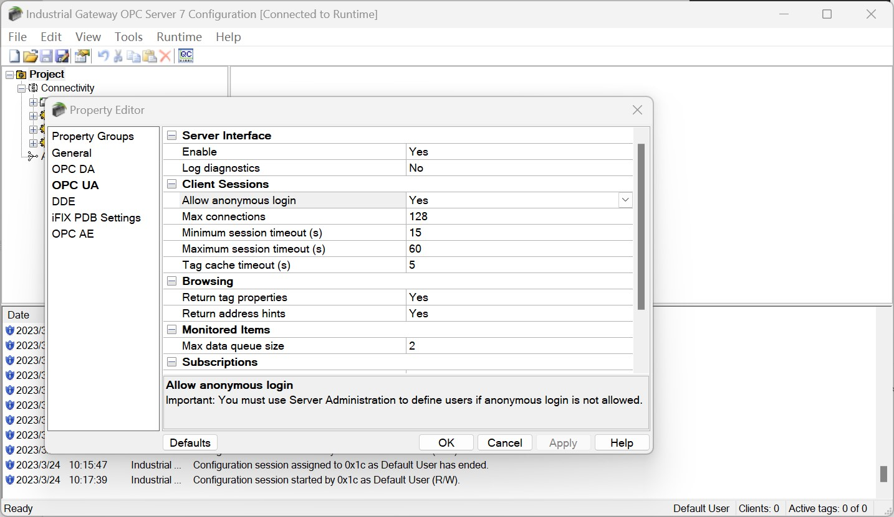
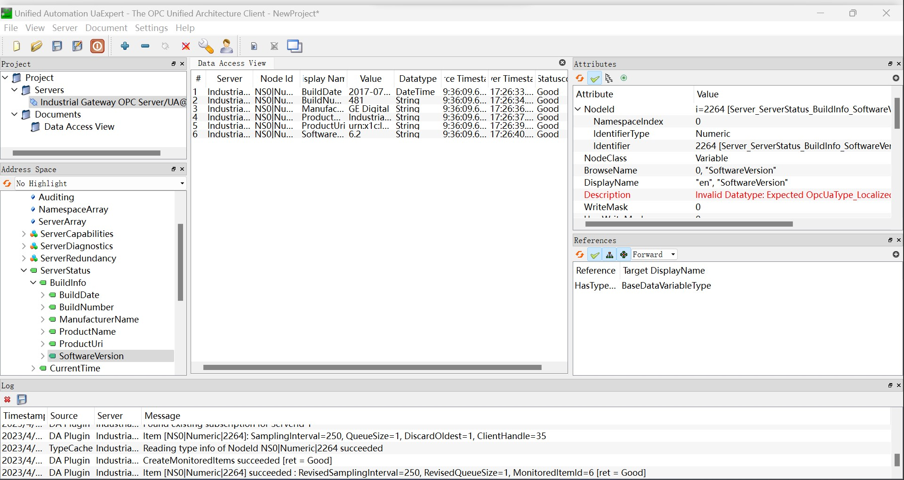

# Connect to Industrial Gateway OPC Server

## Anonymous login

1. Double click on the Industrial Gateway OPC Server icon in the system tray, open the  **Project** -> **Property Editor** -> **OPC UA**, and set `Allow anonymous login` to `Yes`.

2. Right-click the Industrial Gateway OPC Server icon in the system tray, select **OPC UA Configuration** -> **Server Endpoint**, double-click the endpoint entry, and check all security policies.

3. Right-click on the Industrial Gateway OPC Server icon in the system tray and select **Reinitialize** in the menu.

4. Neuron adds a new southbound OPC UA device, opens **Device Configuration**, fills in the `Endpoint URL` of the target Server, without filling in username/password, without adding certificate/key, and starts the device connection.

## Certificate/Key + Anonymous Login

1. Set up an anonymous login as described above.

2. Refer to [Connection policy](./policy.md) to generate or convert a certificate/key.

3. Right-click the Industrial Gateway OPC Server icon in the system tray, select **OPC UA Configuration** -> **Trusted Clients**, and import the client certificate in DER format into the list.

4. Right-click on the Industrial Gateway OPC Server icon in the system tray and select **Reinitialize** in the menu.

## Neuron setting

1. To view the PLC measurement point information via the UaExpert software, Refer to [UaExpert usage](./uaexpert.md).

2. Neuron adds a new southbound OPC UA device, opens **Device Configuration**, fills in the `Endpoint URL` of the target Server, does not need to fill in the username/password, adds the certificate/key and starts the device connection.

3. Add `Groups` and `Tags` based on the measurement point information.

## Test Data List

| Name             | Address | Attribute | Data type |
| -------- | ------------------------------------------ | ---------- | ------ |
| BuildDate        | 0!2266  | Read      | UINT32    |
| BuildNumber      | 0!2265  | Read      | STRING    |
| ManufacturerName | 0!2263  | Read      | STRING    |
| ProductName      | 0!2261  | Read      | STRING    |
| ProductUri       | 0!2262  | Read      | STRING    |
| SoftwareVersion  | 0!2264  | Read      | STRING    |

