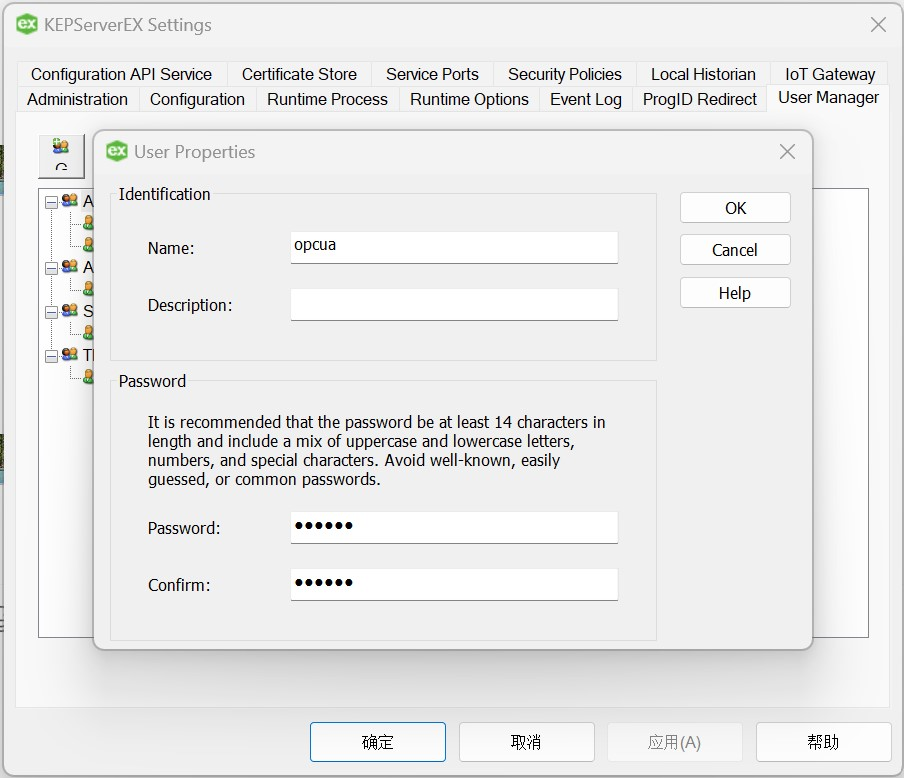
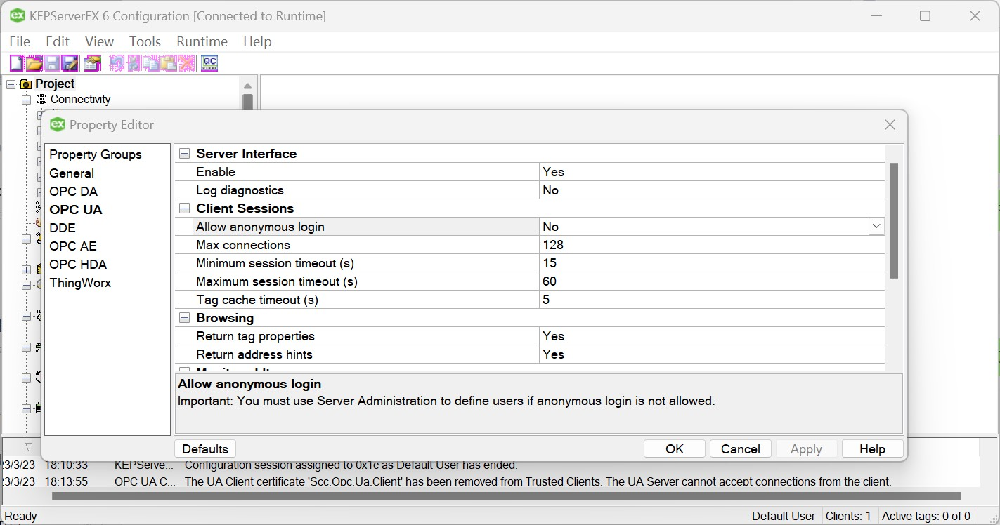
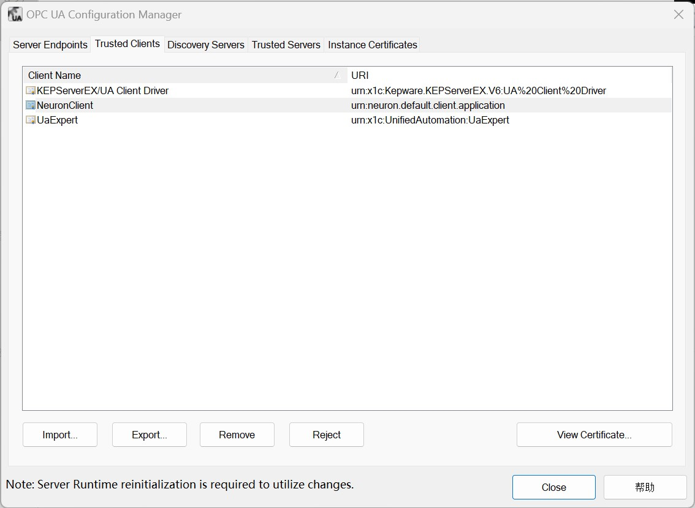
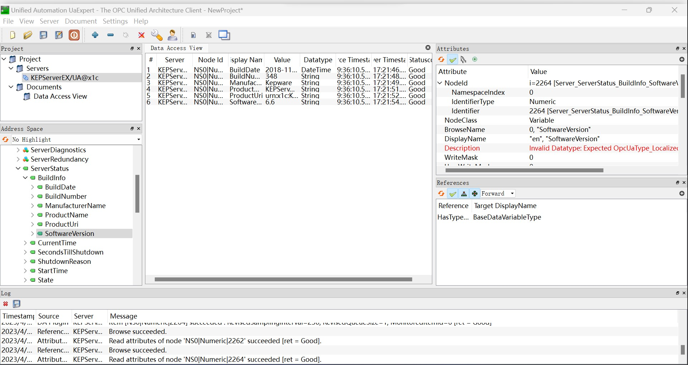

# Connect to KEPServerEX

Developed by Kepware, KEPServerEX is a robust connectivity solution between industrial automation equipment and applications, commonly employed in industrial control environments for efficient data acquisition. With a comprehensive set of drivers, it enables reliable communication between a wide range of industrial hardware and software. Leveraging OPC (an industry standard for interoperability in automation) alongside IT-centric communication protocols such as SNMP, ODBC, and Web Services, KEPServerEX serves as a unified source for industrial data access.

The Neuron OPC UA plug-in can be used as a client to access KEPServerEX.

## Username/Password Login

1. Right-click on the KEPServerEX icon in the system tray, select **Settings** -> **KEPServerEX Settings** -> **User Manager**, create a new user under the **Administrators** group and set the Username/Password.
    
2. Double click on the KEPServerEX icon in the system tray, open the **Project** -> **Property Editor** -> **OPC UA**, and set **Allow anonymous login** to **No**.
    
3. Right-click on the KEPServerEX icon in the system tray, select **OPC UA Configuration** -> **Server Endpoints**, double-click on the endpoint entry and check all security policies.
    
4. Right-click on the KEPServerEX icon in the system tray and select **Reinitialize** in the menu.

## Configure Neuron

1. Get the PLC measurement point information via the UaExpert software, refer to [UaExpert](http://localhost:8080/docs/en/latest/configuration/south-devices/opc-ua/uaexpert.html).
2. Neuron adds a new southbound OPC UA device, opens **Device Configuration**, fills in the **Endpoint URL** of the target Server, fills in the user name/password, no need to add certificate/key, and starts the device connection.
3. Right-click on the KEPServerEX icon in the system tray, select **OPC UA Configuration** -> **Trusted Clients**, and set the NeuronClient certificate as trusted.
    
4. Right-click on the KEPServerEX icon in the system tray and select **Reinitialize** in the menu.

## Certificate/Key + Username/Password Login

1. Set the username/password as above.

2. Refer to [Connection policy](./policy.md) to generate or convert a certificate/key.

3. Right-click on the KEPServerEX icon in the system tray, select **OPC UA Configuration** -> **Trusted Clients**, and import the client certificate in DER format into the list.

4. Right-click on the KEPServerEX icon in the system tray and select **Reinitialize** in the menu.

## Configure Neuron

1. Get the PLC measurement point information via the UaExpert software, refer to [UaExpert](./uaexpert.md).

2. Neuron adds a new southbound OPC UA device, opens **Device Configuration**, fills in the **Endpoint URL** of the target Server, fills in the user name/password, adds the certificate/key, and starts the device connection.

3. Add **Groups** and **Tags** based on the measurement point information.

## Test Data List

|  Name    |  Address                                      | Attribute       | Data type   |
| -------- | ------------------------------------------ | ---------- | ------ |
| BuildDate | 0!2266 | Read | UINT32 |
| BuildNumber | 0!2265 | Read | STRING |
| ManufacturerName | 0!2263 | Read | STRING |
| ProductName | 0!2261 | Read | STRING |
| ProductUri | 0!2262 | Read | STRING |
| SoftwareVersion | 0!2264 | Read | STRING |

