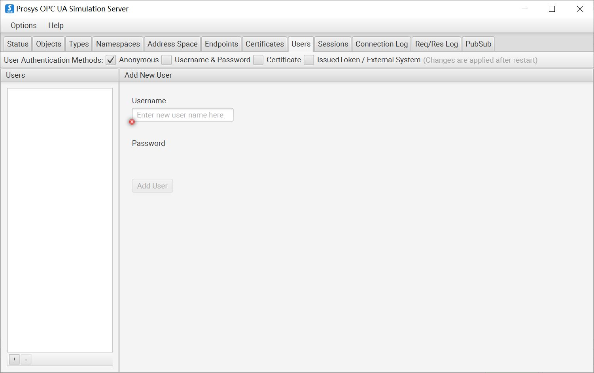

# Connect to Prosys Simulation Server

You need to switch Prosys Simulation Server to `Expert Mode` first, click on the menu `Options` -> `Switch to Expert Mode`.

## Anonymous login

1. Open the **Endpoints** -> **Security Modes**, deselect `Sign` and `Sign&Encrypt`, and select `None`.

2. Open the **Users** -> **User Authentication Methods**, deselect `Username&Password`, `Certificate` and `IssuedToken/External System`, and select `Anonymous`.

3. Save the settings and restart the Prosys OPC UA Simulation Server.

4. Neuron adds a new southbound OPC UA device, opens **Device Configuration**, fills in the `Endpoint URL` of the target Server, without filling in username/password, without adding certificate/key, and starts the device connection.

## Certificate/Key + Anonymous Login

1. Refer to [Connection policy](./policy.md) to generate or convert a certificate/key.

2. Open the **Endpoints** -> **Security Modes**, deselect `None`, and select `Sign` and `Sign&Encrypt`.

3. Open the **Users** -> **User Authentication Methods**, deselect `Username&Password`, `Certificate` and `IssuedToken/External System`, and select `Anonymous`.

4. Save the settings and restart the Prosys OPC UA Simulation Server.

5. Neuron adds a new southbound OPC UA device, opens **Device Configuration**, fills in the `Endpoint URL` of the target Server, does not need to fill in the username/password, adds the certificate/key and starts the device connection.

6. Open the **Certificates** and set the client certificate in the list to Trust.

## Username/Password Login

1. Open the **Endpoints** -> **Security Modes**, deselect `None`, and select `Sign` and `Sign&Encrypt`.

2. Open the **Users** -> **User Authentication Methods**, deselect `Anonymous`, `Certificate` and `IssuedToken/External System`, and select `Username&Password` to add a custom username/password.

3. Save the settings and restart the Prosys OPC UA Simulation Server.

4. Neuron adds a new southbound OPC UA device, opens **Device Configuration**, fills in the `Endpoint URL` of the target Server, fills in the user name/password, no need to add certificate/key, and starts the device connection.

5. Open the **Certificates** and set the client certificate in the list to Trust.

## Certificate/key + username/password login

1. Same username/password settings as above.

2. Neuron adds a new southbound OPC UA device, opens **Device Configuration**, fills in the `Endpoint URL` of the target Server, fills in the user name/password, adds the certificate/key, and starts the device connection.

3. Open the **Certificates** and set the client certificate in the list to Trust.

## Neuron setting

1. To view the PLC measurement point information via the UaExpert software, Refer to [UaExpert usage](./uaexpert.md).

2. Add `Groups` and `Tags` based on the measurement point information.

## Test data list

|  Name    |  Address  | Attribute | Data type   |
| -------- | ------ | ---- | ------ |
| Counter  | 3!1001 | Read | INT32  |
| Random   | 3!1002 | Read | DOUBLE |
| Sawtooth | 3!1003 | Read | DOUBLE |
| Sinusoid | 3!1004 | Read | DOUBLE |
| Square   | 3!1005 | Read | DOUBLE |
| Triangle | 3!1006 | Read | DOUBLE |

