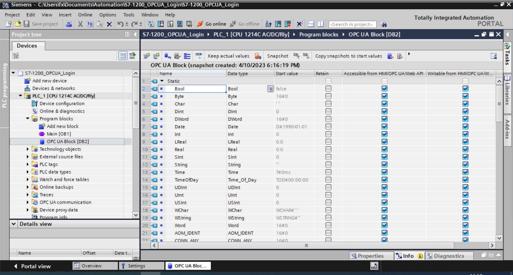
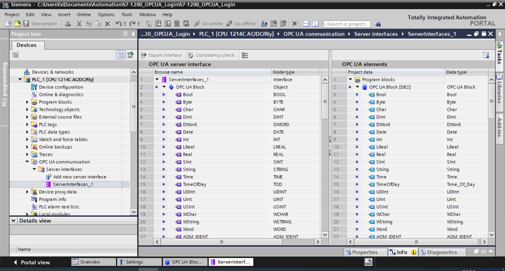

# Connect to Siemens S7-1200

The Siemens S7-1200 PLC is programmed via Siemens' TIA Portal (Totally Integrated Automation Portal) software. Once you've installed the TIA Portal, you can design, test, troubleshoot, and maintain your automation project in a single software suite, with a standardized and intuitive navigation system to configure and program your S7-1200 PLC, as well as other Siemens automation devices.

This section introduces how to leverage Nuron OPC UA plugin to connect S7-1200. 

## Username/Password Login

1. Select the target PLC in the TIA V16 programming software, right-click and open the **Properties** -> **General** -> **OPC UA**.

2. Open the **Activate OPC UA Server** option.

3. Check the required security policy in the **Security policies available on the server** list. If the security requirement is not particularly high, you can just check **No security**, so that the speed of reading and writing requests will be faster.

4. Check **Automatically accept client certificates during runtime** in the **Trusted client** section.

5. Turn off **Enable guest authentication** in the **Guest authentication** section.

6. Check the **Enable username and password authentication** box in the **Username and password authentication** section.

7. Adding a user name and password to the **User Management** list.

8. Downloading programs to the PLC.

## Add Program Blocks

1. Select the target PLC in the TIA V16 programming software, open **Program blocks** -> **Add New block**, add a **Global DB** block named OPC UA Block, add a data point for each type in the OPC UA Block, set the **Name** to the same type as the **Data Type**.

2. Check the **Accessible from HMI/OPC UA/Web API** and **Writable from HMI/OPC UA/Web API** options for all data points.

3. Download programe to PLC.

## Add Server Interfaces

1. Select the target PLC in the TIA V16 programming software, open **OPC UA communication** -> **Server interfaces** -> **Add new server Interface**, add the interface named ServerInterfaces_1, drag the OPC UA Block in the **OPC UA elements** -> **Project data** -> **Program block** on the right to the **OPC UA server interface** -> **Browse name** -> under **ServerInterfaces_1**.

2. Download programe to PLC.

## Configure Neuron

1. Get the PLC measurement point information via the UaExpert software, refer to [UaExpert](./uaexpert.md).
    

2. Neuron adds a new southbound OPC UA device, open **Device Configuration**, fill in the **Endpoint URL** of the target PLC, user name/password, no need to add certificate/key.

3. Add **Groups** and **Tags** based on the measurement point information.

   :::tip
   The **NODEID** of the Siemens S7-1200 is in digital form and the address of the Neuron needs to be set according to the actual value.
   :::

   The data type mapping relation is as follows:

   | PLC Data Type | OPC UA Data Type | Neuron Data Type |
   | ------------ | -------------- | --------------- |
   | AOM_IDENT    | UInt32         | UINT32          |
   | Bool         | Boolean        | BOOL            |
   | Byte         | Byte           | UINT8           |
   | CONN_ANY     | UInt16         | UINT16          |
   | CONN_OUC     | UInt16         | UINT16          |
   | CONN_PRG     | UInt16         | UINT16          |
   | Char         | Byte           | UINT8           |
   | DB_ANY       | UInt16         | UINT16          |
   | DB_DYN       | UInt16         | UINT16          |
   | DB_WWW       | UInt16         | UINT16          |
   | DWord        | UInt32         | UINT32          |
   | Date         | UInt16         | UINT16          |
   | DInt         | Int32          | INT32           |
   | EVENT_ANY    | UInt32         | UINT32          |
   | EVENT_ATT    | UInt32         | UINT32          |
   | EVENT_HWINT  | UInt32         | UINT32          |
   | HW_ANY       | UInt16         | UINT16          |
   | HW_DEVICE    | UInt16         | UINT16          |
   | HW_DPSLAVE   | UInt16         | UINT16          |
   | HW_HSC       | UInt16         | UINT16          |
   | HW_IEPORT    | UInt16         | UINT16          |
   | HW_INTERFACE | UInt16         | UINT16          |
   | HW_IO        | UInt16         | UINT16          |
   | HW_IOSYSTEM  | UInt16         | UINT16          |
   | HW_PWM       | UInt16         | UINT16          |
   | HW_SUBMODULE | UInt16         | UINT16          |
   | Int          | Int16          | INT16           |
   | LReal        | Double         | DOUBLE          |
   | OB_ANY       | Int16          | INT16           |
   | OB_ATT       | Int16          | INT16           |
   | OB_CYCLIC    | Int16          | INT16           |
   | OB_DELAY     | Int16          | INT16           |
   | OB_DIAG      | Int16          | INT16           |
   | OB_HWINT     | Int16          | INT16           |
   | OB_PCYCLE    | Int16          | INT16           |
   | OB_STARTUP   | Int16          | INT16           |
   | OB_TIMEERROR | Int16          | INT16           |
   | OB_TOD       | Int16          | INT16           |
   | PIP          | UInt16         | UINT16          |
   | PORT         | UInt16         | UINT16          |
   | RTM          | UInt16         | UINT16          |
   | Real         | Float          | FLOAT           |
   | SInt         | SByte          | INT8            |
   | String       | String         | STRING          |
   | Time         | Int32          | INT32           |
   | TimeOfDay    | UInt32         | UINT32          |
   | UDInt        | UInt32         | UINT32          |
   | UInt         | UInt16         | UINT16          |
   | USInt        | Byte           | UINT8           |
   | WChar        | UInt16         | UINT16          |
   | WString      | String         | STRING          |
   | Word         | UInt16         | UINT16          |

   
## Test Data List 1

|  Name               |  Address                 | Attribute | Date type   |
| ------------------- | --------------------- | ---- | ------ |
| DeviceManual        | 3!DeviceManual        | Read | STRING |
| DeviceRevision      | 3!DeviceRevision      | Read | STRING |
| EngineeringRevision | 3!EngineeringRevision | Read | STRING |
| HardwareRevision    | 3!HardwareRevision    | Read | STRING |
| OperatingMode       | 3!OperatingMode       | Read | INT32  |
| OrderNumber         | 3!OrderNumber         | Read | STRING |
| RevisionCounter     | 3!RevisionCounter     | Read | INT32  |
| SerialNumber        | 3!SerialNumber        | Read | STRING |
| SoftwareRevision    | 3!SoftwareRevision    | Read | STRING |

## Test Data List 2

| Name   | Address | Attribute       | Data type   |
| ------ | ---- | ---------- | ------ |
| SInt   | 4!12 | Read Write | INT8   |
| Int    | 4!9  | Read Write | INT16  |
| DInt   | 4!6  | Read Write | INT32  |
| Byte   | 4!4  | Read Write | UINT8  |
| UInt   | 4!17 | Read Write | UINT16 |
| UDInt  | 4!16 | Read Write | UINT32 |
| Real   | 4!11 | Read Write | FLOAT  |
| LReal  | 4!10 | Read Write | DOUBLE |
| Bool   | 4!3  | Read Write | BOOL   |
| String | 4!13 | Read Write | STRING |

