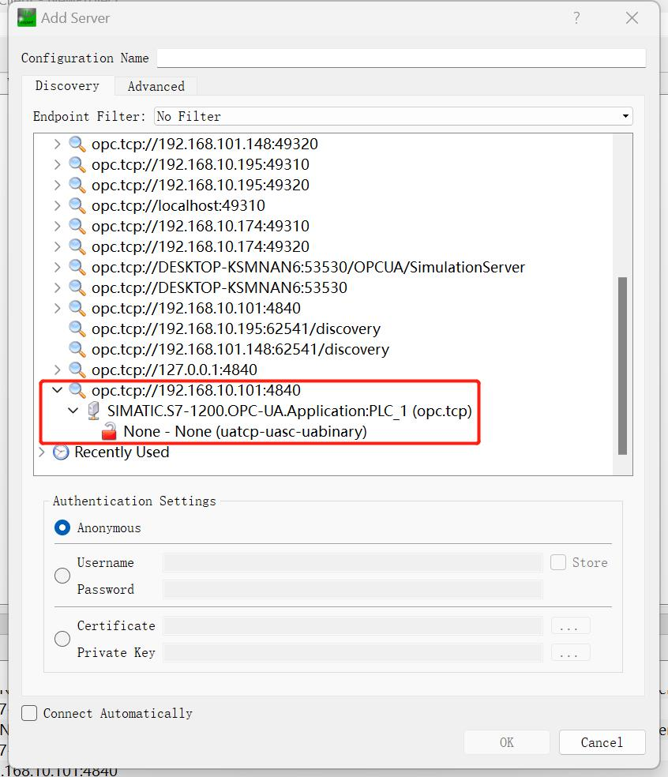
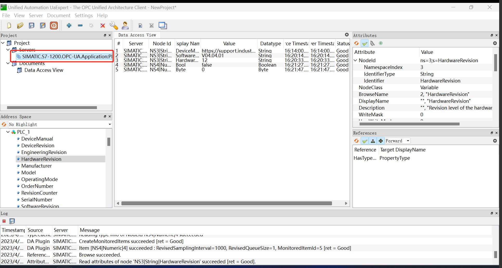

# UaExpert

UaExpert is a full-featured OPC UA client that enables users to connect to an OPC UA server and view all of the available nodes (such as devices, sensors, etc.) and their properties (such as temperature, pressure, etc.).

## Install UaExpert

Go to [Unified Automation Downloads](https://www.unified-automation.com/downloads.html) to register and download UaExpert and install it.

## Get Node Information

1. Open UaExpert software, click the toolbar `+` button, double click **Custom Discovery** -> **< Double click to Add Server... >**, in the pop-up dialog box, fill in the access address of OPC UA Server, click **OK** and the address will be added to the end of the list.

     

     

2. Fully expand the child nodes under **Access Addresses**, double click on the appropriate connection policy and the connection will be added to UaExpert's **Project** view.

     

     

3. Right-click on the target OPC UA Server (SIMATIC.S7-1200... in the example) under **Servers** in the **Project** view on the left. and select the **Connect** interface in the pop-up menu to connect to the target server.

     

4. Expand the child nodes in the **Address Space** view on the left to see the address information of the corresponding node in **Attributes** on the right, where **NamespaceIndex** is the **Namespace Index** and **Identifier** is the **Node ID**.
     

5. Drag the child node in the **Address Space** view to the **Data Access View** view to see the data type of the node.
     

6. Set the type of measurement point for the Neuron OPC UA plug-in according to the type information in the **Data Access View** view.
