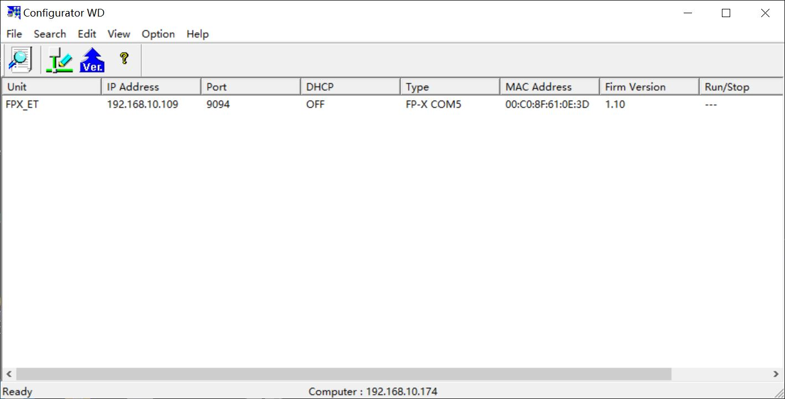
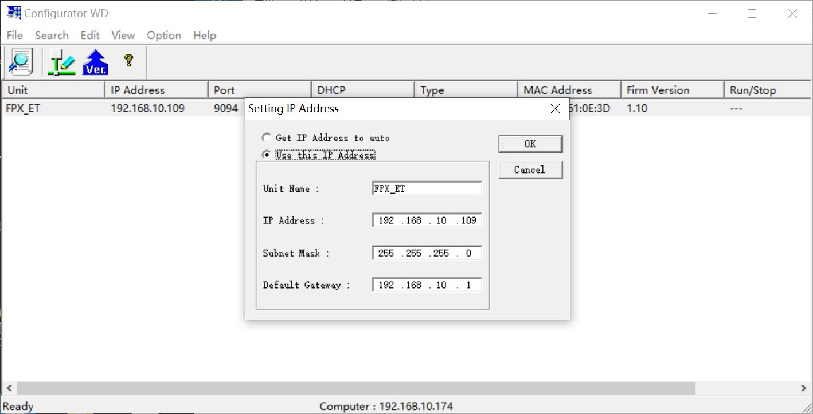
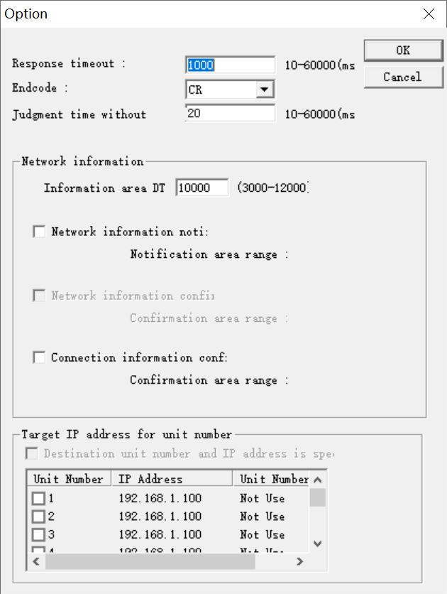
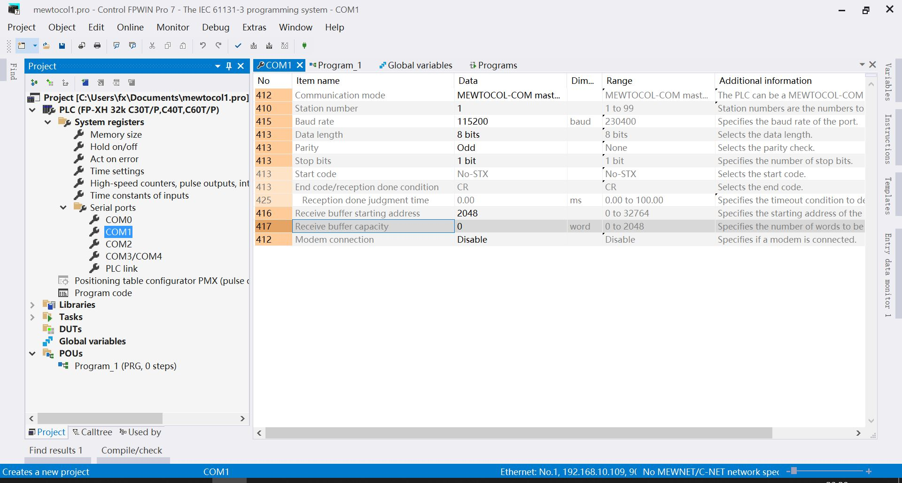
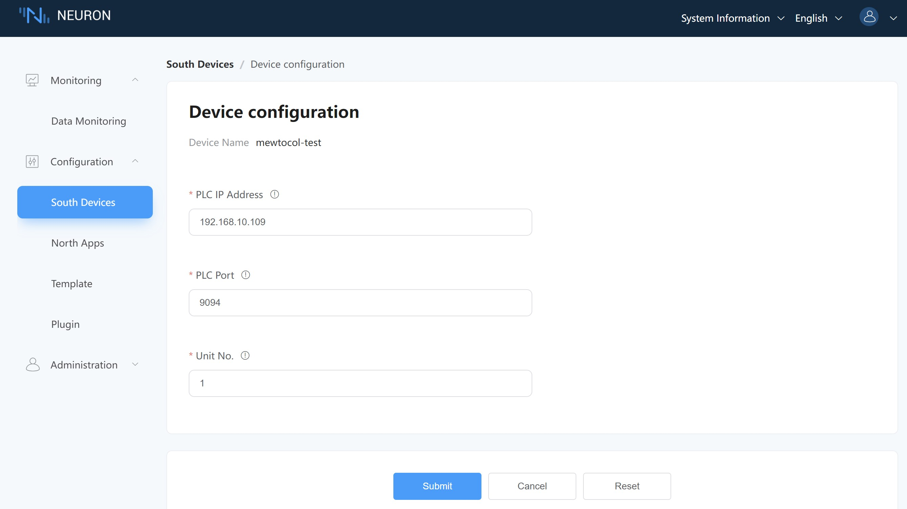

# Connect to FP-XH C30T

## Configurator WD
1. Go to https://www3.panasonic.biz/ac/e/fasys/software_info/common/tol_configwd.jsp and download configurator_wd_v177.exe after registration and install it.

2. Open the Configurator WD software, click on the menu `Option` -> `Select IP of PC` -> `Specify the IP address of PC`, select the local IP address and click on the `OK` button.

3. Click on the menu `Search` -> `Search BroadCast`, the FP-X COM5 module will appear in the list.

4. Right click on the FP-X COM5 item in the list and select `Setting IP Address` in the pop-up menu to set a fixed IP address for the PLC device, then click `OK`.

5. Right click on the FP-X COM5 item in the list, select `Communication Setting` in the pop-up menu, set the `Baud rate of COM1` to `115200` and click `OK`.

6. Right-click on the FP-X COM5 item in the list, select `Communication Setting`-> `Option Setting` in the pop-up menu, set `Respons timeout` to `1000` and click `OK`.

7. Open Control FPWIN Pro 7 and confirm that the `Communication Speed` of the PLC serial port `COM1` is `115200`.

## Neuron Setting
1. Add a Panasonic Mewtocol device to the Neuron Southbound Device Manager. 2.

2. Change `PLC IP Address` to the target device IP address in the device configuration. 3.

3. Modify `PLC Port` to be the target device port in the device configuration. 4.

4. Change `Unit Number` to the target device unit number in the device configuration and submit the setup form.

## Test Data List
| Name |  Address    | Attribute | Data type   |
| ---- | --------| ---- | ------ |
| DATA1  | DT0    | Read Write | INT16  |
| DATA2  | DT2    | Read Write | UINT16 |
| DATA3  | DT4    | Read Write | INT32  |
| DATA4  | DT7    | Read Write | UINT32 |
| DATA5  | DT10    | Read Write | FLOAT  |
| DATA6  | DT13    | Read Write | DOUBLE |
| DATA7  | X0    | Read       | BIT    |
| DATA8  | Y0    | Read Write | BIT    |
| DATA9  | DT20.0 | Read       | BIT    |
| DATA10  | DT17.20  | Read Write | STRING |