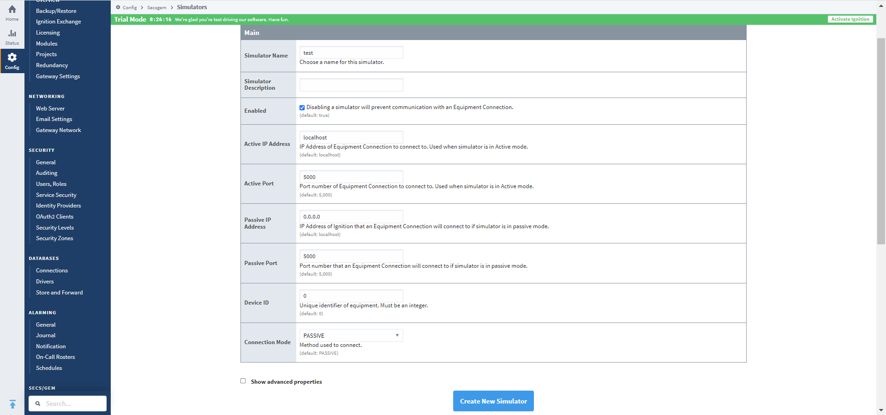
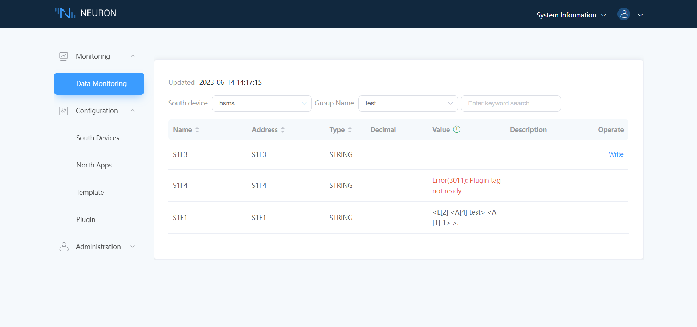
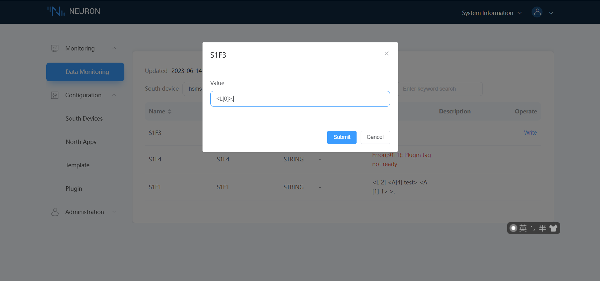
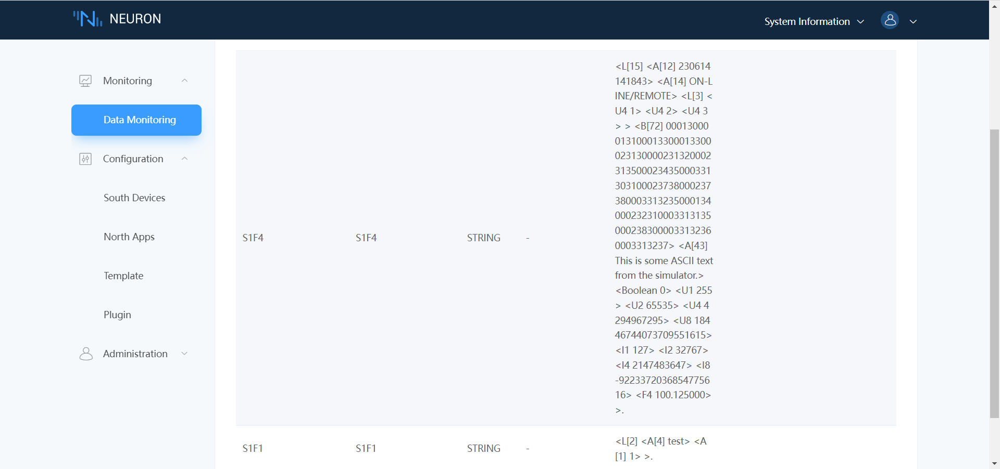

# Ignition SECS/GEM Example

This article will use the SECS GEM HSMS plugin to connect to the Ignition SECS/GEM simulator, enabling the reading and writing of data from SECS/GEM simulated devices. Please ensure that the plugin and simulator are networked.

## Download And Install Ignition SECS/GEM Simulator

The installation of the simulator is divided into two parts: the first part is the installation of the Ignition gateway software, and the second part is the installation of the SECS/GEM module.

* To install the Ignition gateway software, you can download the installation package from the [Ignition](https://inductiveautomation.com/downloads/) page.
  
* Download the SECS/GEM Module, which can be downloaded from the [SECS/GEM Module](https://inductiveautomation.com/downloads/ignition/8.1.28) page.
  
* After installing Ignition, use a web browser to access port 8088 and perform the necessary initialization settings. Once complete, log in to the main page.
  
* Go to **Config -> System -> Modules**, and install the downloaded SECS/GEM Module file. Upon completion of installation, a SECS/GEM sub-menu should appear in the Config menu, indicating a successful installation.

## Create An Ignition SECS/GEM Simulator

Go to **Config -> SECS/GEM -> Simulator**, click on `Create new Simulator...`, enter the required simulator parameters according to your needs. Mainly, you need to set the simulator name, Passive IP address, Passive port, and device ID. Then click on `Create New Simulator` to create it. Example shown below.
  

The created simulator in this article is named "test", with a Passive IP address of 0.0.0.0, port of 5000, and a device ID of 0。

## Configure the Neuron node to connect to the Ignition SECS/GEM Simulator

* Click on `Add Device` in the **South Devices** and select the `SECS GEM HSMS` plugin to create a node to connect to the SECS/GEM Simulator.
* After creating the node, click on `Device Configuration` to enter the device configuration page. Configure the node information according to the actual situation,
	* `Device IP Address`: Target device IP address
	* `Device Port`: Target device port, default 5000
 	* `Deivce ID`：Target device ID，default 0
* In the created south-device node, create a group and create some point position under the group.
* Enter the Neuron **Data Monitoring** page and select the corresponding device and group to view the collected data points, as shown in the following figure.
  

Due to the unique characteristics of the SECS-II protocol, there are certain patterns when creating new points. For example, for the S1F1 message, which does not require any additional parameters for reading, you can simply create a point with a Read or Sub attribute to obtain the return value. However, for messages such as S1F3, which requires a LIST-type parameter and returns an S1F4 message, in order to complete an operation, you need to create two points: a Write-attribute S1F3 node and a Sub (or Read) attribute S1F4 node, with the point name matching the message name. As shown in the following figure.

The above figure simulates the reading of S1F3 with an empty LIST parameter, and S1F4 returns all the statuses of the simulated device.