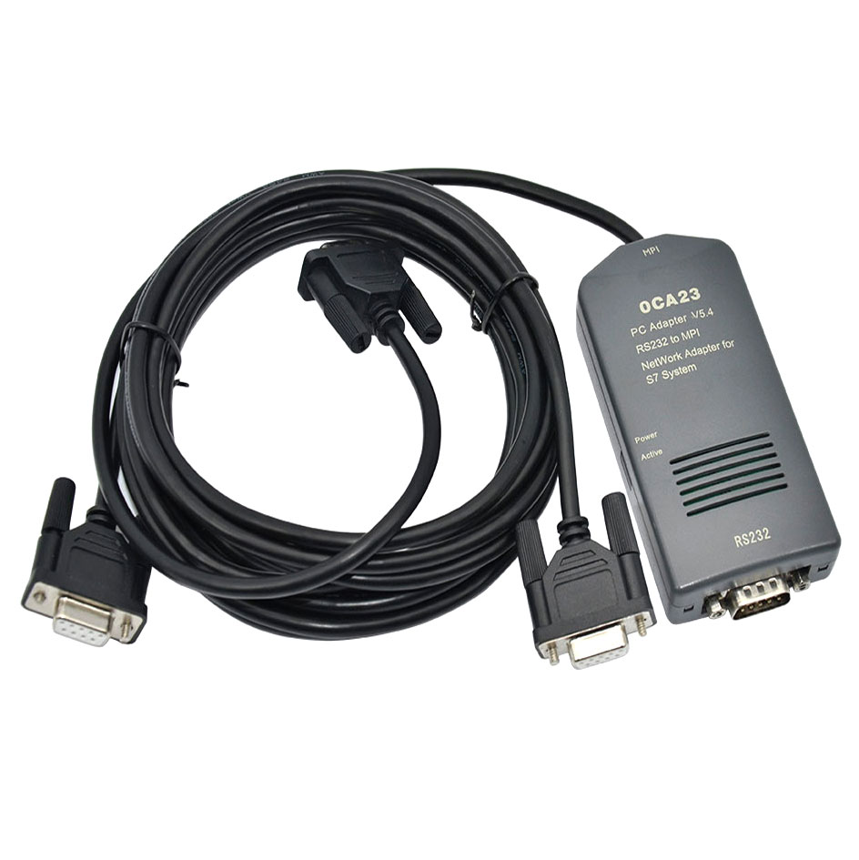
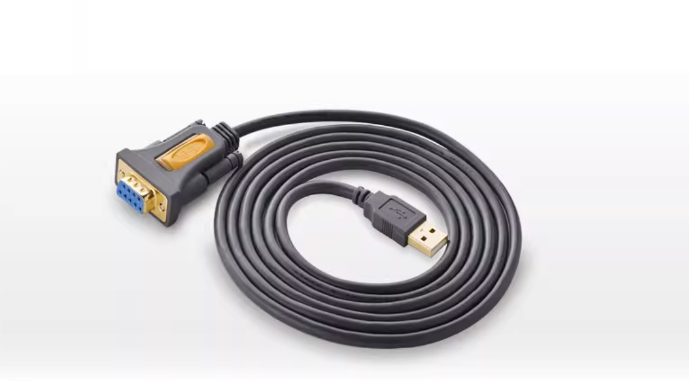
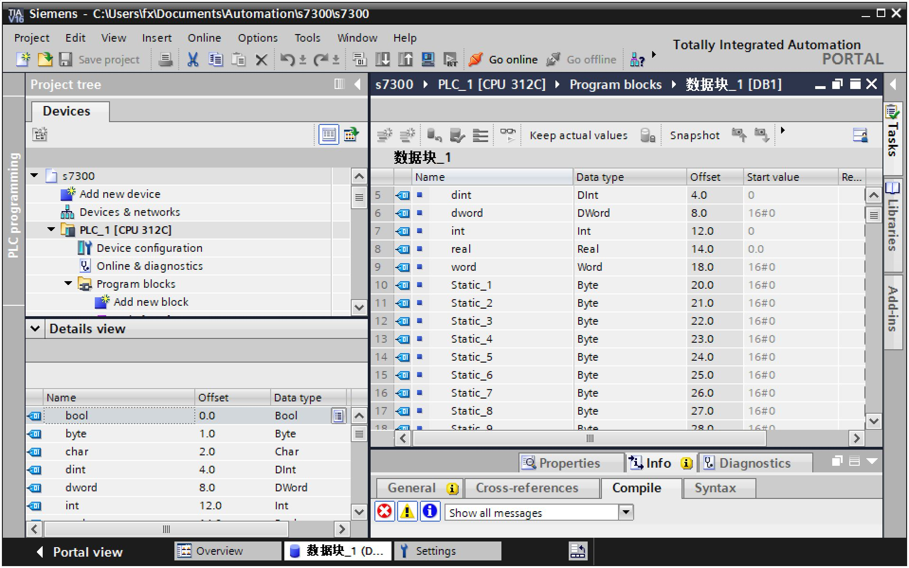
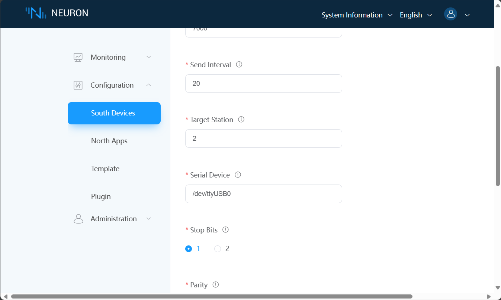

# Siemens S7300 PLC Connection Example

The S7300 is a member of the Siemens S7 family of PLCs. Suitable for large and complex automation applications, this PLC offers high performance and rich functionality.

This section describes how to connect the S7300 via the Neuron Siemens MPI plug-in.

## Connecting Hardware Devices

1. Use adapter 0CA23 to connect to the MPI interface of the S7-300.

2. Connect the 0CA23 adapter to the PC using the RS232-USB adapter cable.

## PLC Setting

1. Assume we are using the default MPI station number 2 for the S7300 PLC.
2. a data block is added to the S7300 PLC in TIA Portal and data points are created as shown:

## Neuron Setting

1. Add a Siemens MPI device to the Neuron Southbound Device Manager. 2.

2. Modify the **Serial Device** item to the actual device path, leave the other configuration items as default, and submit the setup form.

3. Add **Group**，Add testing **Tag**。

## Test Data List

|  Name |  Address    |  Attribute | Data Type   |
| ---- | --------| ---- | ------ |
| DATA1  | DB1.DBB0    | Read Write | UINT32 |
| DATA2  | DB1.DBB16.7 | Read Write | BIT    |
| DATA3  | DB1.DBB5    | Read Write | DOUBLE |
| DATA4  | M100        | Read Write | INT64  |
| DATA5  | M108.20     | Read Write | STRING |
| DATA6  | I1.2        | Read Write | BIT    |
| DATA7  | Q0.7        | Read Write | BIT    |
