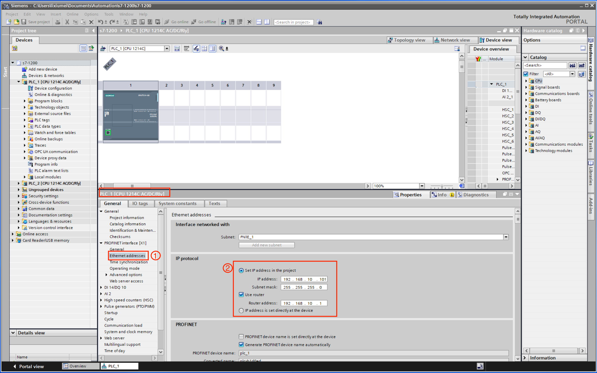
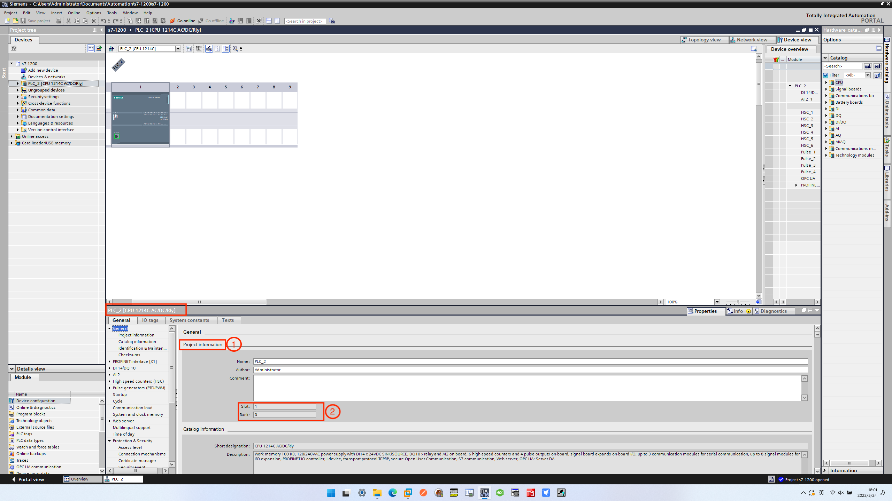
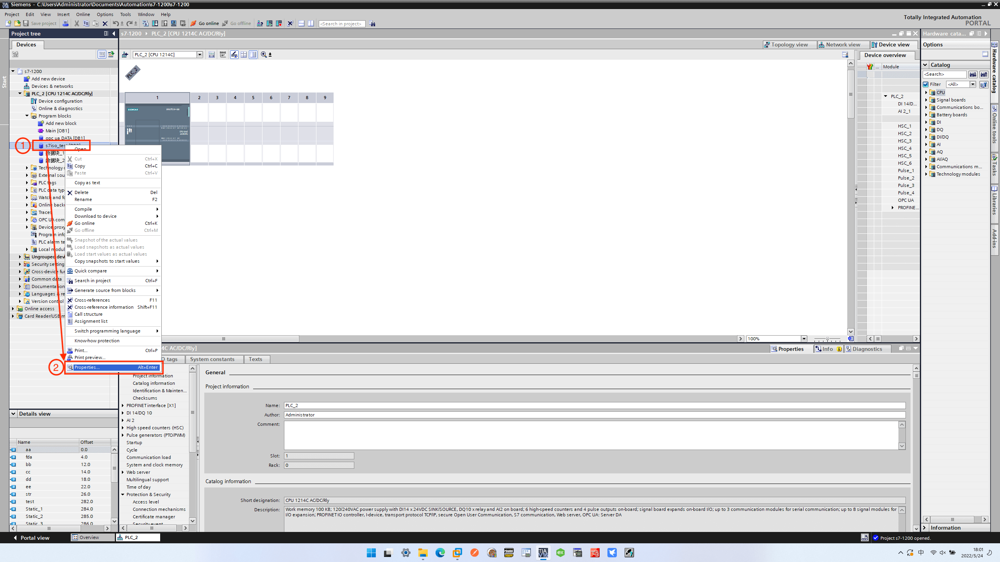
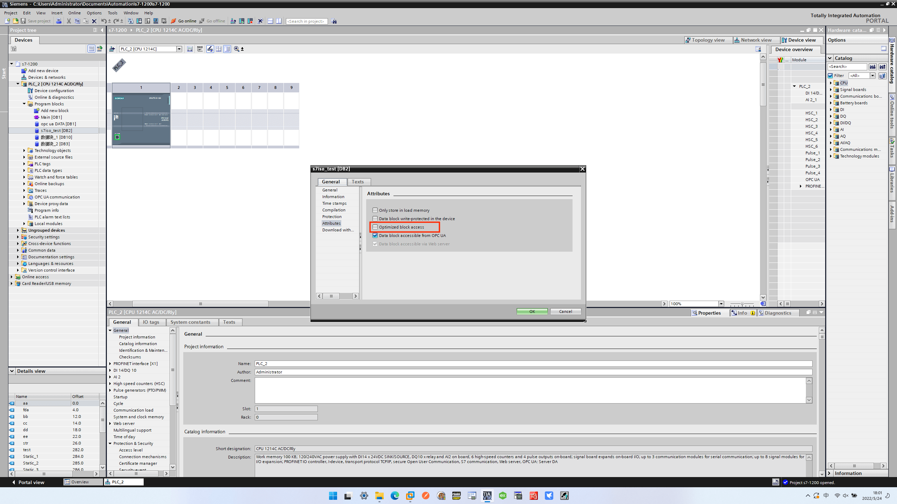
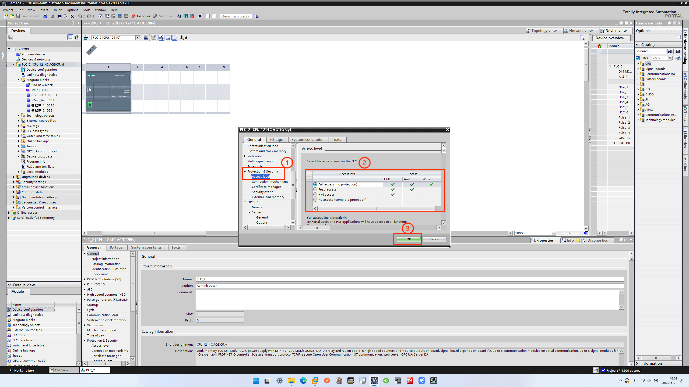
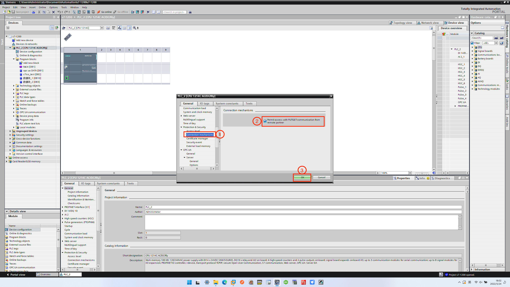

# Tailor S7 1200/1500 PLC for Effective ISOTCP Plugin Use

When interfacing with Siemens S7 1200/1500 PLC using the Siemens S7 ISOTCP plugin, certain modifications are required in the Siemens software (TIA16) settings:

* The **optimized block access** must be turned off.
* The **access level** must be **full** and the **connection mechanism** must allow GET/PUT.

This section uses TIA Portal V16 to demonstrate the setting. 

## Connection to PLC

First, the connection device settings should be made, as shown in the image below.

1. Under the device name, double-click **Device configuration**, and select **Ethernet addresses** in the **interface** directory.
2. Fill in the IP address of the network connected to the PLC correspondingly to complete the connection setting.

## Check Slot and Rack

Under the condition that the software is correctly connected to the device, on the **Device configuration** page, select **General** -> **Project information** to view the  rack number and slot number, as shown in the image below.

## Configure the PLC

The following settings are also required when accessing an S7 1200/1500 PLC.

### Close Access to Optimization Block

Right-click the DB block that you want to use, and select **Properties** in the pop-up dialog box, as shown in the image below.

In the dialog box that pops up, uncheck **Optimized block access**, as shown in the image below.

### Configure PLC Security Settings

Right-click the device name, and select **Properties** in the pop-up dialog box, as shown in the image below.

First, set the **Access level**, and set the read and write permissions according to your needs, as shown in the image below.

Then set **Connection mechanism**, check **Permit access with PUT/GET communication from remote partner**, as shown in the image below.

