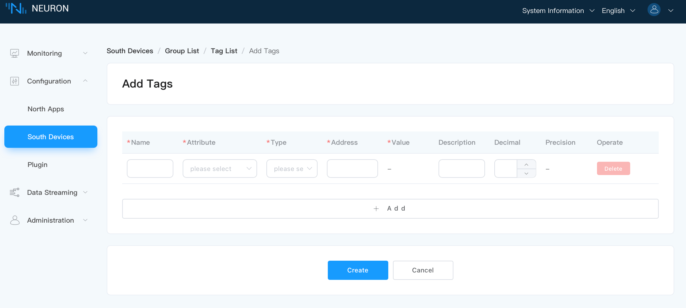
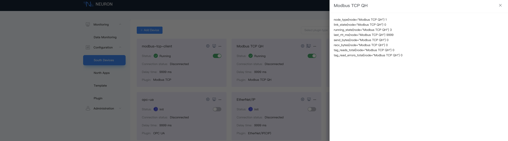

# Connect to Southbound Devices

This chapter will introduce how to use Neuron to support the transformation of various industrial protocols, enabling data collection from different types of southbound devices. This section will use PeakHMI Slave Simulators to simulate Modbus TCP devices, demonstrating the complete process of adding and configuring southbound devices.

Modbus TCP is a version of the Modbus protocol based on Ethernet, which uses TCP/IP for communication.

## Add A Southbound Device

Create a southbound device node to connect to a real device or simulator.

In **Configuration** -> **South Devices**, click **Add Device** to add a device node. Or you can choose to add southbound devices in a plugin mode and install and [configure the plugin through a template](../templates/templates.md). This demonstration will use the plugin method as an example.  

* Name: Fill in the name of the device, such as modbus-tcp-1;
* Plugin: Select the plugin of modbus-tcp from the drop-down box.

After clicking **Create**, you will be directed to the **Device Configuration** page, where we will configure the parameters needed for Neuron to establish a connection with the device. You can also click on the Device Configuration icon on the southbound device card to start the configuration.

## Device Configuration

This page includes the parameters required for Neuron to establish a connection with the device. 

::: tip

To ensure communication between Neuron and southbound devices, please make sure the IP and Port are correctly set and the firewall is turned off.

:::

Click the **Application Configuration** button on the device card to configure. For configuration items of the Modbus TCP driver, see [Southbound Drivers - Modbus TCP](../south-devices/modbus-tcp/modbus-tcp.md).

After clicking **Submit**, the configuration of the northbound application is completed, and the application card automatically enters the **Running** state.

After the southbound device is successfully created, a newly created card will appear in the southbound/northbound management interface, as shown in the following figure.


## Device Cards

On the **South Devices** page, you can choose to display southbound applications in a list or card view. Here uses the device card as an example to explain the various options.

* **Name**: The unique name provided by the user for the northbound application.
* **Application Configuration**: Click this button to enter the configuration interface for setting the parameters required for Neuron to connect to southbound devices.
* **Edit**: Starting from version 2.5.0, Neuron supports updating node names. To change the name of the target node, click the **Edit** icon, and in the pop-up dialog box, modify the node name.
* **Data Statistics**: Statistics for the node.

* **DEBUG Log**: Print the DEBUG level log for the current node. After ten minutes, Neuron will revert to printing the default level of logs.

* **Delete**: Remove this node from the device list.

* Status: Displays the current status of the device node. Currently, the node has five working statuses.

  * **Initialize**: After adding a northbound application for the first time, it will enter the initialization state.
  * **Configure**: Enter the device configuration and enter the configuration state.
  * **Ready**: After successful configuration, enter the ready state.
  * **Running**: The application is in running status.
  * **Stop**: The application is stopped.

* **Connection Status**: Displays the connection status of the device. After adding the group and tag, Neuron will connect to the device to collect data, and the connection status will show **Connected**.

* **Plugin**: Displays the name of the plugin module used by the device.

## Configure Data Groups and Tags

In Neuron, a "tag" represents a specific data point within a device, enabling data extraction or injection. "Group" is a collection of user-interest tags that facilitate data exchange between nodes. After adding the south devices, you can start to add tags and groups to start the data acquisition.

::: tip
Neuron supports the batch configuration of groups and data tag points through Excel files. For details, see [Batch Group/Tag Configuration](../import-export/import-export.md).
:::

### Create A Group

Create a group of tags, in which collect and report the data of the same group at the same frequency

Click the new device node to enter the group list management interface, and click **Create** to create the group.

* Name: Fill in the name of the Group, such as group-1.
* Interval: Set the the frequency of collection and reporting of this group of tags, in milliseconds, 100 means that the whole group of points is collected every 100 ms, and the value of the whole group of points is reported once.

:::tip
Interval is a time interval that is used to collect data from equipment and report the data to MQTT. The minimum setting can be 100ms, but when there are a lot of collected data, if the data monitoring interface reports an error that the point value is invalid, the value of the interval can be appropriately increased.
:::

### Add Tags to the Group

Add the device tags to be collected, including tag address, tag attribute, tag type, etc.

Click the **Tag list** icon in the group to enter the tag list management interface.

Select the **Create** icon to enter the tag page.



* **Name**: This is a unique identifier that you provide for the point, such as point-1.
* **Attribute**: Dropdown to select the point attribute, for example, read, write, subscribe, static, supporting the configuration of multiple point types.
  * Read: Used to read data
  * Write: Used to write data
  * Subscribe: Only sends messages when data changes. For example, the default data is 0, when the data changes to 2, a message will be sent
  * Static: Requires a value to be assigned at configuration, and the assigned value can also be seen on the monitoring page after configuration
* **Type**: The type of data stored at this tag. This could be integer, float, string, or boolean. Choose the type according to your device data.
* **Address**: Fill in the driver address, for example, 1!40001. 1 represents the point site number set in the Modbus simulator, and 40001 represents the point register address. For detailed instructions on how to use the driver address, please refer to [South Device - Modbus TCP](./modbus-tcp/modbus-tcp.md#examples).
* **Decimal**: Default is not filled; when the tag attribute includes write, you can set the Decimal. In this case, device value * decimal = display value. If the point Decimal is 0.1, and the value written into the device is 234, the display value is 23.4.
* **Precision**: Configure the precision when the point type is float or double. The precision range is 0 to 17.
* **Description**: Default is not filled.

::: tip
After the tag is created, the working status of the equipment card is **running**, and the connection status should be **Connected**. If the connection status is still **Disconnected**, please execute the following instructions at the terminal of the Neuron running environment to confirm whether the Neuron running environment can access the corresponding IP and port.

```bash
telnet <Running IP on PC side of Modbus simulator> 502
```

:::

## Data Monitoring

After completing the point configuration, you can click **Monitoring** -> **Data Monitoring** to view device information and control devices. For details, refer to [Data Monitoring](../../usage/monitoring.md).

## Operation and Maintenance

### Data Statistics

In the device card or device column, you can click on the data statistics chart to view the application running status, and the state of received and sent data.



Key field descriptions are as follows:

| Parameter             | Description                                                  |
| --------------------- | ------------------------------------------------------------ |
| last_rtt_ms           | The time interval of sending and receiving an instruction, in milliseconds |
| send_bytes            | The total number of bytes of sent instructions               |
| recv_bytes            | The total number of bytes of received instructions           |
| tag_reads_total       | The total number of instructions for reading points, including failed reads |
| tag_read_errors_total | The total number of instructions for failed reads            |
| group_tags_total      | The total number of points in the group                      |
| group_last_send_msgs  | The number of messages sent by calling a group timer once    |
| group_last_timer_ms   | The time to call a group timer once, in milliseconds         |
| link_state            | Node connection status <br />DISCONNECTED = 0<br />CONNECTED = 1 |
| running_state         | Node state <br />INIT = 1<br />READY = 2<br />RUNNING = 3<br />STOPPED = 4 |

### Troubleshooting

If there are any issues with device operation, you can click on the DEBUG log chart. The system will automatically print DEBUG level logs for that node and switch back to the system default log level after ten minutes. Later, you can click on **System Information** -> **Logs** at the top of the page to view logs and perform troubleshooting. For a detailed interpretation of system logs, see [Managing Logs](../../admin/log-management.md).