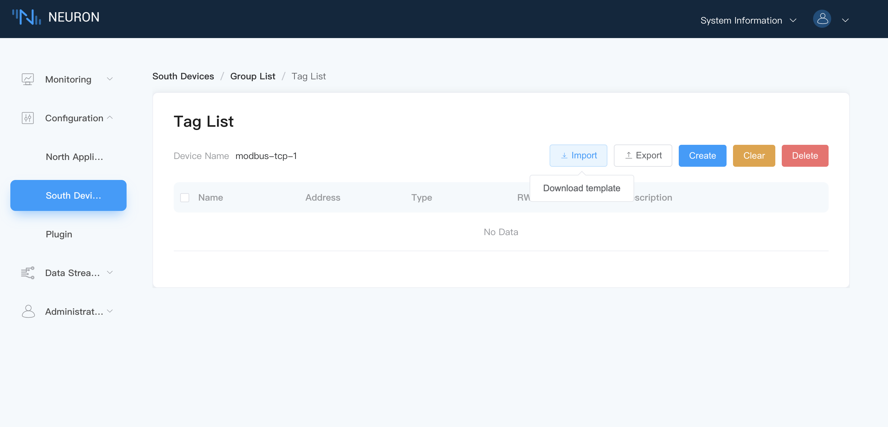
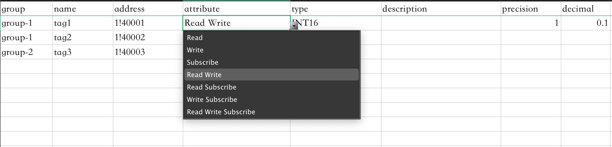

# Configuration Import/Export

Neuron provides configuration Excel sheet import and export capability to accelerate the data tags setup configuration and to keep data tags information in outside storage.

## Config Import

### Step 1 Download Template

Hover the mouse over `Import` and the button `Download Template` will appear, as shown below.

Click the `Download Template` button to download the Excel sheet.

### Step 2 Fill in the Excel

Fill in the relevant information according to the form format, as shown below.

1. Fill in the Tag name;
2. Fill in the address of the Tag;
3. Select the attribute from the drop-down box;
4. Select the data type from the drop-down box;
5. Fill in the description, which can be left blank.

### Step 3 Import the Excel

Click the `Import` button and select the Excel file to be imported.

## Config Export

Click the `Export` button, and all tag information created in the page will be exported to an Excel sheet.
