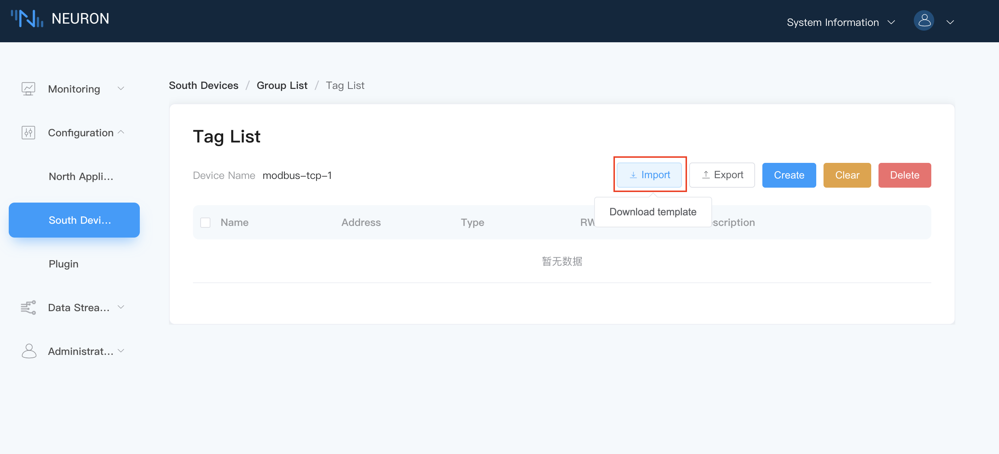
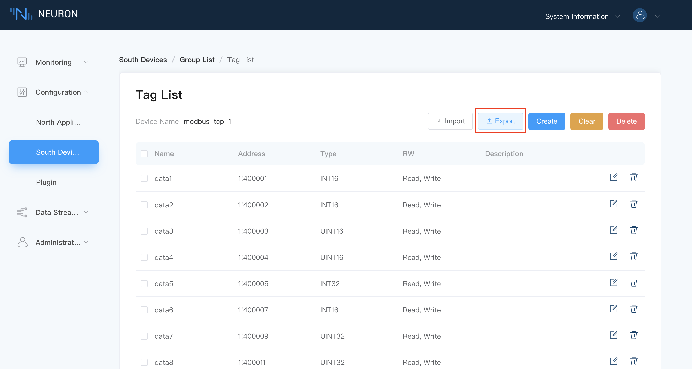

# Data Tags Import/Export

## Data Tags Import

### Step 1 Download Template

Hover the mouse over `Import` and the button `Download Template` will appear, as shown below.

Click the `Download Template` button to download the Excel sheet.

### Step 2 Fill in the Excel Sheet

Fill in the relevant information according to the Excel sheet format as shown below.

The following items must be filled accordingly.

* Fill in the Tag name;
* Fill in the address of the Tag;
* Select the attribute from the drop-down box;
* Select the data type from the drop-down box;
* Fill in the description, which can be left blank.

### Step 3 Import the Excel Sheet

Click on the `Import` button and select the Excel file to be imported.

## Data Tags Excel sheet Export

Click on the `Export` button, and all data tags information listed will be exported to an Excel sheet. Users may save the Excel sheet for data tags backup.

