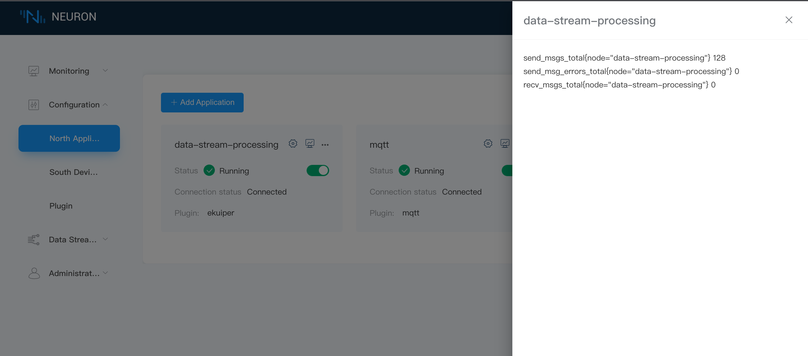

# Data statistics

Neuron supports the north-south node data statistics function based on Prometheus data model, which is used to monitor the running state of nodes. The basic principle of Prometheus is to periodically capture the status of monitored components through HTTP protocol. Any component can access monitoring by providing the corresponding HTTP interface. Neuron provides the corresponding interface and can successfully access Prometheus for monitoring.

Each node card has an operation button of `Data statistics`, which is used to display the statistical information of the node. At present, Neuron has realized the statistics of some general fields and north-south general fields, and will continue to increase statistical fields according to the demand.

## Northbound Node Statistics

The statistics already supported by the ekuiper plugin are shown in the following figure.

| Parameters             | Description                                | 
| ---------------------- | ------------------------------------------ |
| send_msgs_total        | Total number of sent the messages          |
| send_msg_errors_total  | Total number of failed messages sent       |
| recv_msgs_total        | Total number of received the messages      |

## Southboud node statistics

The southbound node supports some general statistical fields. However, the statistical fields required by each driver may vary. In later versions, the statistical fields required by each driver will be updated. The following figure describes the common statistical fields.

| Parameters               | Description              | 
| ------------------------ | --------------------------------------- |
| last_rtt_ms              | The interval between sending and receiving a command, in milliseconds |
| send_bytes               | Total number of bytes of sent commands        |
| recv_bytes               | Total number of bytes of received commands    |
| tag_reads_total          | Total number of commands to read the tags, including read failures |
| tag_read_errors_total    | Total number of commands that failed to read the tags   |
| group_tags_total         | Total number of tags in the group                       |
| group_last_send_msgs     | Number of messages sent by calling group timer once     |
| group_last_timer_ms      | The time when the group timer is called once, in milliseconds |