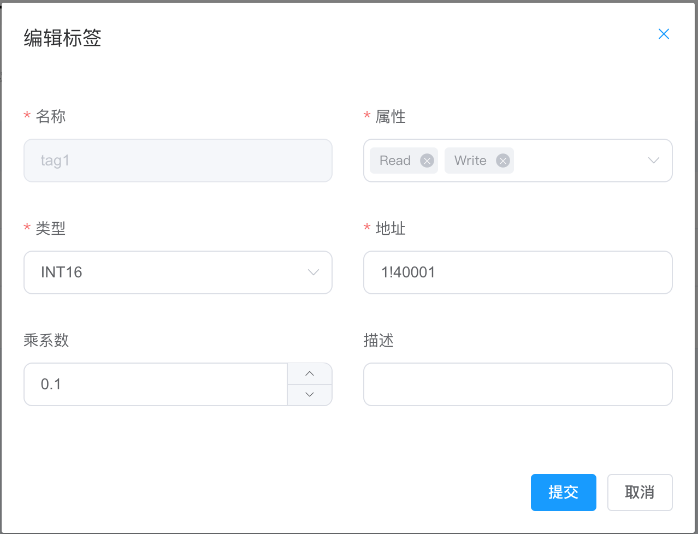
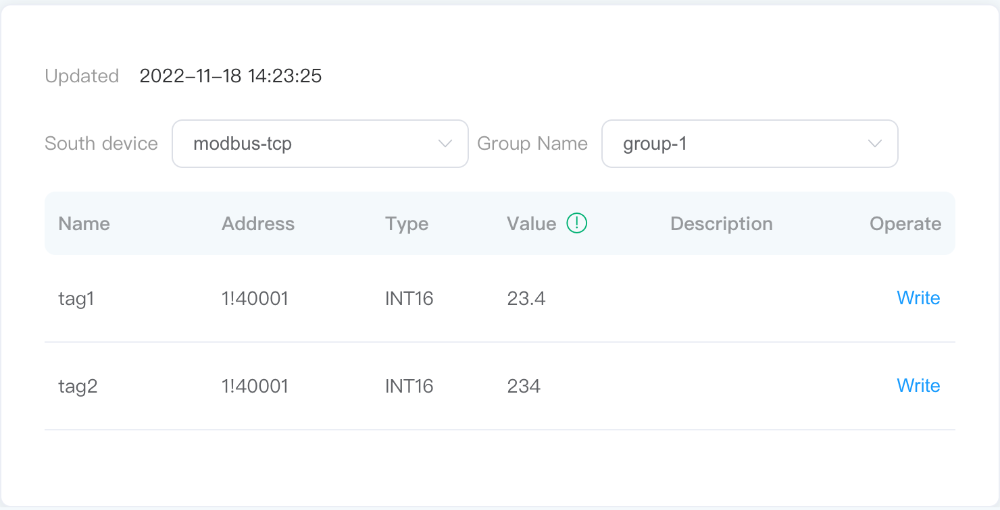

# Device Control

## Step 1 Change the value from the dashboard

When the tag is set with the write attribute, the Tag of the data monitoring interface will have a write operation. Click on `Write` button and input a value to control device. For example, modify the value of the 1!40001 point address with the write attribute, as shown below.

1. Click on the `write` button at the end of the label to be changed;
2. Select whether to input in hexadecimal format, not select;
3. Enter a new value for the label, e.g. 123;
4. Click on the `Submit` button to submit the new value.

::: tip
This point in the device must also have the writable attribute, otherwise it cannot be written successfully.
:::

## Step 2 Check whether the device point value is modified successfully

Check over the Modbus simulator whether the point value has changed to the same input value as above.

## Supplementary instructions

Usage of decimal:

Device value * Decimal = Display value

When configuring the decimal at the tags, the write attribute supports the writing of the multiplication factor, E.g.

The value of decimal is 0.1, and write display value on the dashboard , such as 23.4, the dashboard display value is 23.4, and the value written into the device is 234, as shown in the figure below.

* tag1 is the display value configured with 0.1 decimal.
* tag2 is the display value without decimal configured (i.e. device value).

:::tip
If the configured decimal is 0.1 and the input value exceeds one decimal place, it will be rounded up automatically. E.g, if you enter 23.56, 23.6 is displayed, and the value written to the device is 236.
:::
