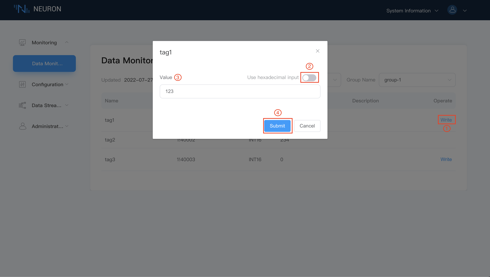

# Device Control

## Step 1 Change the value from the dashboard

When the tag is set with the write attribute, the Tag of the data monitoring interface will have a write operation. Click `Write` to realize the reverse control device. For example, modify the value of the 1!40001 point address with the write attribute, as shown below.

1. Click the `write` button at the end of the label to be changed;
2. Select whether to input in hexadecimal format, not select;
3. Enter a new value for the label, e.g. 123;
4. Click the `Submit` button to submit the new value.

::: tip
This point in the device must also have the writable attribute, otherwise it cannot be written successfully.
:::

## Step 2 Check whether the device point value is modified successfully

Open the Modbus simulator and check whether the point value changes, as shown below.

