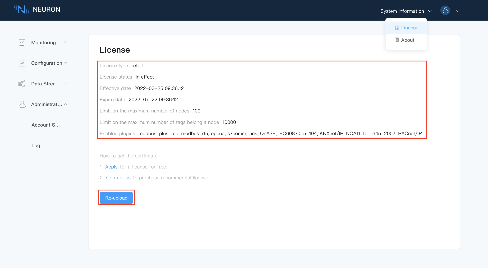

# License Installation

## Step 1 Install License

The commercial pluggable modules can only be used when a valid license has been installed. If the license has expired, user can apply for a valid license from [official website](https://www.emqx.com/en/apply-licenses/neuron) and install it as shown below.

To install a license,

1. Click on the `License` from the System Information drop-down box in the upper-right corner.
2. Click on the `Upload` button to select the license file and then submit.

::: tip
Users can apply for a trial license from official website by clicking on the `Apply`, or contact our sales representatives to purchase a commercial license by clicking on the `Contact us`.
:::

## Step 2 Check over the License details

After the license is successfully installed, it will display the license information, as shown below.

The license page details includes following items.

* `Expire date`, if the license has expired, the system would not work correctly anymore. Users must obtain a new valid license from official website, `Re-upload` the new license as procedure above.
* `Limit on the maximum number of nodes`, The maximum number of connection nodes that Neuron can create, a node can be either a southbound device or a northbound application.
* `Limit on the maximum number of tags`, The maximum number of total data tags that Neuron can create.
* `Enabled Plugins`, List of all the authorized pluggable modules for this license.
