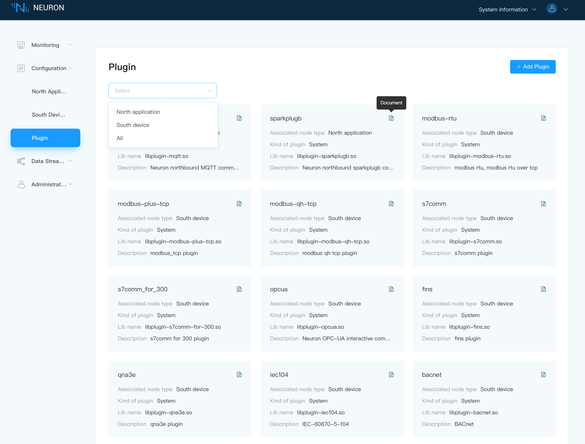
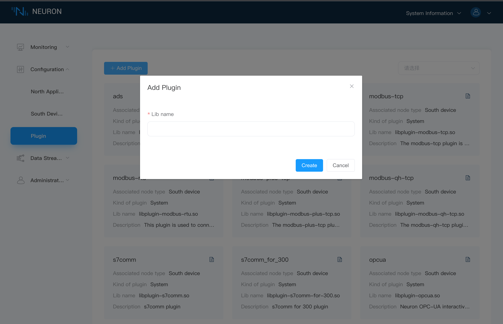

# Plugin Modules Management

The plug-in management interface displays all the plug-in information added by the user, including the name of the plug-in, associated node type, plug-in category and driver library name, as shown in the following figure. The plug-in types include the following 3 modes:

- Static: cannot be deleted
- System: cannot be deleted, native
- Custom: Deletable, user-developed or custom-developed

When there are too many plugins added, the user can filter out the plugins for northbound applications/southbound devices from the dropdown box, as shown in the following figure.

Users can add plugins according to the `Add Plugin` button in the upper right corner, as shown in the figure below, manually add the file name of the .so file that has been added to the build directory.

