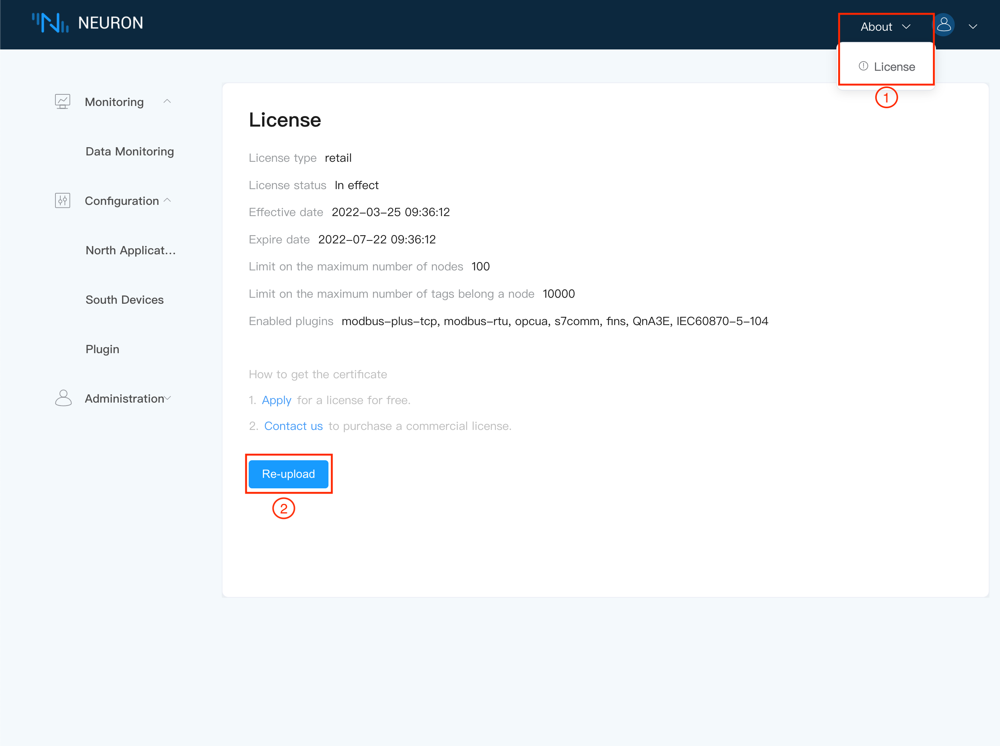
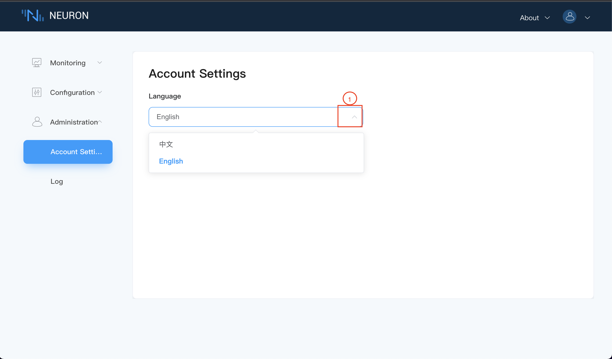
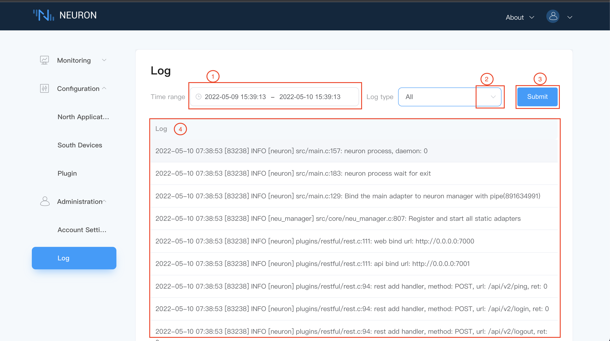
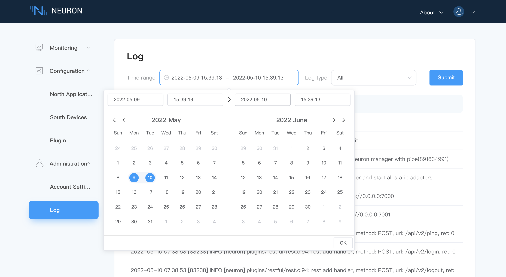
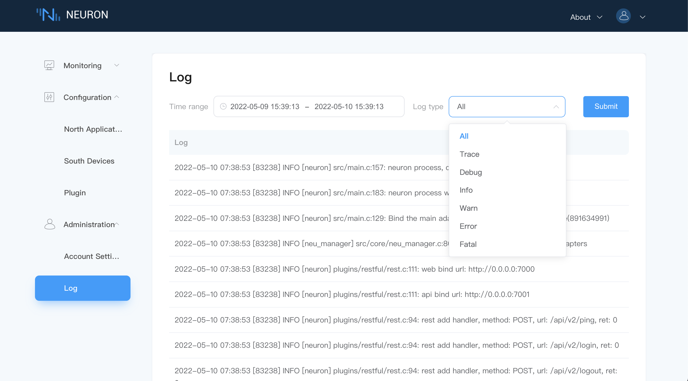

# Management

## License

Click the `About` drop-down box in the upper right corner of the page and select License, as shown in the following figure.

In the License interface, you can apply a trial license for free or upload a commercial license. Click the corresponding link to enter the corresponding application page. After receiving the license file, upload the .lic file, as follows as shown in the figure.

After the license is uploaded successfully, as shown in the figure below, the basic information of the license is displayed. The user can apply and upload the license again when license expired.

## Account setup

The account setting interface currently only provides the choice of the interface display language, as shown in the following figure.

## Log

The log interface displays the running log information of Neuron, as shown in the following figure.

Users can choose to view logs within a specific time period, as shown in the following figure.

Users can filter out specific log types, as shown in the following figure.

