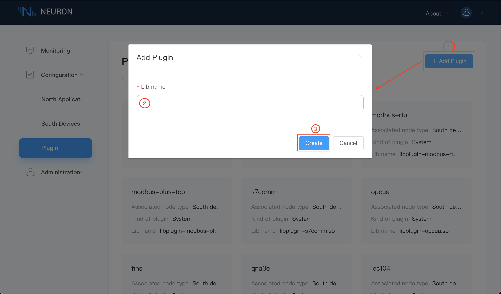

# Configuration

## Northbound Application Management

The northbound application management interface displays all user-defined northbound applications, including the details of name, working status and connection status. There are 5 working states: Initializing, Configuring, Ready, Running, and Stopping. After adding a northbound application, it enters the initialization state, and when the application is set, it enters the configuration state. When the configuration is completed, it will be the preparation state. The user can click the switch button of the working state to choose to run/stop the device.

The northbound application management interface can also perform the `add application` operation. Each application can be configured and deleted individually. Click any blank space of the application card to enter the subscription interface under the application, as shown in the following figure.

Users can click the `Add Application` button in the upper right corner to add an application. You need to fill in the application name and click the dropdown to select the northbound application plug-in, as shown in the following figure.

When you click the `Apply Configuration` button, you will enter the configuration interface of the application. The items with "*" are required fields, and there is an information prompt button behind each field. Place the mouse over this icon, and a help message will appear. The description of this field is shown in the following figure.

When you click on the blank space of the card, you can enter the subscription interface, as shown in the following figure.

In the subscription interface, users can view the list of all subscribed groups under the corresponding application name, and can add/delete subscriptions on the prompt screen:

- The `Export` button can export the subscribed Group list in Excel form;
- The `Add subscription` button can be used to add a subscription, as shown in the figure below, the drop-down box selects all the subscribed southbound devices and the corresponding group;

- `Clear` button can delete all subscription operations at once;
- `Delete` button, when selecting all, click the `Delete` button, the effect is equivalent to `Clear`, which can delete all subscriptions. When you select some Groups, click the `Delete` button to quickly delete the subscriptions of the selected Groups in batches;

## Southbound device management

The southbound device management interface displays all the southbound devices added by the user, including the name, working status and connection status of each device, where the working status is the same as that of the northbound application.

The southbound device management interface can also perform the `add device` operation. Each device can be configured and deleted individually. Click any blank space on the device card to enter the group list interface, as shown in the figure below.

The same as the northbound application, the user needs to click the `Add device` button in the upper right corner to add a device, fill in the device name, and click the dropdown to select the southbound device plug-in, as shown in the figure below.

When you click the `Device Configuration` button, you will enter the configuration interface of the device. The items with "*" are required fields. There is an information prompt button behind each field. Place the mouse over this button, and the help message will appear, as shown in the following figure.

When you click on the blank space of the card, you can enter the Group list interface under the device, as shown in the following figure.

In the group list interface, users can view all group lists under the corresponding device, and can add/delete groups on the interface:

- The `Export` button can export the Group list information in the form of Excel;
- The `Create` button can be used to add a group, as shown in the figure below, fill in the group information, create a group, and the user can use the edit button to modify the group configuration;

- `Clear` button can delete all created groups with one click;
- `Delete` button, when selecting all, click the `Delete` button, the effect is equivalent to `Clear`, all groups can be deleted. When selecting some Groups, click the `Delete` button to quickly delete the selected Groups in batches;

On the Group list interface, click the tag list under a group to enter the Tag list interface, as shown in the following figure.

In the tag list interface, users can view the name of the device they are in, and can also create/delete tags on the interface. This page can also use Excel to import tags in batches;

- `Import` button, place the mouse over the `Import` button, the imported Excel template will appear, and users can import tags through Excel in batches;
- The `Create` button can be used to add tags. As shown in the figure below, fill in the tag name, driver address, attribute and type to create a tag. Of course, you can add multiple tags at a time through the `add` button below. At present, there are 3 attributes: read, write, and subscribe. The Tag type is determined according to the data type provided in the plug-in, as shown in the following figure.

- `Clear` button can delete all created tags at once;
- `Delete` button, when selecting all, click the `Delete` button, the effect is equivalent to `Clear`, all tags will be deleted. When selecting some tags, click the `delete` button to quickly delete the selected tags in batches;

## Plugin management

The plug-in management interface displays all the plug-in information added by the user, including the name of the plug-in, associated node type, plug-in category and driver library name, as shown in the following figure. The plug-in types include the following 3 modes:

- Static: cannot be deleted
- System: cannot be deleted, native
- Custom: Deletable, user-developed or custom-developed

When there are too many plugins added, the user can filter out the plugins for northbound applications/southbound devices from the dropdown box, as shown in the following figure.

Users can add plugins according to the `Add Plugin` button in the upper right corner, as shown in the figure below, manually add the file name of the .so file that has been added to the build directory.

