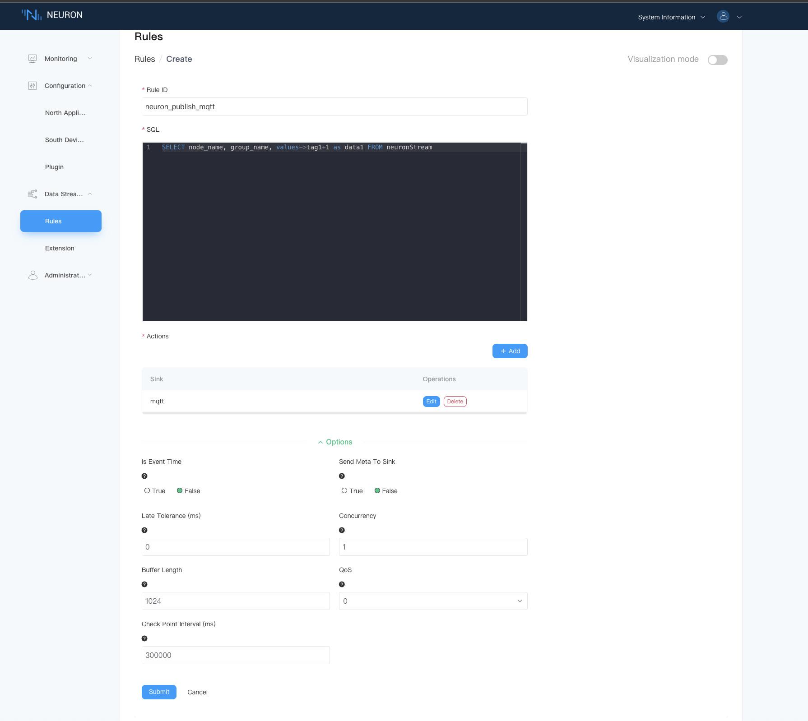
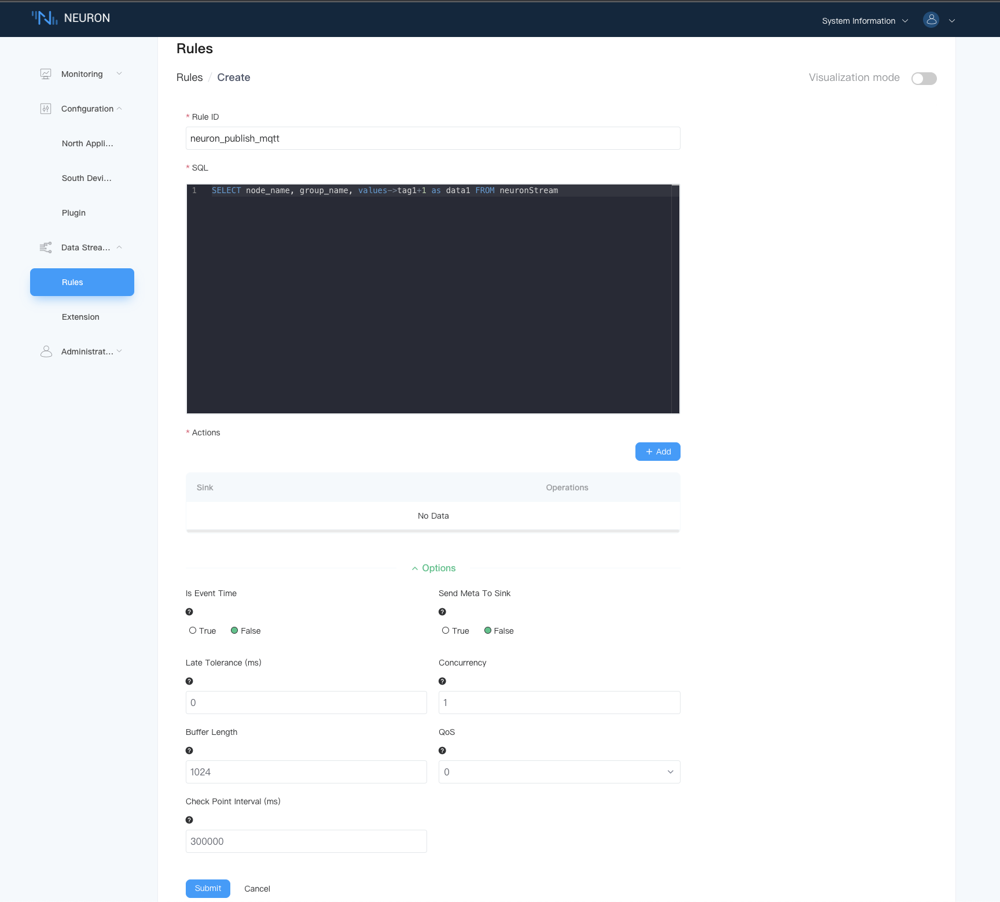
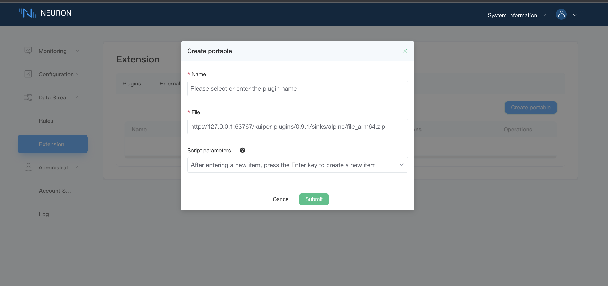
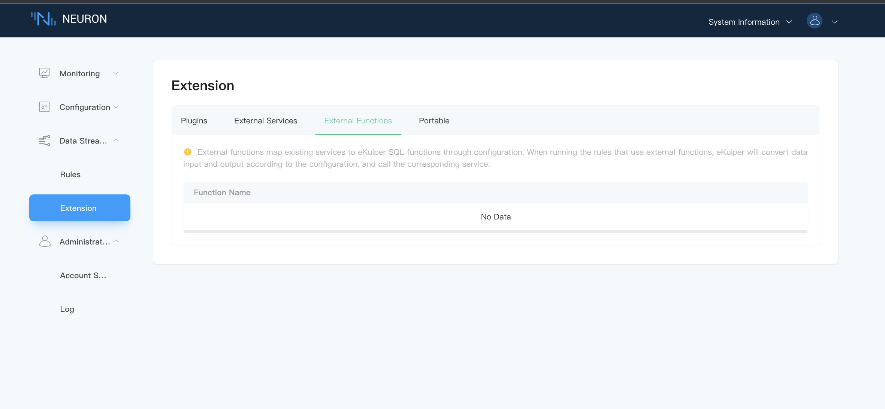

# Data Stream Processing

## Rules

Each rule represents a computing job to run in stream engine. The subscribed Group of data-stream node will be regarded as the continuous streaming data source. The rule will run continuously once started and only stopped if the user send stop command explicitly. The rule may also stop abnormally for errors.

It is common to run multiple rules simultaneously. As stream engine is a single instance process, the rules are running in the same memory space. However, there are separated in the runtime and the error in one rule should not affect others. Regarding workload, all rules share the same hardware resource. Each rule can specify the operator buffer to limit the processing rate to avoid taking all resources.

Multiple rules can form a processing pipeline by specifying a joint point in sink/source. For example, the first rule produce the result to a topic in memory sink and the other rule subscribe to that topic in its memory source. Besides the pair of memory sink/source, users can also use mqtt or other sink/source pair to connect rules.

## Extension

### Native Plugins

Native plugin extension leverage the native golang plugin system to dynamically load the custom extensions in runtime. After installed, the native plugin is actually running like the native code and can share or transfer data in memory with the main program which will guarantee the best performance.

Thus, the native plugin extension fits in scenarios where the user only runs in the supported os and environment, has the ability or infrastructure to rebuild the plugin during update, do not need to unload the plugin in runtime and is only using golang.

### Portable Plugins

Portable plugin extension leverages a plugin system based on IPC communication. Potentially, it will support all programming languages. And currently, golang and python are supported. Compared to native plugins, it is portable because the plugins will run in a separate process and do not have those harsh build/deployment requirements.

### External Services

A configuration method is provided that eKuiper can use SQL to directly call external services in a functional manner, including various rpc services, http services, and so on. This method will greatly improve the ease of eKuiper extensions. External functions will be used as a supplement to the plugin system, and plugins are only recommended for high performance requirements.

### External Functions

