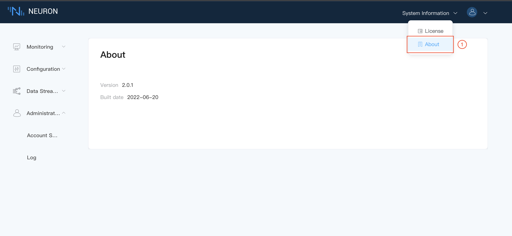

# System Information

## License

Click the `System Information` drop-down box in the upper right corner of the page and select License, as shown in the following figure.

In the License interface, you can apply a trial license for free or upload a commercial license. Click on the `Apply` link to enter into the corresponding trial license application page. However, you can contact our sales team for commerical license by clicking on `Contact us' link. After receiving the suitable license file, extract it and upload the .lic file to the Neuron.

After Neuron license is uploaded successfully, the information content of the license will be shown. The user can apply and upload the license again when the current license expires.

## About

This page will show the current version number of Neuron and its build date for reference.

